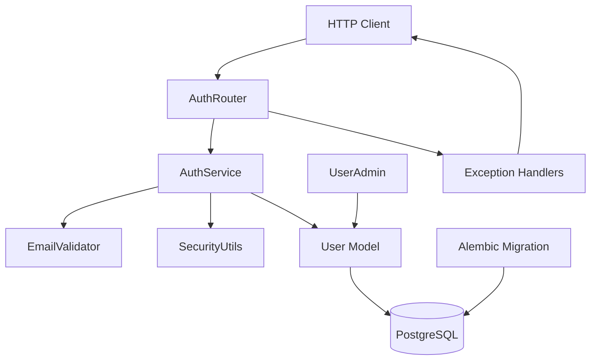
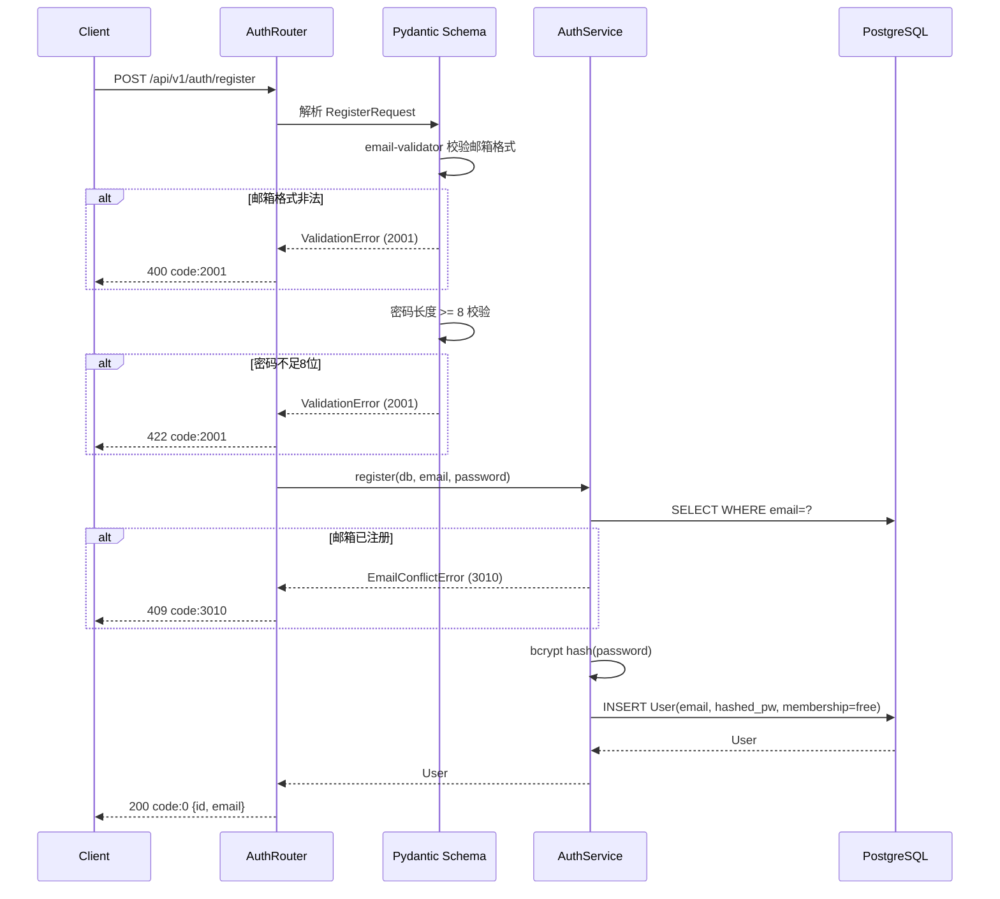
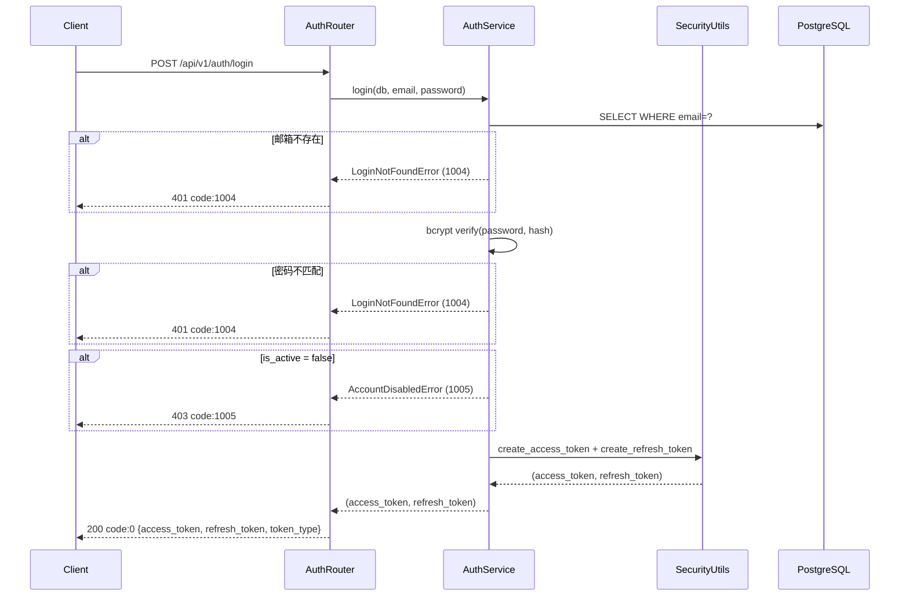
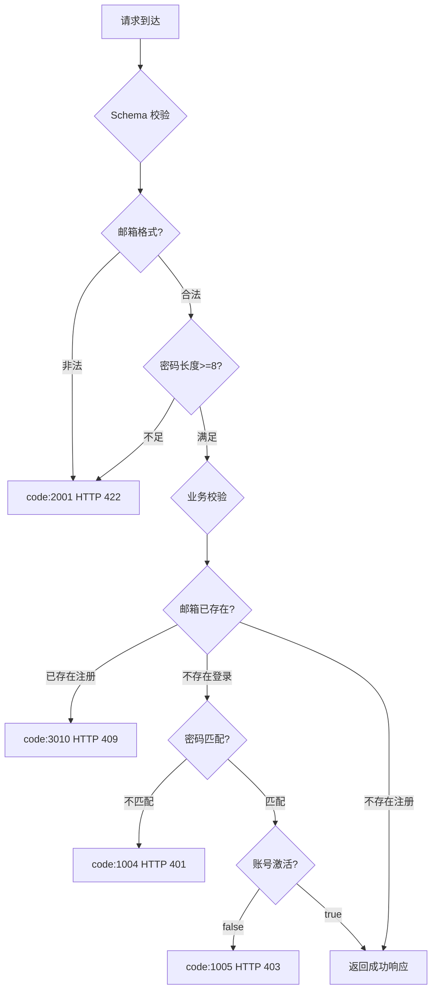
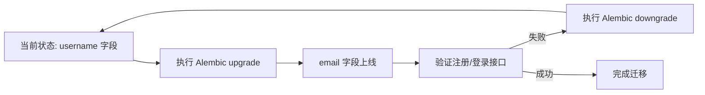

# 设计文档：邮箱注册登录（email-auth）

## 概述

本功能将平台用户身份标识从用户名（`username`）迁移至邮箱地址（`email`），同时引入第三方邮箱格式校验库 `email-validator`，并补全邮箱注册/登录所需的新业务错误码。该变更属于对现有认证体系（Auth Service）的**扩展性改造**，不涉及新的外部服务集成，注册即激活，无需邮件验证流程。

**目标用户**：新注册用户通过邮箱+密码完成账号创建；已注册用户通过邮箱+密码获取 JWT 令牌并访问分级会员功能。

**影响范围**：对现有用户模型、Schema、服务层、路由层、Admin 视图和 Alembic 迁移脚本执行原地字段替换，不引入新的服务进程或基础设施组件。

### 目标

- 将用户身份标识从 `username` 字段替换为 `email` 字段，保持数据库约束和索引对等
- 引入 `email-validator` 库，在 Pydantic Schema 层自动触发 RFC 5321/5322 合规校验
- 新增错误码 `3010`（邮箱已被注册）和 `1005`（账号已被禁用），精化登录错误语义
- 将注册密码最低长度从 6 位升级为 8 位
- 保持现有 JWT 结构、Token 刷新流程和统一信封格式不变

### 非目标

- 不实现邮箱验证（发送验证邮件）；注册即立即激活
- 不变更 JWT claims 结构或 Token 有效期
- 不引入多因素认证、OAuth 等扩展认证方式
- 不修改 sqladmin 独立管理员认证体系

---

## 需求可追溯性

| 需求 ID | 摘要 | 组件 | 接口 | 流程 |
|---------|------|------|------|------|
| 1.1 | email-validator 校验邮箱格式 | `EmailValidator`、`RegisterRequest` | Schema 校验钩子 | 注册流程 |
| 1.2 | 格式非法返回 `2001` | `EmailValidator`、`ValidationError` | Pydantic 异常 | 注册流程 |
| 1.3 | 邮箱重复返回 `3010` HTTP 409 | `AuthService.register`、`EmailConflictError` | `POST /auth/register` | 注册流程 |
| 1.4 | bcrypt 哈希存储，默认 free | `AuthService.register` | — | 注册流程 |
| 1.5 | 成功返回用户 ID 和邮箱 | `UserRead`、`RegisterRequest` | `POST /auth/register` | 注册流程 |
| 1.6 | 密码最低 8 字符 | `RegisterRequest` Field | Schema 层 | 注册流程 |
| 1.7 | 密码不足返回 `2001` | Pydantic 校验 | 全局异常处理器 | 注册流程 |
| 2.1 | 按邮箱查询用户 | `AuthService.login` | — | 登录流程 |
| 2.2 | 邮箱不存在返回 `1004` HTTP 401 | `LoginNotFoundError`（新） | `POST /auth/login` | 登录流程 |
| 2.3 | 密码不匹配返回 `1004` HTTP 401 | `AuthService.login` | `POST /auth/login` | 登录流程 |
| 2.4 | 账号禁用返回 `1005` HTTP 403 | `AccountDisabledError`（新） | `POST /auth/login` | 登录流程 |
| 2.5 | 签发 access+refresh token | `SecurityUtils` | — | 登录流程 |
| 2.6 | 响应包含 token_type: bearer | `TokenPair` | `POST /auth/login` | 登录流程 |
| 3.1 | 新增 email 字段，移除 username | `User` 模型 | — | 数据迁移 |
| 3.2 | Alembic upgrade/downgrade | Alembic 迁移脚本 | — | 数据迁移 |
| 3.3 | email 唯一索引 | `User` 模型 | — | 数据迁移 |
| 3.4 | 更新 Pydantic Schema | `RegisterRequest`、`LoginRequest`、`UserRead` | — | Schema 层 |
| 3.5 | 更新 UserAdmin 视图 | `UserAdmin` | — | Admin 层 |
| 4.1 | 使用 email-validator 库 | `EmailValidator` 工具 | — | 校验流程 |
| 4.2 | 格式非法返回 `2001` | `EmailValidator` | Pydantic 钩子 | 校验流程 |
| 4.3 | Schema 层集成，自动触发 | `RegisterRequest`、`LoginRequest` | — | 校验流程 |
| 4.4 | 库异常时降级为正则校验 | `EmailValidator` | — | 降级流程 |
| 5.1 | 校验 refresh token 签名和 type | `SecurityUtils.decode_token` | — | 刷新流程 |
| 5.2 | 过期/无效返回 `1001` HTTP 401 | `AuthenticationError` | `POST /auth/refresh` | 刷新流程 |
| 5.3 | type 非 refresh 返回 `1001` | `AuthenticationError` | `POST /auth/refresh` | 刷新流程 |
| 5.4 | 返回新 access_token | `AuthService.refresh_access_token` | `POST /auth/refresh` | 刷新流程 |
| 5.5 | 允许无限次刷新 | `AuthService.refresh_access_token` | — | 刷新流程 |
| 6.1 | 端点挂载于 /api/v1/auth/ | `AuthRouter` | 3 个 POST 端点 | — |
| 6.2 | 统一信封响应 | `ApiResponse`、`ok`/`fail` | 全局 | — |
| 6.3 | 422 转 `2001` 信封格式 | `validation_exception_handler` | 全局 | — |
| 6.4 | 不暴露密码哈希或堆栈 | `app_error_handler`、`generic_exception_handler` | 全局 | — |

---

## 架构

### 现有架构分析

认证模块已按分层架构实现，`src/api/auth.py`（路由层）→ `src/services/auth_service.py`（业务层）→ `src/models/user.py`（数据层）链路完整，JWT 工具封装于 `src/core/security.py`，全局异常处理器位于 `src/core/exception_handlers.py`。

当前约束与缺口：
- `User` 模型使用 `username` 字段（`String(64)`）并建有唯一索引 `idx_users_username`，需通过 Alembic 原地替换为 `email`
- `AuthService` 中登录凭证错误统一使用 `AuthenticationError(code=1001)`，需拆分为 `LoginNotFoundError(code=1004)` 和 `AccountDisabledError(code=1005)`
- `ConflictError(code=3002)` 已存在，但语义为"资源冲突"，邮箱重复需单独定义 `EmailConflictError(code=3010)`
- `RegisterRequest` 中密码最低长度为 6，需改为 8
- 尚未引入 `email-validator` 依赖

### 架构边界图



### 技术栈

| 层 | 选型/版本 | 在本功能中的角色 | 说明 |
|----|-----------|-----------------|------|
| 后端框架 | FastAPI（现有） | 路由层 HTTP 适配 | 无变更 |
| 业务层 | Python 3.11 / 纯函数 | 注册/登录/刷新业务逻辑 | AuthService 原地修改 |
| 数据层 | SQLAlchemy 2.x（现有） | User 模型字段替换 | username → email |
| 数据库迁移 | Alembic（现有） | 原地字段变更+索引 | 新增一条迁移脚本 |
| Schema 校验 | Pydantic v2（现有） | 请求体字段校验 | 新增 email 字段校验 |
| 邮箱校验 | **email-validator 2.x**（新增） | RFC 5321/5322 邮箱格式校验 | `pydantic[email]` 可选安装 |
| 密码哈希 | passlib[bcrypt]（现有） | 密码安全存储 | 无变更 |
| JWT | python-jose / PyJWT（现有） | token 签发与校验 | 无变更 |
| Admin UI | sqladmin（现有） | UserAdmin 视图更新 | username → email 字段 |

> `email-validator` 是 Pydantic v2 的官方推荐邮箱校验后端（`pydantic[email]`）。当库导入失败时，`EmailValidator` 降级为 RFC 5322 基础正则并记录 WARNING 日志。

---

## 系统流程

### 注册流程



### 登录流程



---

## 组件与接口

### 组件概览

| 组件 | 层 | 意图 | 需求覆盖 | 主要依赖 | 契约类型 |
|------|----|------|----------|----------|----------|
| `EmailValidator` | `src/utils/` | 邮箱格式校验工具，封装 email-validator 库 | 1.1, 1.2, 4.1–4.4 | email-validator 2.x (P0) | Service |
| `RegisterRequest` | `src/schemas/auth.py` | 注册请求体 Schema，集成邮箱和密码校验 | 1.1, 1.2, 1.6, 1.7, 3.4 | EmailValidator (P0), Pydantic v2 (P0) | State |
| `LoginRequest` | `src/schemas/auth.py` | 登录请求体 Schema，email 字段替换 username | 2.1, 3.4 | Pydantic v2 (P0) | State |
| `UserRead` | `src/schemas/auth.py` | 注册成功响应 Schema，返回 id 和 email | 1.5, 3.4 | Pydantic v2 (P0) | State |
| `AuthService` | `src/services/auth_service.py` | 注册/登录/刷新业务逻辑，按邮箱查询用户 | 1.3–1.5, 2.1–2.6, 5.1–5.5 | User 模型 (P0), SecurityUtils (P0) | Service |
| `User` 模型 | `src/models/user.py` | 将 username 替换为 email 字段 | 3.1, 3.3 | SQLAlchemy 2.x (P0) | State |
| Alembic 迁移脚本 | `alembic/versions/` | 数据库原地字段迁移 | 3.2 | Alembic (P0) | Batch |
| `EmailConflictError` | `src/core/exceptions.py` | 邮箱已注册业务异常（code=3010） | 1.3 | AppError (P0) | Service |
| `LoginNotFoundError` | `src/core/exceptions.py` | 邮箱/密码错误认证异常（code=1004） | 2.2, 2.3 | AppError (P0) | Service |
| `AccountDisabledError` | `src/core/exceptions.py` | 账号禁用认证异常（code=1005） | 2.4 | AppError (P0) | Service |
| `UserAdmin` | `src/admin/views.py` | sqladmin 用户管理视图，username→email | 3.5 | sqladmin (P0), User 模型 (P0) | — |
| `AuthRouter` | `src/api/auth.py` | HTTP 路由层，端点挂载和响应封装 | 6.1–6.4 | AuthService (P0) | API |

---

### 工具层（src/utils/）

#### EmailValidator

| 字段 | 详情 |
|------|------|
| 意图 | 封装 email-validator 库，提供统一的邮箱格式校验入口，支持降级 |
| 需求 | 1.1, 1.2, 4.1, 4.2, 4.3, 4.4 |

**职责与约束**
- 主路径：调用 `email_validator.validate_email()` 执行 RFC 5321/5322 校验，返回归一化邮箱字符串
- 降级路径：当 `email_validator` 导入失败时，使用 `re` 基础正则（`^[^@]+@[^@]+\.[^@]+$`）进行校验，并通过 `structlog` 记录 WARNING 日志
- 不抛出 HTTP 异常；校验失败时抛出 `ValueError`，由 Pydantic `field_validator` 捕获转为 `ValidationError(2001)`
- 静态方法，无实例状态

**依赖**
- 外部：`email-validator 2.x` — 邮箱格式校验（P0，可降级）
- 外部：`structlog` — 降级警告日志（P1）

**契约**：Service [x]

##### 服务接口

```python
class EmailValidator:
    @staticmethod
    def validate(email: str) -> str:
        """
        校验并归一化邮箱地址。

        Args:
            email: 用户提交的原始邮箱字符串

        Returns:
            归一化后的邮箱字符串（如小写化、去除多余空白）

        Raises:
            ValueError: 邮箱格式不合法，含具体原因描述
        """
        ...
```

- 前置条件：`email` 为非空字符串
- 后置条件：返回值为归一化的合法邮箱字符串，或抛出 `ValueError`
- 不变量：email-validator 库不可用时降级为正则校验，服务不中断

**实现说明**
- 集成：在 `src/utils/email_validator.py` 中实现，通过 `try/except ImportError` 检测库可用性
- 校验：在模块加载时尝试 `import email_validator`，失败则设置降级标志
- 风险：降级正则宽松于 RFC 标准，可能放过部分无效邮箱；可接受，记录日志可观察

---

### Schema 层（src/schemas/auth.py）

#### RegisterRequest（原地修改）

| 字段 | 详情 |
|------|------|
| 意图 | 注册请求体 Schema，username 字段替换为 email，密码最低长度从 6 改为 8 |
| 需求 | 1.1, 1.2, 1.6, 1.7, 3.4 |

**契约**：State [x]

##### 字段定义

```python
class RegisterRequest(BaseModel):
    email: str = Field(..., max_length=254, description="注册邮箱")
    password: str = Field(..., min_length=8, max_length=128, description="密码，至少8个字符")

    @field_validator("email")
    @classmethod
    def validate_email_field(cls, v: str) -> str:
        return EmailValidator.validate(v)
```

- `email` 字段使用 `@field_validator` 调用 `EmailValidator.validate()`
- `password` 的 `min_length=8` 取代原有的 `min_length=6`
- 校验失败由 Pydantic 抛出 `RequestValidationError`，全局处理器转为 `code:2001` 信封

#### LoginRequest（原地修改）

| 字段 | 详情 |
|------|------|
| 意图 | 登录请求体 Schema，username 替换为 email |
| 需求 | 2.1, 3.4 |

```python
class LoginRequest(BaseModel):
    email: str = Field(..., description="登录邮箱")
    password: str = Field(..., description="密码")

    @field_validator("email")
    @classmethod
    def validate_email_field(cls, v: str) -> str:
        return EmailValidator.validate(v)
```

#### UserRead（原地修改）

| 字段 | 详情 |
|------|------|
| 意图 | 注册成功响应 Schema，username 替换为 email |
| 需求 | 1.5, 3.4 |

```python
class UserRead(BaseModel):
    id: int
    email: str
    membership: MembershipTier
    created_at: datetime | None = None

    model_config = {"from_attributes": True}
```

---

### 业务逻辑层（src/services/auth_service.py）

#### AuthService（原地修改）

| 字段 | 详情 |
|------|------|
| 意图 | 注册/登录/刷新业务逻辑，将用户查询维度从 username 切换为 email |
| 需求 | 1.3–1.5, 2.1–2.6, 5.1–5.5 |

**职责与约束**
- `register`：按 email 查重，重复时抛 `EmailConflictError(3010)`，成功时返回 `User` 对象
- `login`：按 email 查用户，不存在或密码不匹配时抛 `LoginNotFoundError(1004)`，账号禁用时抛 `AccountDisabledError(1005)`
- `refresh_access_token`：逻辑不变，维持现有 `AuthenticationError(1001)` 语义
- 不依赖 FastAPI 或 HTTP 层

**依赖**
- 入站：`AuthRouter` — 注入 `AsyncSession` 和参数（P0）
- 出站：`User` 模型 — 数据库查询（P0）
- 出站：`SecurityUtils` — bcrypt 验证和 JWT 签发（P0）
- 外部：`EmailConflictError`、`LoginNotFoundError`、`AccountDisabledError` — 异常语义（P0）

**契约**：Service [x]

##### 服务接口

```python
class AuthService:
    async def register(
        self, db: AsyncSession, email: str, password: str
    ) -> User:
        """
        注册新用户（邮箱已由 Schema 层校验格式）。

        Raises:
            EmailConflictError: email 已存在（code=3010）
        """
        ...

    async def login(
        self, db: AsyncSession, email: str, password: str
    ) -> tuple[str, str]:
        """
        返回 (access_token, refresh_token)。

        Raises:
            LoginNotFoundError: email 不存在或密码不匹配（code=1004）
            AccountDisabledError: 账号已禁用（code=1005）
        """
        ...

    async def refresh_access_token(
        self, db: AsyncSession, refresh_token: str
    ) -> str:
        """
        Raises:
            AuthenticationError: token 无效/过期/类型错误（code=1001）
        """
        ...
```

- 前置条件：`email` 已经过 Schema 层 `EmailValidator` 校验
- 不变量：`login` 对邮箱不存在和密码错误返回同一错误码（1004），防止用户枚举

**实现说明**
- 集成：将所有 `User.username` 查询替换为 `User.email`
- 风险：现有测试套件中 `username` 相关 fixture 和断言需同步更新

---

### 核心共享层（src/core/exceptions.py）

新增三个异常类，原有类不变：

```python
class EmailConflictError(AppError):
    """邮箱已被注册（code=3010）。"""
    code = 3010
    default_message = "邮箱已被注册"


class LoginNotFoundError(AppError):
    """邮箱或密码错误（code=1004）。防止用户枚举，不区分具体原因。"""
    code = 1004
    default_message = "邮箱或密码错误"


class AccountDisabledError(AppError):
    """账号已被禁用（code=1005）。"""
    code = 1005
    default_message = "账号已被禁用"
```

同步更新 `src/core/exception_handlers.py` 中的 `_ERROR_HTTP_STATUS` 映射：

```python
_ERROR_HTTP_STATUS: dict[type[AppError], int] = {
    # 现有条目保持不变 ...
    LoginNotFoundError: 401,       # 新增
    AccountDisabledError: 403,     # 新增
    EmailConflictError: 409,       # 新增
}
```

---

### 路由层（src/api/auth.py）

#### AuthRouter（原地修改）

| 字段 | 详情 |
|------|------|
| 意图 | 将 `/register` 和 `/login` 端点参数从 username 切换为 email，其余不变 |
| 需求 | 6.1–6.4 |

**契约**：API [x]

##### API 合约

| 方法 | 端点 | 请求体 | 成功响应 | 错误码 |
|------|------|--------|----------|--------|
| POST | `/api/v1/auth/register` | `RegisterRequest{email, password}` | `ApiResponse[UserRead]{id, email, membership}` | 2001 (格式/密码), 3010 (重复) |
| POST | `/api/v1/auth/login` | `LoginRequest{email, password}` | `ApiResponse[TokenPair]` | 1004 (凭证错误), 1005 (禁用) |
| POST | `/api/v1/auth/refresh` | `RefreshRequest{refresh_token}` | `ApiResponse[AccessToken]` | 1001 (token 无效) |

- 所有响应使用 `{"code": ..., "message": ..., "data": ...}` 信封格式
- 422 Pydantic 校验错误由 `validation_exception_handler` 转换为 `code:2001`
- 任何响应均不包含 `hashed_password` 或原始堆栈信息

---

### 数据模型层（src/models/user.py）

#### User 模型（原地修改）

| 字段 | 详情 |
|------|------|
| 意图 | 将 `username` 字段替换为 `email`，更新唯一索引 |
| 需求 | 3.1, 3.3 |

**契约**：State [x]

##### 字段定义

```python
class User(Base, TimestampMixin):
    __tablename__ = "users"
    __table_args__ = (Index("idx_users_email", "email"),)

    id: Mapped[int] = mapped_column(primary_key=True, autoincrement=True)
    email: Mapped[str] = mapped_column(String(254), unique=True, nullable=False, index=True)
    hashed_password: Mapped[str] = mapped_column(String(256), nullable=False)
    membership: Mapped[MembershipTier] = mapped_column(
        Enum(MembershipTier, name="membershiptier", values_callable=lambda x: [e.value for e in x]),
        nullable=False,
        default=MembershipTier.FREE,
        server_default=MembershipTier.FREE.value,
    )
    is_active: Mapped[bool] = mapped_column(Boolean, nullable=False, default=True, server_default="true")
    is_admin: Mapped[bool] = mapped_column(Boolean, nullable=False, default=False, server_default="false")
```

- `email` 字段长度 `String(254)` 遵循 RFC 5321 最大邮箱长度规范
- 旧索引 `idx_users_username` 在迁移脚本中删除，新建 `idx_users_email`
- `unique=True` 和数据库层唯一索引双重保障唯一性（需求 3.3）

---

### Admin 层（src/admin/views.py）

#### UserAdmin（原地修改）

| 字段 | 详情 |
|------|------|
| 意图 | 将 username 展示列和搜索列替换为 email |
| 需求 | 3.5 |

```python
class UserAdmin(ModelView, model=User):
    column_list = [User.id, User.email, User.membership, User.is_active, User.is_admin, User.created_at]
    column_searchable_list = [User.email]
    column_sortable_list = [User.created_at]
    form_columns = [User.membership, User.is_active, User.is_admin]
    can_delete = False
    can_create = False
    can_edit = True
    can_view_details = True
```

---

### 数据迁移（alembic/versions/）

#### Alembic 迁移脚本（新建）

| 字段 | 详情 |
|------|------|
| 意图 | 原地替换数据库 `users` 表字段：`username` → `email` |
| 需求 | 3.1, 3.2, 3.3 |

**契约**：Batch [x]

##### Batch / Job 合约

- **触发**：`alembic upgrade head`（`make migrate`）
- **输入/校验**：目标数据库中 `users` 表存在且含 `username` 列
- **输出/目标**：
  - `upgrade()`：删除 `idx_users_username`，删除 `username` 列，新增 `email VARCHAR(254) UNIQUE NOT NULL`，新建 `idx_users_email`
  - `downgrade()`：逆向操作，还原 `username VARCHAR(64) UNIQUE NOT NULL` 和原索引
- **幂等性**：Alembic 版本表保证每条迁移只执行一次；`downgrade` 恢复完整表结构
- **命名规范**：`{seq}_replace_username_with_email_in_users.py`

**实现说明**
- 风险：现有生产数据库中 `username` 列数据将丢失（`downgrade` 可还原列但无法恢复原始数据）；本项目为开发阶段，可接受
- 在 CI 环境中执行 `downgrade` 测试以验证脚本完整性

---

## 数据模型

### 领域模型

`User` 是认证上下文的唯一聚合根：
- **身份标识**：`email`（唯一，不可为空）
- **凭证**：`hashed_password`（bcrypt，不可逆）
- **状态**：`is_active`（false 时拒绝所有登录）
- **授权**：`membership`（枚举，控制功能访问权限）
- **时间戳**：`created_at`、`updated_at`（UTC，由 TimestampMixin 提供）

业务规则：
- 注册时 `membership` 默认为 `FREE`，`is_active` 默认为 `true`，无需外部激活
- `email` 一旦注册不可通过 API 修改（只读），仅 sqladmin 管理员可干预

### 逻辑数据模型

```
User
├── id: int (PK, autoincrement)
├── email: str (UNIQUE NOT NULL, max 254, idx_users_email)
├── hashed_password: str (NOT NULL)
├── membership: MembershipTier (NOT NULL, default=free)
├── is_active: bool (NOT NULL, default=true)
├── is_admin: bool (NOT NULL, default=false)
├── created_at: datetime (TZ, server_default=now())
└── updated_at: datetime (TZ, server_default=now(), onupdate=now())
```

### 数据契约与集成

**注册响应（`UserRead`）**

```json
{
  "id": 1,
  "email": "user@example.com",
  "membership": "free",
  "created_at": "2026-03-15T04:49:36Z"
}
```

**登录响应（`TokenPair`）**

```json
{
  "access_token": "<jwt>",
  "refresh_token": "<jwt>",
  "token_type": "bearer"
}
```

**JWT Claims（不变）**

```json
{
  "sub": "1",
  "membership": "free",
  "exp": 1712000000,
  "iat": 1711996400,
  "type": "access"
}
```

---

## 错误处理

### 错误策略

遵循"快速失败"原则：邮箱格式校验在 Pydantic Schema 解析阶段触发，业务唯一性校验在服务层触发，所有错误通过全局异常处理器统一转换为信封格式，不向客户端暴露内部状态。

### 错误码总表

| 业务码 | HTTP 状态码 | 触发场景 | 异常类 |
|--------|------------|---------|-------|
| `2001` | 422 | 邮箱格式非法 / 密码不足8位 / 其他 Schema 校验失败 | Pydantic `RequestValidationError` |
| `3010` | 409 | 邮箱已被注册 | `EmailConflictError`（新增） |
| `1004` | 401 | 邮箱不存在或密码不匹配 | `LoginNotFoundError`（新增） |
| `1005` | 403 | 账号已被禁用（`is_active=false`） | `AccountDisabledError`（新增） |
| `1001` | 401 | refresh token 无效/过期/类型错误 | `AuthenticationError`（现有） |
| `5000` | 500 | 未捕获内部异常 | `generic_exception_handler` |

### 错误处理流程



### 监控

- 所有 `AppError` 通过 `app_error_handler` 记录 structlog WARNING，包含 `code`、`message`、`path`
- `EmailValidator` 降级事件记录 WARNING，包含 `reason: "email_validator import failed"`
- 邮箱重复（3010）和账号禁用（1005）建议在监控系统中设置告警阈值，异常峰值可能指示暴力注册或账号封禁问题

---

## 测试策略

### 单元测试（`tests/unit/`）

- `EmailValidator.validate`：合法邮箱返回归一化字符串；缺少 `@`、无效域名等返回 `ValueError`；`email_validator` 不可用时降级为正则并触发 WARNING 日志
- `RegisterRequest`：邮箱格式非法、密码不足 8 位时 Pydantic 抛出 `ValidationError`
- `AuthService.register`：邮箱重复时抛 `EmailConflictError(3010)`；成功时返回 `User` 对象且 `membership=free`
- `AuthService.login`：邮箱不存在抛 `LoginNotFoundError(1004)`；密码错误抛 `LoginNotFoundError(1004)`；`is_active=false` 抛 `AccountDisabledError(1005)`；成功返回 token 对

### 集成测试（`tests/integration/`）

- `POST /api/v1/auth/register`：合法请求返回 `code:0` 含 `id` 和 `email`；邮箱格式非法返回 `code:2001 HTTP 422`；邮箱重复返回 `code:3010 HTTP 409`；密码不足返回 `code:2001 HTTP 422`
- `POST /api/v1/auth/login`：合法凭证返回 `code:0` 含 token 对；邮箱不存在返回 `code:1004 HTTP 401`；密码错误返回 `code:1004 HTTP 401`；账号禁用返回 `code:1005 HTTP 403`
- `POST /api/v1/auth/refresh`：有效 refresh token 返回新 access token；无效/过期/类型错误返回 `code:1001 HTTP 401`
- Alembic 迁移：`upgrade` + `downgrade` 往返执行后表结构还原

---

## 安全考量

- **密码强度**：最低 8 字符，由 Pydantic `Field(min_length=8)` 在请求解析阶段强制，不依赖业务层
- **用户枚举防护**：登录时邮箱不存在和密码错误统一返回 `code:1004`，不区分具体原因
- **密码安全**：bcrypt 哈希存储，salt 自动生成，禁止明文出现于日志或响应
- **信息暴露**：任何错误响应均不包含 `hashed_password`、数据库细节或内部堆栈；`generic_exception_handler` 兜底
- **邮箱归一化**：`email-validator` 归一化输出（如小写化）确保同一地址不因大小写差异绕过唯一性约束

---

## 迁移策略



- **Phase 1**：在测试环境运行 `alembic upgrade head`，执行集成测试套件
- **Phase 2**：验证 `downgrade` 脚本可完整还原表结构（CI 强制检查）
- **Phase 3**：在生产环境执行 `upgrade`；回滚触发条件：注册/登录接口连续失败率超过 5%
- **数据影响**：`upgrade` 会删除 `username` 列中所有现有数据。本项目处于开发阶段，无生产数据需保留，迁移直接进行

---

## 参考资料

- [email-validator PyPI 页面](https://pypi.org/project/email-validator/) — 库版本、安装方式（`pydantic[email]`）
- [Pydantic Network Types 文档](https://docs.pydantic.dev/latest/api/networks/) — `EmailStr` 类型与 email-validator 集成方式
