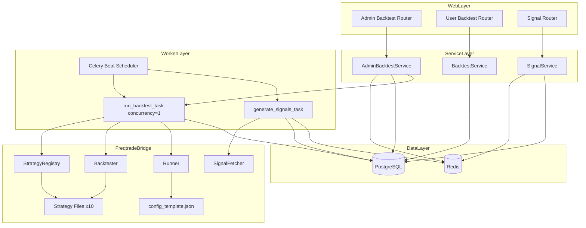
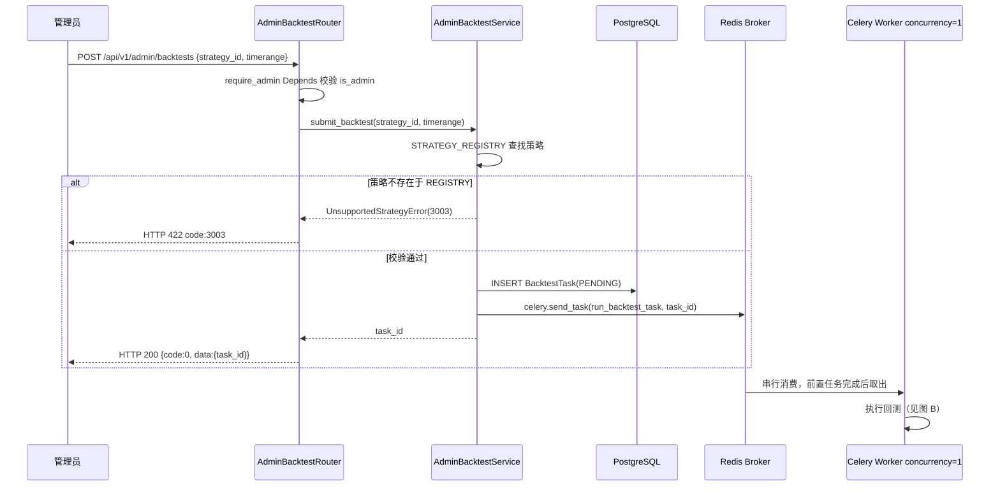
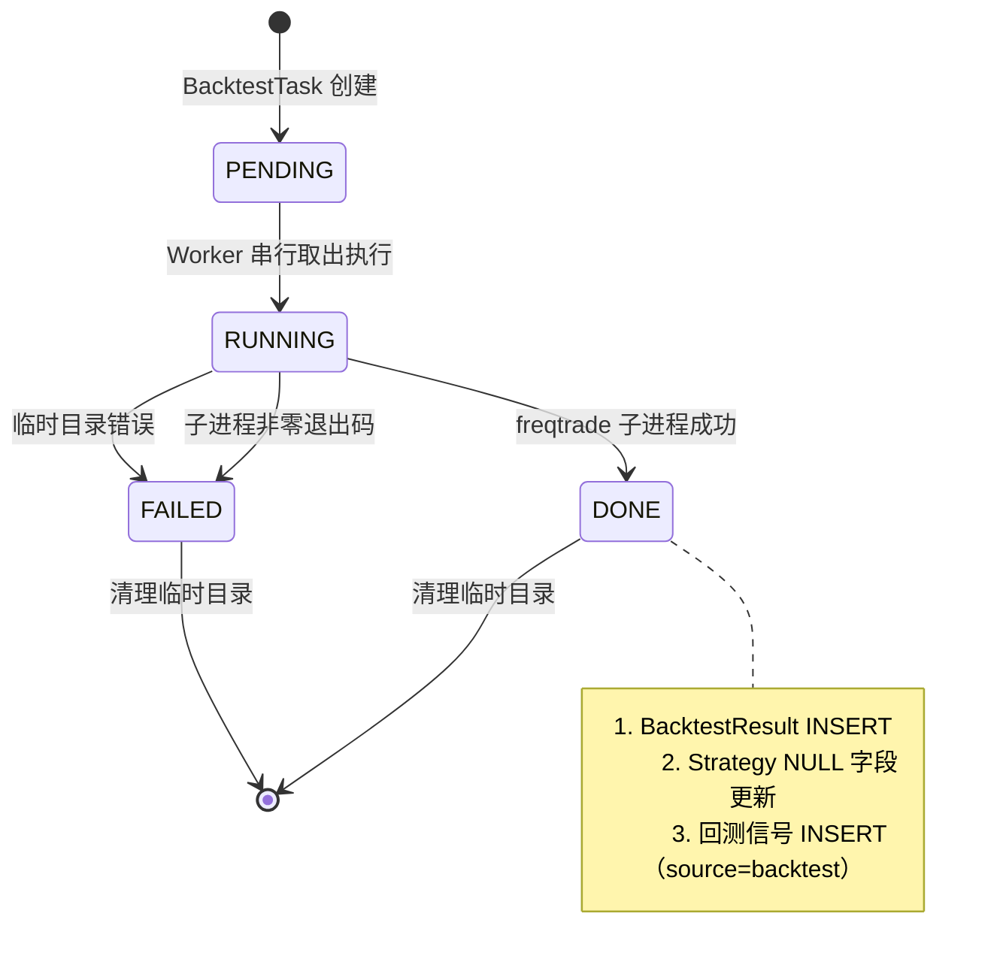
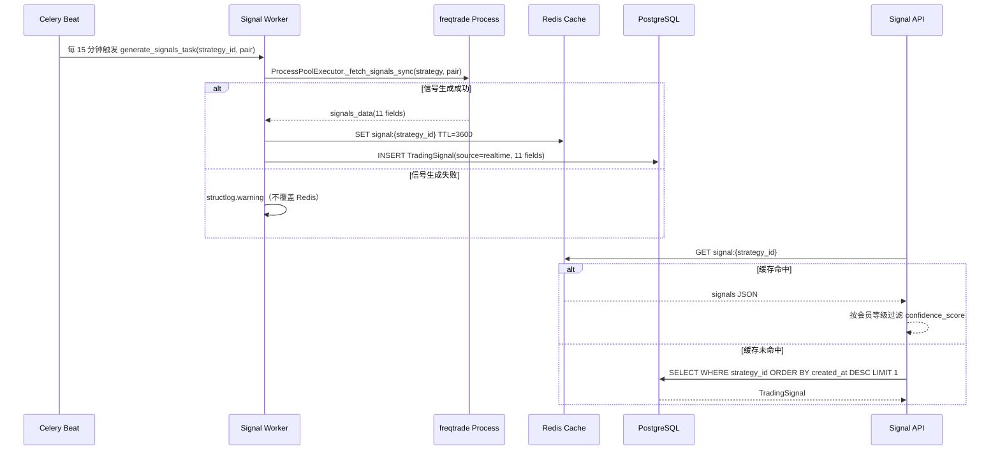
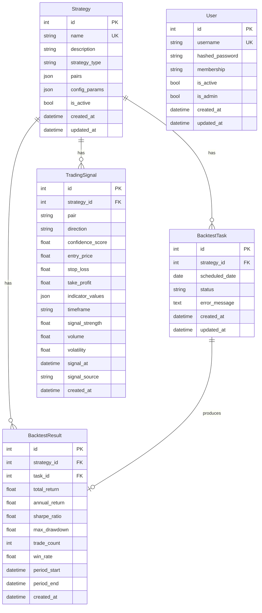
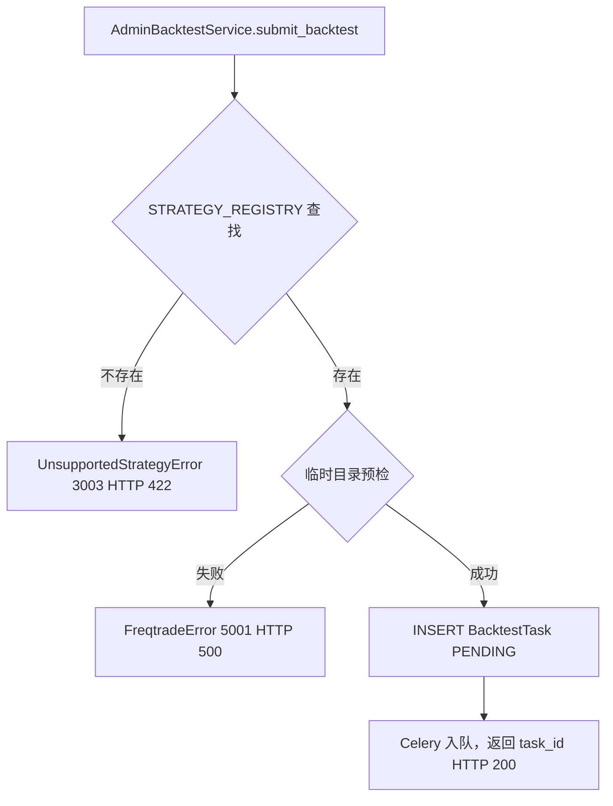

# 技术设计文档：freqtrade-integration

## 概览

本功能将 freqtrade 量化引擎与 FastAPI 后端服务进行深度集成，实现面向管理员的回测任务全生命周期管理、持久化交易信号生成、配置隔离与 MVP 阶段十大经典策略预置。所有 freqtrade 调用封装在 `src/freqtrade_bridge/` 层，通过 Celery Worker 与 FastAPI 主进程完全解耦，确保 Web 事件循环不被阻塞。

**目标用户**：平台后台运营管理员（通过管理员专属 API 触发和监控回测）、Celery 调度程序（自动生成信号）、普通/VIP 用户（只读查看策略信号与回测结果展示）。

**影响**：在现有代码库基础上新增管理员专属回测提交 API、`STRATEGY_REGISTRY` 静态注册机制、信号来源（`signal_source`）字段、扩展 `TradingSignal` 模型至 11 个字段、十个预置策略文件及种子数据，并扩展现有 `BacktestTask`/`TradingSignal` 数据模型。Celery Worker 以 `concurrency=1` 启动，确保回测任务严格串行执行。

### 目标

- 管理员可通过 `POST /api/v1/admin/backtests` 手动触发回测，HTTP 在 500ms 内响应并返回 `task_id`
- Celery Beat 每日 UTC 02:00 自动调度所有 `is_active=True` 策略的回测任务
- 回测完成后核心指标写入 `backtest_results` 表，信号以 INSERT 追加写入 `trading_signals` 表并标注来源为 `backtest`
- `STRATEGY_REGISTRY` 覆盖十个经典策略，每个策略文件可独立通过 `freqtrade backtesting` 命令执行
- 信号查询接口响应时间在 200ms 以内（优先 Redis 缓存，缓存未命中回退 PostgreSQL）
- 回测任务串行执行（concurrency=1），任意时刻最多 1 个 RUNNING，其余以 PENDING 排队；任务提交永不拒绝

### 非目标

- 不支持用户或管理员动态提交新策略代码
- 不向普通用户开放回测触发功能
- 不实现 WebSocket 推送，客户端通过轮询查询任务状态
- 不引入 freqtrade RPC API 模式（MVP 阶段复杂度不匹配）
- 不修改已存在的普通用户回测结果查询接口（`GET /api/v1/strategies/{id}/backtests` 等）

---

## 需求可追溯性

| 需求 | 摘要 | 组件 | 接口 | 流程 |
|------|------|------|------|------|
| 1.1 | 管理员权限校验，非管理员返回 code:1002 | `require_admin` Depends、`AdminBacktestService` | Admin Backtest API | 图 A：回测提交流程 |
| 1.2 | 创建 BacktestTask(PENDING)，500ms 内返回 task_id | `AdminBacktestService.submit_backtest`、`BacktestTask` 模型 | Admin Backtest API | 图 A |
| 1.3 | Celery Worker 执行 FreqtradeBridge 子进程，不在事件循环中 | `run_backtest_task`、`FreqtradeBridge.Backtester` | Celery Batch Contract | 图 A |
| 1.4 | 任务执行中更新状态为 RUNNING，记录开始时间 | `run_backtest_task` | Celery Batch Contract | 图 B：任务状态机 |
| 1.5 | 回测成功将指标写入 BacktestTask.result_json，状态置 DONE | `run_backtest_task`、`BacktestTask` 模型 | Celery Batch Contract | 图 B |
| 1.6 | DONE 后将 NULL 字段更新至策略表 | `run_backtest_task`（补充策略字段更新逻辑） | Celery Batch Contract | 图 B |
| 1.7 | 子进程失败置 FAILED，返回 code:5001 | `FreqtradeBridge.Backtester`、`AdminBacktestService` | Service Interface | 图 B |
| 1.8 | 串行队列：concurrency=1，同时仅 1 个 RUNNING，其余 PENDING 排队；无超时强制终止 | `celery_app.py`（concurrency=1）、`run_backtest_task` | Celery Batch Contract | 图 B |
| 1.9 | 重复提交以 PENDING 状态入队，不拒绝，不返回 code:3002 | `AdminBacktestService.submit_backtest`（仅注册表校验，不做 RUNNING 计数守卫） | Admin Backtest API | — |
| 2.1 | 信号生成间隔不超过配置刷新周期（默认 5 分钟） | `celery_app.py` Beat 计划（可配置） | Celery Batch Contract | — |
| 2.2 | 信号在 ProcessPoolExecutor 中生成 | `SignalFetcher` | Service Interface | — |
| 2.3 | 信号以 INSERT 追加写入，11 个字段：pair、direction、confidence_score、entry_price、stop_loss、take_profit、indicator_values、timeframe、signal_strength、volume、volatility | `generate_signals_task`、`TradingSignal` 模型 | DB Contract | — |
| 2.4 | trading_signals 只增不删时序表 | `TradingSignal` 模型（无 updated_at，无 upsert） | DB Contract | — |
| 2.5 | 回测产生的信号追加写入并标记 source=backtest | `run_backtest_task` 补充逻辑、`TradingSignal.signal_source` | DB Contract | — |
| 2.6 | 多交易对并发，最大进程数配置控制（默认 2） | `SignalFetcher._executor`（max_workers=2） | Service Interface | — |
| 2.7 | 信号失败记录日志，不影响 API 响应 | `generate_signals_task` | — | — |
| 2.8 | 信号查询按 created_at 降序取最新一条，200ms 内 | `SignalService`（优先 Redis） | Signal API | — |
| 2.9 | 信号生成结构化日志（structlog JSON） | `generate_signals_task` | — | — |
| 3.1 | 任务隔离目录 `/tmp/freqtrade_jobs/{task_id}/` | `FreqtradeBridge.Runner` | Batch Contract | — |
| 3.2 | config.json 不含敏感字段，从环境变量注入 | `Runner.generate_config` | Batch Contract | — |
| 3.3 | 任务结束后清理临时目录 | `Runner.cleanup_task_dir` | Batch Contract | — |
| 3.4 | 临时目录创建失败返回 code:5001 | `AdminBacktestService.submit_backtest` 预检 | Service Interface | — |
| 3.5 | `STRATEGY_REGISTRY` 三元映射 | `StrategyRegistry` 模块（新增） | Service Interface | — |
| 3.6 | 策略文件复制到 strategy/ 子目录 | `run_backtest_task`（扩展逻辑） | Batch Contract | — |
| 3.7 | 策略不在注册表返回 code:3003 | `AdminBacktestService`、`UnsupportedStrategyError` | Admin Backtest API | — |
| 3.8 | freqtrade 逻辑封装在 freqtrade_bridge/ | 整体架构约束（单向依赖） | — | — |
| 3.9 | 多 Worker 实例 task_id 路径唯一 | `BacktestTask.id`（自增主键） | — | — |
| 4.1 | `GET /admin/backtests/{task_id}`，仅管理员 | `AdminBacktestService`、Admin Backtest API | Admin Backtest API | — |
| 4.2 | 非管理员查询返回 code:1002 | `require_admin` Depends | Admin Backtest API | — |
| 4.3 | task_id 不存在返回 code:3001 | `AdminBacktestService.get_task` | Admin Backtest API | — |
| 4.4 | `GET /admin/backtests` 列表，分页+筛选 | `AdminBacktestService.list_tasks` | Admin Backtest API | — |
| 4.5 | DONE 状态返回完整六项指标 | `BacktestTaskRead` Schema（管理员视图无字段裁剪） | Admin Backtest API | — |
| 5.1 | 错误封装为 FreqtradeExecutionError | `FreqtradeBridge.exceptions` | Service Interface | — |
| 5.2 | 捕获后置 FAILED，返回 code:5001 信封 | `run_backtest_task` | Service Interface | — |
| 5.3 | stderr 写入 error_message（截断 2000 字符） | `Backtester` | — | — |
| 5.4 | 结构化日志 task_id/strategy/耗时/退出码 | `Backtester` | — | — |
| 5.5 | 任务始终可入队，不因队列积压而拒绝 | `AdminBacktestService`（移除全局 RUNNING 守卫） | Admin Backtest API | — |
| 6.1 | freqtrade_bridge 不依赖 api/ 层 | 架构约束（单向依赖） | — | — |
| 6.2 | Celery Worker 独立进程，通过 Redis broker 通信 | `celery_app.py` | — | — |
| 6.3 | 路由层仅入队，立即返回 task_id | Admin Backtest API 路由（非阻塞） | Admin Backtest API | — |
| 6.4 | CPU 密集型操作在独立进程中 | `Backtester`（subprocess）、`SignalFetcher`（ProcessPoolExecutor） | — | — |
| 6.5 | Worker Redis broker 地址通过环境变量配置 | `celery_app.py` | — | — |
| 7.1 | 十个策略文件在 strategies/ 目录 | `StrategyFiles`（新增） | — | — |
| 7.2 | 每个策略实现三个核心方法 | `StrategyFiles` | — | — |
| 7.3 | `STRATEGY_REGISTRY` 覆盖十个策略 | `StrategyRegistry` 模块 | Service Interface | — |
| 7.4 | STRATEGY_REGISTRY 正确解析类名和文件路径 | `StrategyRegistry` 模块 | — | — |
| 7.5 | config_template.json 四个主流币种 + 占位符 | `ConfigTemplate`（新增） | — | — |
| 7.6 | 种子数据脚本幂等批量插入十条策略记录 | `SeedData` 模块（新增） | — | — |
| 7.7 | 同名策略已存在则跳过 | `SeedData` 模块 | — | — |
| 7.8 | 策略文件 populate_indicators 包含所有所需指标 | `StrategyFiles` | — | — |
| 7.9 | 所有文件纳入 Git 追踪 | 代码仓库管理约束 | — | — |

---

## 架构

### 现有架构分析

项目已完成以下基础设施：

- **`src/freqtrade_bridge/`**：`exceptions.py`（自定义异常）、`runner.py`（配置生成与目录清理）、`backtester.py`（`run_backtest_subprocess` 子进程封装）、`signal_fetcher.py`（进程池框架，核心逻辑待实现）
- **`src/models/`**：`BacktestTask`、`BacktestResult`、`TradingSignal`（字段待扩展）、`Strategy`
- **`src/workers/`**：Celery 应用、双队列、Beat 计划、`run_backtest_task`（含幂等守卫和状态流转）、`generate_signals_task`（含 Redis+DB 持久化）
- **`src/services/`**：`BacktestService`（只读）、`SignalService`（Redis 优先）
- **`src/api/`**：普通用户回测查询路由、信号查询路由
- **`src/core/`**：完整异常体系、`require_membership` Depends、统一响应信封

**现有代码的关键局限**：
1. 无管理员专属 API 路由（`/admin/backtests`）及对应服务层
2. `User` 模型无 `is_admin` 字段，无管理员鉴权 Depends
3. 无 `STRATEGY_REGISTRY` 机制，`run_backtest_task` 尚未查找策略文件路径
4. `TradingSignal` 缺少 `signal_source` 字段及扩展的 11 个信号字段（`entry_price`、`stop_loss`、`take_profit`、`indicator_values`、`timeframe`、`signal_strength`、`volume`、`volatility`）
5. 无十个策略文件、`config_template.json`、种子数据脚本
6. `run_backtest_task` 未将回测信号追加写入 `trading_signals`
7. 无 `UnsupportedStrategyError(code=3003)` 错误类
8. `celery_app.py` 的 `backtest` 队列 Worker 须改为 `concurrency=1`

### 架构模式与边界图



**关键约束**：
- `FreqtradeBridge` 层不引用 `src/api/` 中的任何 `Request`/`Response`/`APIRouter` 对象（单向依赖）
- Celery `backtest` 队列 Worker 以 `concurrency=1` 启动，任意时刻只有 1 个回测任务 RUNNING，其余在 Celery 内部队列排队
- 管理员 API 路由层仅入队，立即返回 `task_id`，不等待回测执行结果
- 任务提交不进行 RUNNING 状态计数守卫，不因队列积压拒绝新任务

### 技术栈

| 层级 | 选型/版本 | 在本功能中的角色 | 备注 |
|------|-----------|-----------------|------|
| 后端/服务层 | FastAPI（现有） | 管理员回测 API 路由、鉴权 Depends | 新增 `admin` 前缀路由 |
| 业务逻辑层 | Python 3.10+ | `AdminBacktestService`（新增）、`BacktestService`（扩展） | 无 HTTP 依赖 |
| 数据/存储层 | PostgreSQL + SQLAlchemy 2.x | BacktestTask/BacktestResult/TradingSignal 持久化 | 新增 `is_admin`、`signal_source` 及扩展信号字段迁移 |
| 消息/事件层 | Celery + Redis（现有，backtest 队列 concurrency=1） | 回测任务串行调度、信号 Beat 调度 | 新增策略文件查找逻辑，回测 Worker 限单并发 |
| 量化引擎层 | freqtrade（INTERFACE_VERSION=3） | 回测子进程、信号生成进程池 | 新增十个策略文件 |
| 缓存层 | Redis（现有） | 信号热缓存（TTL=3600s）、Celery broker | 现有实现无需变更 |
| 配置管理层 | pydantic-settings（现有） | `SIGNAL_REFRESH_INTERVAL` 可配置 | 移除 `RUNNING_BACKTEST_LIMIT` 环境变量 |
| 日志 | structlog 24.0+（现有） | 所有 freqtrade 调用的结构化 JSON 日志 | 现有实现无需变更 |

---

## 系统流程

### 图 A：管理员手动触发回测流程



> 关键决策：任务提交仅校验 `STRATEGY_REGISTRY` 注册表，不检查当前 RUNNING 任务数。串行保证由 Celery `concurrency=1` 在 Worker 侧实现，而非在服务层拒绝请求。管理员重复提交同一策略的回测请求时，新任务以 PENDING 状态进入 Celery 队列排队等待，绝不返回 `code: 3002`。

### 图 B：Celery Worker 回测任务状态机



> 状态机移除了旧设计中的"超时 600s → FAILED"分支。回测子进程无强制超时，任务运行至自然结束（成功或失败）。

### 图 C：信号生成与查询流程



---

## 组件与接口

### 组件汇总

| 组件 | 层级 | 意图 | 需求覆盖 | 关键依赖（P0/P1） | 合同类型 |
|------|------|------|----------|-------------------|----------|
| `require_admin` Depends | core/deps | 管理员身份校验，非管理员抛 PermissionError | 1.1, 4.2 | `User.is_admin`(P0) | Service |
| `UnsupportedStrategyError` | core/exceptions | code=3003 策略不支持错误 | 3.7 | — | — |
| `AdminBacktestService` | services | 管理员回测任务提交（注册表校验 + 无条件入队）、查询、列表 | 1.1–1.9, 4.1–4.5, 5.5 | `BacktestTask`(P0), `StrategyRegistry`(P0) | Service, API |
| Admin Backtest Router | api | 管理员专属回测 HTTP 端点 | 1.1, 1.2, 4.1, 4.3, 4.4 | `AdminBacktestService`(P0) | API |
| `StrategyRegistry` 模块 | freqtrade_bridge | STRATEGY_REGISTRY 三元映射，策略查找 | 3.5, 3.7, 7.3, 7.4 | `StrategyFiles`(P0) | Service |
| `StrategyFiles` | freqtrade_bridge/strategies | 十个 freqtrade IStrategy 实现文件 | 7.1, 7.2, 7.8, 7.9 | freqtrade(P0), pandas-ta(P0) | Batch |
| `ConfigTemplate` | freqtrade_bridge | 带占位符的 config_template.json | 7.5 | — | — |
| `SeedData` 模块 | freqtrade_bridge/seeds | 幂等批量插入十条策略种子数据 | 7.6, 7.7 | `Strategy` 模型(P0) | Batch |
| `User.is_admin` 字段扩展 | models/user | 布尔型管理员标记，Alembic 迁移 | 1.1, 4.2 | — | State |
| `TradingSignal` 模型扩展 | models/signal | 新增 signal_source + 8 个扩展信号字段，Alembic 迁移 | 2.3, 2.4, 2.5 | — | State |
| `run_backtest_task` 扩展 | workers/tasks | 补充策略文件复制、回测信号写入、Strategy NULL 字段更新；无超时限制 | 1.4–1.6, 1.8, 2.5, 3.1, 3.6 | `StrategyRegistry`(P0) | Batch |
| `_fetch_signals_sync` 实现 | freqtrade_bridge/signal_fetcher | 完成 freqtrade 信号逻辑（当前为占位），输出 11 字段信号数据 | 2.1, 2.2, 2.3 | freqtrade IStrategy(P0) | Service |

---

### freqtrade_bridge 层

#### StrategyRegistry 模块

| 字段 | 详情 |
|------|------|
| 意图 | 维护数据库策略名 ↔ freqtrade 类名 ↔ 策略文件路径的三元静态映射 |
| 需求 | 3.5, 3.6, 3.7, 7.3, 7.4 |

**职责与约束**
- 提供 `STRATEGY_REGISTRY: dict[str, StrategyRegistryEntry]` 全局常量，键为数据库 `Strategy.name` 字段值
- `StrategyRegistryEntry` 为 `TypedDict`，包含 `class_name: str` 和 `file_path: Path`
- `file_path` 在模块加载时解析为绝对路径（基于 `__file__`），确保路径指向实际存在的文件
- 提供 `lookup(strategy_name: str) -> StrategyRegistryEntry` 辅助函数，策略名不存在时抛 `UnsupportedStrategyError`

**依赖**
- 入站：`AdminBacktestService`、`run_backtest_task` — 通过 `lookup()` 查找策略文件路径（P0）
- 出站：`src/freqtrade_bridge/strategies/` 目录下的十个策略文件（P0）
- 外部：无

**合同**：Service [x] / API [ ] / Event [ ] / Batch [ ] / State [ ]

##### Service Interface
```python
from typing import TypedDict
from pathlib import Path

class StrategyRegistryEntry(TypedDict):
    class_name: str      # freqtrade 策略类名，如 "TurtleTrading"
    file_path: Path      # 策略文件绝对路径

# 全局常量，覆盖十个策略：TurtleTrading、BollingerMeanReversion、RsiMeanReversion、
# MacdTrend、IchimokuTrend、ParabolicSarTrend、KeltnerBreakout、AroonTrend、Nr7Breakout、StochasticReversal
STRATEGY_REGISTRY: dict[str, StrategyRegistryEntry]

def lookup(strategy_name: str) -> StrategyRegistryEntry:
    """
    Raises:
        UnsupportedStrategyError: strategy_name 不在 STRATEGY_REGISTRY 中
    """
```

- 前置条件：`strategy_name` 为非空字符串
- 后置条件：返回的 `file_path` 指向实际存在的文件
- 不变量：`STRATEGY_REGISTRY` 在进程生命周期内不可变（纯 Python 常量）

**实现注意事项**
- 风险：策略文件被意外删除时 `file_path` 指向不存在的文件，需在 `lookup()` 中验证文件存在性并记录告警日志

---

#### StrategyFiles（十个策略文件）

| 字段 | 详情 |
|------|------|
| 意图 | 预置十个经典量化策略的 freqtrade IStrategy 实现，供回测和信号生成调用 |
| 需求 | 7.1, 7.2, 7.8, 7.9 |

**职责与约束**
- 每个文件对应一个独立 `IStrategy` 子类，声明 `INTERFACE_VERSION = 3`
- 三个必须实现的方法：`populate_indicators`、`populate_entry_trend`、`populate_exit_trend`
- 信号列使用 `enter_long` / `exit_long`（freqtrade v3 接口），不使用旧版 `buy`/`sell`
- 指标计算仅使用 freqtrade 内置的 `pandas-ta`，不引入额外依赖
- 每个文件可独立通过 `freqtrade backtesting --strategy <ClassName>` 执行而不报错

**十个策略类名与对应文件**

| # | 策略名（STRATEGY_REGISTRY 键） | 类名 | 策略类别 | 文件名 |
|---|-------------------------------|------|----------|--------|
| 1 | TurtleTrading | TurtleTrading | trend_following | turtle_trading.py |
| 2 | BollingerMeanReversion | BollingerMeanReversion | mean_reversion | bollinger_mean_reversion.py |
| 3 | RsiMeanReversion | RsiMeanReversion | mean_reversion | rsi_mean_reversion.py |
| 4 | MacdTrend | MacdTrend | trend_following | macd_trend.py |
| 5 | IchimokuTrend | IchimokuTrend | trend_following | ichimoku_trend.py |
| 6 | ParabolicSarTrend | ParabolicSarTrend | trend_following | parabolic_sar_trend.py |
| 7 | KeltnerBreakout | KeltnerBreakout | breakout | keltner_breakout.py |
| 8 | AroonTrend | AroonTrend | trend_following | aroon_trend.py |
| 9 | Nr7Breakout | Nr7Breakout | breakout | nr7_breakout.py |
| 10 | StochasticReversal | StochasticReversal | mean_reversion | stochastic_reversal.py |

**合同**：Service [ ] / API [ ] / Event [ ] / Batch [x] / State [ ]

##### Batch / Job Contract
- 触发：`run_backtest_task` 通过 `StrategyRegistry.lookup()` 获取路径后，以文件复制方式放入任务临时目录
- 输入：freqtrade config.json + 策略文件
- 输出：freqtrade 标准 JSON 回测结果（`total_return`、`annual_return`、`sharpe_ratio`、`max_drawdown`、`trade_count`、`win_rate`）
- 幂等性：策略文件为静态只读，每次复制均幂等

---

#### ConfigTemplate

| 字段 | 详情 |
|------|------|
| 意图 | 提供带占位符的 freqtrade 默认配置模板，由 Runner 在任务创建时注入实际参数 |
| 需求 | 7.5 |

**职责与约束**
- 文件位置：`src/freqtrade_bridge/config_template.json`
- 包含四个默认交易对：`BTC/USDT`、`ETH/USDT`、`BNB/USDT`、`SOL/USDT`
- 时间周期默认 `1h`
- 回测日期范围以占位符表示：`"timerange": "{{TIMERANGE}}"`
- 不包含任何交易所 API Key 或账户凭证

---

#### SeedData 模块

| 字段 | 详情 |
|------|------|
| 意图 | 幂等批量插入十条经典策略种子数据，供 MVP 阶段端到端验证 |
| 需求 | 7.6, 7.7 |

**职责与约束**
- 位置：`src/freqtrade_bridge/seeds/seed_strategies.py`
- 使用 SQLAlchemy 同步 session（适用于迁移脚本或 CLI 调用）
- 以 `Strategy.name` 唯一性检测幂等：若同名记录已存在则跳过（不 UPDATE）
- `name` 字段值与 `STRATEGY_REGISTRY` 键名完全一致
- 每条记录包含 `name`、`description`、`category` 字段，`category` 取值为 `trend_following`、`mean_reversion` 或 `breakout`
- 提供 pytest fixture 可选形式（`tests/fixtures/strategy_fixtures.py`）

**合同**：Service [ ] / API [ ] / Event [ ] / Batch [x] / State [ ]

##### Batch / Job Contract
- 触发：CLI 脚本或 pytest fixture 手动调用
- 输入：无外部输入，数据内嵌于脚本
- 输出：`strategies` 表中最多新增十条记录（含 `name`、`description`、`category` 三字段）
- 幂等性：`INSERT ... ON CONFLICT DO NOTHING` 或先 SELECT 再按需 INSERT

---

### 业务逻辑层（services）

#### AdminBacktestService

| 字段 | 详情 |
|------|------|
| 意图 | 管理员回测任务提交（仅注册表校验，无 RUNNING 计数守卫，永不拒绝入队）、任务状态查询、任务列表查询 |
| 需求 | 1.1–1.9, 4.1–4.5, 5.5 |

**职责与约束**
- 提交前执行单级守卫：`STRATEGY_REGISTRY` 策略查找（不存在则 `UnsupportedStrategyError(3003)`）
- 不检查 RUNNING 任务数，不对队列积压进行任何限流或拒绝
- 创建 `BacktestTask(PENDING)` 后通过 `celery_app.send_task` 异步入队，不等待结果
- 串行执行由 Celery Worker `concurrency=1` 保证，服务层不重复实施
- 所有查询方法仅供管理员调用，服务层不重复校验权限（由路由层 `require_admin` Depends 保证）
- 任务列表支持按 `strategy_name`、`status` 过滤，按 `created_at` 降序分页

**依赖**
- 入站：Admin Backtest Router — 通过 FastAPI Depends 注入（P0）
- 出站：`BacktestTask` 模型（P0）、`Strategy` 模型（P1）、`StrategyRegistry.lookup()`（P0）
- 外部：Celery `send_task`（P0）、PostgreSQL AsyncSession（P0）

**合同**：Service [x] / API [ ] / Event [ ] / Batch [ ] / State [ ]

##### Service Interface
```python
class AdminBacktestService:
    async def submit_backtest(
        self,
        db: AsyncSession,
        strategy_id: int,
        timerange: str,
    ) -> BacktestTask:
        """
        校验策略在 STRATEGY_REGISTRY 中存在，随即创建 BacktestTask(PENDING) 并入队。
        不检查 RUNNING 任务数；不返回 code:3002。

        Raises:
            UnsupportedStrategyError: 策略不在 STRATEGY_REGISTRY（code=3003, HTTP 422）
            FreqtradeError: 临时目录预检失败（code=5001, HTTP 500）
        """

    async def get_task(
        self,
        db: AsyncSession,
        task_id: int,
    ) -> BacktestTask:
        """
        Raises:
            NotFoundError: task_id 不存在（code=3001, HTTP 404）
        """

    async def list_tasks(
        self,
        db: AsyncSession,
        page: int,
        page_size: int,
        strategy_name: str | None,
        status: TaskStatus | None,
    ) -> tuple[list[BacktestTask], int]:
        """Returns (tasks, total)"""
```

- 前置条件：调用方已通过 `require_admin` 校验
- 后置条件：`submit_backtest` 返回后，`BacktestTask` 已写入 DB 且 Celery 任务已入队
- 不变量：`(strategy_id, scheduled_date)` 唯一约束由 DB 层保证（同日同策略防重，但不跨日阻塞）

**实现注意事项**
- 移除旧设计中的策略级 RUNNING 计数查询和全局 RUNNING 计数查询，两次数据库查询均不再执行
- 并发安全由 `concurrency=1` 的 Celery Worker 保证；若同日重复提交，DB 唯一约束 `(strategy_id, scheduled_date)` 作为最终防线返回 DB 错误，与 `code:3002` 无关

---

### 路由层（api）

#### Admin Backtest Router

| 字段 | 详情 |
|------|------|
| 意图 | 提供管理员专属回测任务的 HTTP 端点，所有接口需 `require_admin` 鉴权 |
| 需求 | 1.1, 1.2, 1.9, 4.1, 4.3, 4.4, 4.5, 5.5, 6.3 |

**合同**：Service [ ] / API [x] / Event [ ] / Batch [ ] / State [ ]

##### API Contract

| 方法 | 端点 | 请求 | 响应 | 错误 |
|------|------|------|------|------|
| POST | /api/v1/admin/backtests | `BacktestSubmitRequest` | `ApiResponse[BacktestTaskRead]` | 1002(403), 3003(422), 5001(500) |
| GET | /api/v1/admin/backtests | `?page=1&page_size=20&strategy_name=&status=` | `ApiResponse[PaginatedData[BacktestTaskRead]]` | 1002(403) |
| GET | /api/v1/admin/backtests/{task_id} | — | `ApiResponse[BacktestTaskRead]` | 1002(403), 3001(404) |

> POST 端点错误码中不再包含 `3002`（队列积压不拒绝）。

**请求/响应 Schema**：

```python
class BacktestSubmitRequest(BaseModel):
    strategy_id: int
    timerange: str          # 格式："20240101-20241231"

class BacktestTaskRead(BaseModel):
    id: int
    strategy_id: int
    scheduled_date: date
    status: TaskStatus
    error_message: str | None
    result_summary: BacktestResultSummary | None   # 仅 DONE 状态时非 None
    created_at: datetime
    updated_at: datetime

    model_config = {"from_attributes": True}

class BacktestResultSummary(BaseModel):
    total_return: float
    annual_return: float
    sharpe_ratio: float
    max_drawdown: float
    trade_count: int
    win_rate: float
```

**实现注意事项**
- 路由文件位置：`src/api/admin_backtests.py`，注册到 `main_router.py` 中前缀 `/api/v1`
- 所有端点通过 `Depends(require_admin)` 强制管理员鉴权
- POST 端点：调用 `AdminBacktestService.submit_backtest`，立即返回 `BacktestTaskRead`（status=PENDING）

---

### 数据模型层（models）

#### User 模型扩展

| 字段 | 详情 |
|------|------|
| 意图 | 新增 `is_admin` 布尔字段，区分管理员与普通用户 |
| 需求 | 1.1, 4.2 |

**合同**：Service [ ] / API [ ] / Event [ ] / Batch [ ] / State [x]

##### State Management
- 新增字段：`is_admin: Mapped[bool] = mapped_column(Boolean, nullable=False, default=False, server_default='false')`
- 通过 Alembic 迁移添加，存量用户默认 `is_admin=False`，无需数据补丁
- `src/core/deps.py` 新增 `require_admin` Depends，校验 `user.is_admin is True`，否则抛 `PermissionError(1002)`

```python
# src/core/deps.py 新增
async def require_admin(
    current_user: Any = Depends(get_current_user),
) -> Any:
    """
    Raises:
        PermissionError: user.is_admin 为 False（code=1002, HTTP 403）
    """
    if not current_user.is_admin:
        raise PermissionError("需要管理员权限")
    return current_user
```

---

#### TradingSignal 模型扩展

| 字段 | 详情 |
|------|------|
| 意图 | 新增 `signal_source` 字段（区分来源）及 8 个扩展信号字段，使 TradingSignal 完整支持 11 个信号维度 |
| 需求 | 2.3, 2.4, 2.5 |

**合同**：Service [ ] / API [ ] / Event [ ] / Batch [ ] / State [x]

##### State Management

现有字段（保留不变）：`id`、`strategy_id`、`pair`、`direction`、`confidence_score`、`signal_at`、`created_at`

新增字段（本次迁移）：

| 字段名 | 类型 | 说明 | 可为 NULL |
|--------|------|------|-----------|
| `signal_source` | `String(16)` | 信号来源：`realtime` 或 `backtest`，`server_default='realtime'` | 否 |
| `entry_price` | `Float` | 建议入场价格 | 是 |
| `stop_loss` | `Float` | 建议止损价格 | 是 |
| `take_profit` | `Float` | 建议止盈价格 | 是 |
| `indicator_values` | `JSON` | 技术指标快照（RSI、MACD、布林带宽等） | 是 |
| `timeframe` | `String(8)` | 信号时间周期，如 `1h` | 是 |
| `signal_strength` | `Float` | 归一化信号强度 | 是 |
| `volume` | `Float` | 对应 K 线成交量 | 是 |
| `volatility` | `Float` | 波动率指标 | 是 |

- 所有新字段允许 NULL，确保现有 `generate_signals_task` 写入路径兼容（旧路径暂不传入扩展字段时不会报错）
- 新路径（信号生成逻辑更新后）应显式传入全部 11 个字段
- `signal_source` 通过 Alembic 迁移添加，存量记录 `server_default='realtime'`，语义准确
- `generate_signals_task` 写入时显式传入 `signal_source='realtime'`
- `run_backtest_task` 写入回测信号时显式传入 `signal_source='backtest'`

---

#### run_backtest_task 扩展

| 字段 | 详情 |
|------|------|
| 意图 | 在现有回测任务流程中补充：策略文件复制、回测信号追加写入、策略 NULL 字段更新；移除超时强制终止逻辑 |
| 需求 | 1.4–1.6, 1.8, 2.5, 3.1, 3.6 |

**合同**：Service [ ] / API [ ] / Event [ ] / Batch [x] / State [ ]

##### Batch / Job Contract（扩展现有实现）
- **触发**：Celery Beat（每日 UTC 02:00）或管理员 API `submit_backtest` 入队；Worker `concurrency=1`，串行消费
- **输入验证**：通过 `StrategyRegistry.lookup(strategy.name)` 获取策略文件路径；失败则置 FAILED
- **超时**：无强制超时；`run_backtest_subprocess` 调用中不传入 `timeout` 参数，任务运行至自然结束
- **任务目录结构**（新增子目录）：
  ```
  /tmp/freqtrade_jobs/{task_id}/
  ├── config.json            # Runner.generate_config 生成
  ├── strategy/              # 策略文件（从 STRATEGY_REGISTRY 路径复制）
  │   └── {StrategyClass}.py
  └── results/               # freqtrade 输出目录
  ```
- **DONE 后新增步骤**：
  1. 将回测产生的交易信号（从 `backtest_output["signals"]`）以 INSERT 方式追加写入 `trading_signals`，`signal_source='backtest'`，并填充可用的扩展字段
  2. 对策略表（`Strategy`）中 `total_return`、`annual_return`、`sharpe_ratio`、`max_drawdown`、`trade_count`、`win_rate` 六个字段，若当前值为 `NULL` 则更新为回测结果值，若已有值则跳过
- **幂等性与恢复**：`acks_late=True`，最多重试 3 次；`(strategy_id, scheduled_date)` 唯一约束防止同日重复创建任务记录

---

### core 层

#### 新增异常：UnsupportedStrategyError

```python
class UnsupportedStrategyError(AppError):
    """策略不支持（code=3003），策略 ID 或名称不在 STRATEGY_REGISTRY 中。"""
    code = 3003
    default_message = "策略不受支持，请联系管理员"
```

HTTP 状态码映射：`exception_handlers.py` 中 `AppError` 统一处理器中为 `code=3003` 映射 HTTP 422。

---

## 数据模型

### 领域模型

**聚合根**：
- `Strategy`：量化策略，包含 `is_active` 标记和 `config_params`；通过 `STRATEGY_REGISTRY` 键名与 freqtrade 类名绑定
- `BacktestTask`：回测任务聚合根，生命周期 PENDING → RUNNING → DONE/FAILED；拥有 `BacktestResult` 值对象

**实体**：
- `BacktestTask`：任务生命周期状态机，含任务元数据和错误信息
- `BacktestResult`：回测六项核心指标，1:1 关联 `BacktestTask`
- `TradingSignal`：只增不删时序信号，含来源标记及 11 个完整信号字段

**业务规则**：
- 同一策略同日不得重复创建 `BacktestTask`（DB 唯一约束）
- `TradingSignal` 禁止 UPDATE/DELETE（仅 INSERT 追加）
- `Strategy` 指标字段仅在为 NULL 时由回测结果填充（不覆盖已有值）
- 任意时刻 Celery `backtest` 队列中最多 1 个任务处于 RUNNING 状态（由 `concurrency=1` 保证，非服务层约束）

### 逻辑数据模型



### 物理数据模型

**新增迁移（Alembic）**：

迁移 1：`xxx_add_is_admin_to_users.py`
```sql
ALTER TABLE users
ADD COLUMN is_admin BOOLEAN NOT NULL DEFAULT FALSE;
```

迁移 2：`xxx_extend_trading_signals.py`
```sql
ALTER TABLE trading_signals
ADD COLUMN signal_source VARCHAR(16) NOT NULL DEFAULT 'realtime',
ADD COLUMN entry_price FLOAT,
ADD COLUMN stop_loss FLOAT,
ADD COLUMN take_profit FLOAT,
ADD COLUMN indicator_values JSONB,
ADD COLUMN timeframe VARCHAR(8),
ADD COLUMN signal_strength FLOAT,
ADD COLUMN volume FLOAT,
ADD COLUMN volatility FLOAT;
```

**现有索引**（无需变更）：
- `backtest_tasks`：`idx_btask_strategy_status(strategy_id, status)` — 支持状态查询
- `trading_signals`：`idx_signal_strategy_at(strategy_id, signal_at)` — 支持最新信号查询

**新增索引**：
- `trading_signals`：`idx_signal_strategy_source(strategy_id, signal_source)` — 支持按来源筛选查询

### 数据合同与集成

**API 数据传输**：
- 请求体：`BacktestSubmitRequest`（`strategy_id: int`，`timerange: str` 格式校验：`YYYYMMDD-YYYYMMDD`）
- 响应体：`BacktestTaskRead`（含任务状态和 `result_summary`，管理员视图无字段裁剪）
- 序列化格式：JSON，时间字段 ISO 8601 UTC

**跨服务数据管理**：
- FastAPI 主进程与 Celery Worker 通过 Redis broker 传递 `task_id` 和 `strategy_id`，无共享内存
- Worker 写入 PostgreSQL 使用同步 `psycopg2` session（`SyncSessionLocal`）

---

## 错误处理

### 错误策略

所有 freqtrade 执行错误在 `FreqtradeBridge` 层封装，不向上泄漏内部异常类型。服务层捕获 `FreqtradeExecutionError` 后更新任务状态为 FAILED，通过统一信封返回业务错误码。`FreqtradeTimeoutError` 在本设计中不再作为主动触发条件（无强制超时），仅保留异常类定义以兼容可能的 freqtrade 内部超时场景。

### 错误分类与响应

**用户错误（4xx）**：
- `1001`（401）：未登录或 token 无效
- `1002`（403）：非管理员尝试访问管理员专属 API
- `2001`（422）：请求参数校验失败（`timerange` 格式错误等）
- `3001`（404）：task_id 不存在
- `3003`（422）：策略不在 STRATEGY_REGISTRY

**系统错误（5xx）**：
- `5001`（500）：freqtrade 调用失败（子进程非零退出码、临时目录创建失败）

> `3002`（队列冲突/超限）已从错误码体系中移除。任务提交不拒绝，无需此错误码。

**错误流程**：



### 监控

- 所有 freqtrade 调用通过 `structlog` 记录 JSON 格式日志：`task_id`、`strategy`、`exit_code`、`duration_ms`、`signal_source`
- FAILED 状态任务通过 `structlog.warning` 记录，管理员可通过 `GET /admin/backtests?status=failed` 检索
- `BacktestTask.error_message` 存储截断至 2000 字符的 stderr 内容，用于问题定位

---

## 测试策略

### 单元测试

- `StrategyRegistry.lookup()`：测试十个有效策略名各返回正确 `class_name` 和存在的 `file_path`；测试无效策略名抛 `UnsupportedStrategyError`
- `AdminBacktestService.submit_backtest`：Mock `StrategyRegistry.lookup`、Mock `BacktestTask` 插入、Mock `celery.send_task`；验证合法策略直接入队（不检查 RUNNING 数）；验证不支持策略返回 3003
- `require_admin` Depends：测试 `is_admin=True` 通过、`is_admin=False` 抛 `PermissionError(1002)`
- `SeedData` 模块：测试幂等性（同名记录不重复插入）
- `run_backtest_task`：验证无 `timeout` 参数传入 `run_backtest_subprocess`

### 集成测试

- `POST /api/v1/admin/backtests`：非管理员用户返回 403；管理员提交有效请求返回 200 + `task_id`；策略不存在返回 422；重复提交同策略返回 200（不返回 409）
- `GET /api/v1/admin/backtests/{task_id}`：正常返回任务详情；不存在返回 404
- `run_backtest_task`（集成，使用 Mock freqtrade）：验证 PENDING → RUNNING → DONE 状态流转、`BacktestResult` 正确写入、`trading_signals` 扩展 11 字段正确写入、临时目录清理
- `generate_signals_task`（集成）：验证 `signal_source='realtime'` 写入及扩展信号字段写入

### 性能测试

- 信号查询接口（`GET /strategies/{id}/signals`）Redis 缓存命中响应时间 < 200ms（p99）
- 管理员提交回测请求 HTTP 响应时间 < 500ms（任务入队后立即返回）
- Celery `backtest` 队列 `concurrency=1` 验证：同时只有 1 个 RUNNING 任务，其余为 PENDING

---

## 安全考量

- `require_admin` Depends 统一鉴权，管理员 API 路由层无需重复实现权限逻辑
- `runner.py` 的 `_SENSITIVE_KEYS` 集合过滤 `api_key`、`api_secret` 等敏感字段，config.json 不含凭证
- freqtrade 子进程 `stderr` 仅写入 `error_message` 字段（截断至 2000 字符），不在 HTTP 响应中透传
- 任务临时目录以 `task_id`（自增主键）命名，无用户可控路径段，防止路径遍历攻击

## 性能与可扩展性

- **信号查询**：优先 Redis 缓存（TTL=3600s），缓存命中时无 DB 查询，满足 200ms 目标
- **回测串行控制**：`backtest` 队列 Worker `concurrency=1`，无服务层 RUNNING 上限守卫，天然串行
- **信号并发控制**：`ProcessPoolExecutor(max_workers=2)` 通过环境变量 `SIGNAL_MAX_WORKERS` 可配置
- **临时目录**：任务完成后 `finally` 块清理，防止 `/tmp` 空间耗尽

---

## 支撑参考资料

详见 `/Users/rccpony/Projects/strategy_platform_service/.kiro/specs/freqtrade-integration/research.md`：

- 话题一：freqtrade IStrategy 接口稳定性（`INTERFACE_VERSION = 3`，`enter_long`/`exit_long` 信号列约定）
- 话题二：现有代码库差距分析（已存在 vs 需新增组件完整列表）
- 话题三：管理员权限方案对比（`is_admin` 字段 vs VIP2 隐式代理）
- 话题四：`signal_source` 字段方案对比
- 话题五：策略不支持错误码（3003）
- 设计决策一至五：详细权衡记录（含并发控制策略变更说明）
