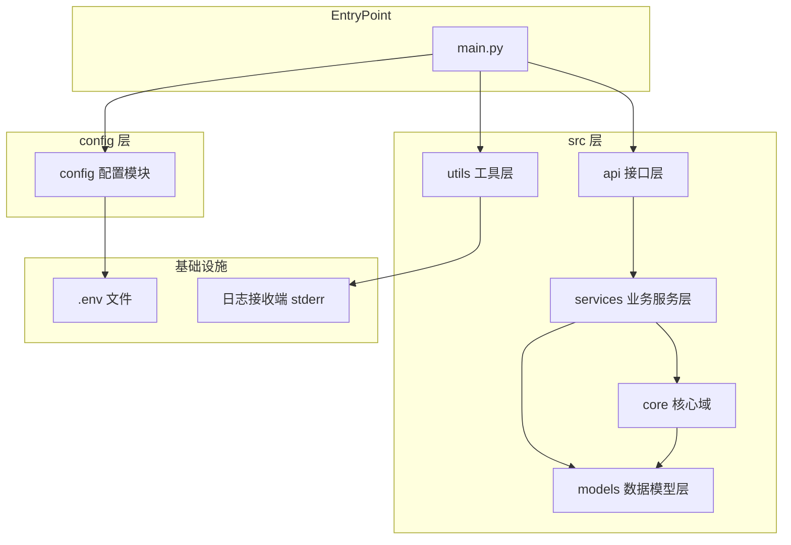
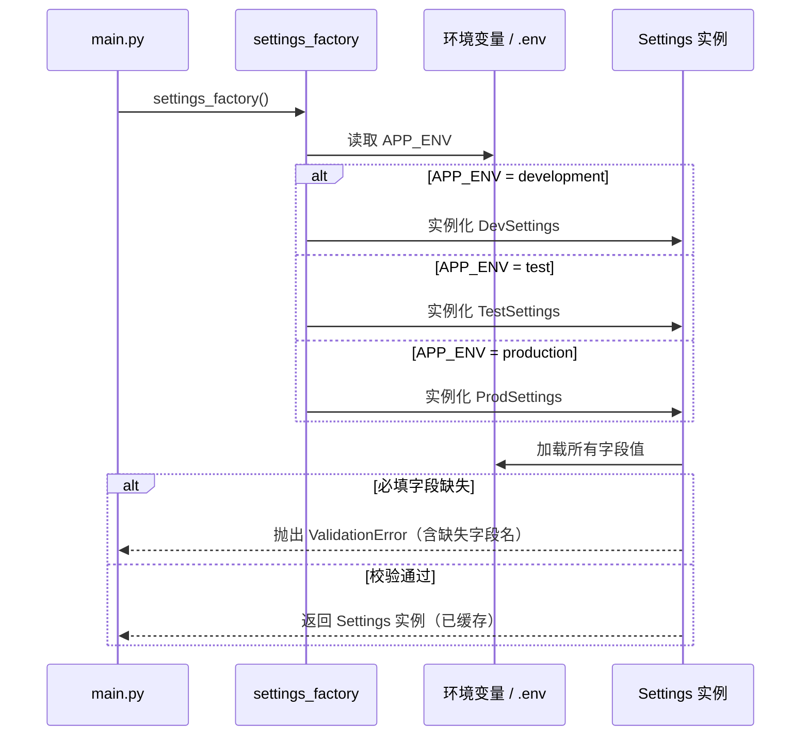
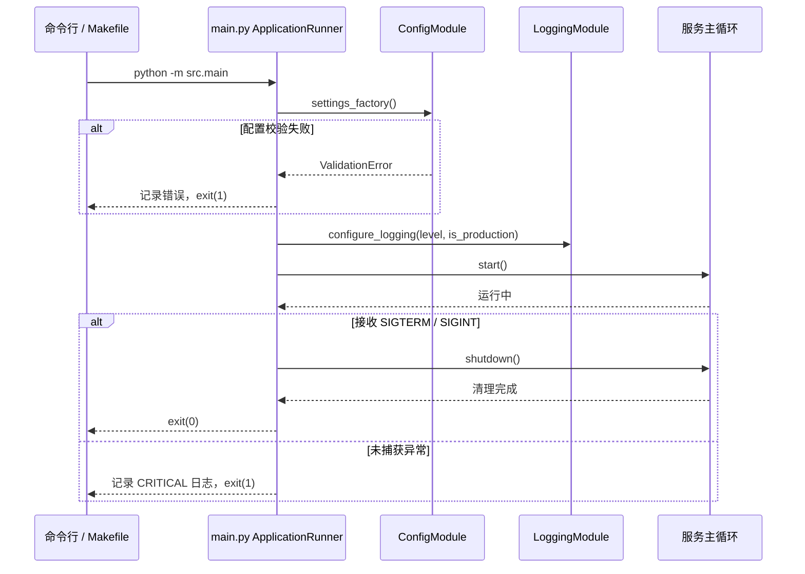

# 技术设计文档

## 概述

`strategy_platform_service` 是一个全新的 Python 后端服务，当前阶段的核心任务是建立标准化的工程脚手架，为后续所有功能模块的开发奠定基础。本文档定义工程目录结构、依赖管理、配置系统、日志系统、代码质量工具链及测试框架的架构设计，确保实现团队的一致性。

**目标用户**：参与本项目的开发工程师。脚手架的成果将以文件系统结构和配置文件的形式交付，开发者通过 `Makefile` 快捷命令与各子系统交互。

**当前影响**：从空仓库状态转变为具备完整基础设施的可运行服务骨架，支持一命令安装、一命令启动、一命令测试。

### 目标

- 建立清晰的分层目录结构，支持团队并行开发
- 提供类型安全的多环境配置管理，启动时快速失败
- 集成 JSON 结构化日志，开发/生产环境自动切换输出格式
- 统一代码质量工具链（lint、format、类型检查），通过 pre-commit 钩子自动执行
- 内置测试框架配置和示例，从第一天起支持 CI/CD 集成
- 提供优雅的应用程序入口，处理信号和未捕获异常

### 非目标

- 具体业务逻辑模块（API 路由、数据库 ORM、消息队列）的实现
- CI/CD 流水线配置（GitHub Actions 等）
- 容器化配置（Dockerfile、docker-compose）
- 认证鉴权框架

---

## 需求追踪

| 需求 | 摘要 | 实现组件 | 接口 | 流程 |
|------|------|----------|------|------|
| 1.1 | 创建顶级目录结构 | DirectoryScaffold | — | 目录初始化流程 |
| 1.2 | 创建 `src/` 子目录 | DirectoryScaffold | — | 目录初始化流程 |
| 1.3 | 创建 `__init__.py` | DirectoryScaffold | — | 目录初始化流程 |
| 1.4 | 创建 `README.md` | DirectoryScaffold | — | — |
| 1.5 | 创建 `.gitignore` | DirectoryScaffold | — | — |
| 2.1 | 运行时依赖声明 | DependencyConfig | `pyproject.toml` | — |
| 2.2 | 开发依赖声明 | DependencyConfig | `pyproject.toml` | — |
| 2.3 | 虚拟环境隔离安装 | DependencyConfig | `uv.lock` | — |
| 2.4 | Makefile 快捷命令 | MakefileCommands | `Makefile` | — |
| 3.1 | `.env.example` 文件 | ConfigModule | — | — |
| 3.2 | `.gitignore` 排除 `.env` | DirectoryScaffold | — | — |
| 3.3 | 配置加载模块 | ConfigModule | `SettingsProtocol` | 配置加载流程 |
| 3.4 | 缺失配置快速失败 | ConfigModule | `settings_factory()` | 配置加载流程 |
| 3.5 | 多环境配置切换 | ConfigModule | `settings_factory()` | 配置加载流程 |
| 4.1 | JSON 结构化日志输出 | LoggingModule | `configure_logging()` | 启动初始化流程 |
| 4.2 | 可配置日志级别 | LoggingModule | `configure_logging()` | — |
| 4.3 | 自动附加元数据 | LoggingModule | `configure_logging()` | — |
| 4.4 | 默认 INFO 级别 | LoggingModule | `configure_logging()` | — |
| 5.1 | ruff 格式化配置 | QualityToolchain | `pyproject.toml` | — |
| 5.2 | mypy 类型检查配置 | QualityToolchain | `pyproject.toml` | — |
| 5.3 | 扫描 src/ 和 tests/ | QualityToolchain | `Makefile` | — |
| 5.4 | pre-commit 钩子 | QualityToolchain | `.pre-commit-config.yaml` | — |
| 6.1 | 测试子目录结构 | TestFramework | — | — |
| 6.2 | pytest 配置 | TestFramework | `pyproject.toml` | — |
| 6.3 | 示例测试文件 | TestFramework | — | — |
| 6.4 | 测试结果摘要含覆盖率 | TestFramework | `pyproject.toml` | — |
| 6.5 | 失败时非零退出 | TestFramework | pytest 原生行为 | — |
| 7.1 | `main.py` 入口文件 | AppEntrypoint | — | 启动初始化流程 |
| 7.2 | 启动序列（配置→日志→服务） | AppEntrypoint | `ApplicationRunner` | 启动初始化流程 |
| 7.3 | 未捕获异常处理 | AppEntrypoint | `ApplicationRunner` | 启动初始化流程 |
| 7.4 | 优雅退出机制 | AppEntrypoint | `ApplicationRunner` | 信号处理流程 |

---

## 架构

### 架构模式与边界图

本项目采用**分层架构**（Layered Architecture），将代码按职责垂直分离。脚手架阶段的核心是建立层间边界，后续业务模块严格遵守依赖方向：上层可依赖下层，禁止反向依赖。



**关键决策**：
- `config/` 置于 `src/` 之外，作为独立顶级目录，允许非 Python 进程（如脚本）直接引用配置定义
- `Utils` 层（含日志模块）是唯一无业务依赖的横切层，任何层均可引用
- `API` 层严禁直接访问 `Models` 层，必须经由 `Services` 层

### 技术栈

| 层次 | 工具/版本 | 在本功能中的角色 | 备注 |
|------|-----------|-----------------|------|
| 包管理 | uv 0.5+ | 依赖解析、虚拟环境、lockfile 生成 | 替代 pip/poetry，速度极快，PEP 标准兼容 |
| 配置管理 | pydantic-settings 2.x | 类型安全环境变量读取、多环境切换 | 与 Pydantic v2 生态集成，支持 SecretStr |
| 结构化日志 | structlog 24.x | JSON 日志输出、处理器链、上下文绑定 | 优于 loguru 的可组合处理器；详见 research.md |
| 代码格式化/Lint | ruff 0.8+ | 格式化 + Lint（替代 black + isort + flake8） | Rust 实现，毫秒级执行 |
| 类型检查 | mypy 1.x | 静态类型分析，strict 模式 | 配置于 pyproject.toml |
| 测试框架 | pytest 8.x | 测试发现、执行、覆盖率报告 | 配合 pytest-cov |
| Pre-commit | pre-commit 3.x | 提交前自动格式化和检查 | 钩子来自 astral-sh/ruff-pre-commit |
| 运行时 | Python 3.11+ | 最低支持版本 | 利用现代类型注解特性 |

---

## 系统流程

### 配置加载流程



### 启动初始化流程



---

## 组件与接口

### 组件摘要

| 组件 | 层次 | 意图 | 需求覆盖 | 关键依赖 | 合约类型 |
|------|------|------|----------|----------|----------|
| DirectoryScaffold | 文件系统 | 创建标准目录结构和基础文件 | 1.1–1.5, 3.2 | — | — |
| DependencyConfig | 构建配置 | 声明运行时和开发依赖 | 2.1–2.3 | uv (P0) | — |
| MakefileCommands | 开发工具 | 提供 install/run/test 快捷命令 | 2.4, 5.3 | uv (P0) | — |
| ConfigModule | config/ | 类型安全的多环境配置加载 | 3.1, 3.3–3.5 | pydantic-settings v2 (P0) | Service |
| LoggingModule | src/utils/ | 结构化日志初始化与全局配置 | 4.1–4.4 | structlog (P0) | Service |
| QualityToolchain | 构建配置 | 格式化、Lint、类型检查、pre-commit | 5.1–5.4 | ruff (P0), mypy (P0), pre-commit (P1) | — |
| TestFramework | tests/ | 测试目录结构、配置和示例 | 6.1–6.5 | pytest (P0), pytest-cov (P0) | — |
| AppEntrypoint | src/ | 应用程序主入口，启动序列和信号处理 | 7.1–7.4 | ConfigModule (P0), LoggingModule (P0) | Service |

---

### 文件系统层

#### DirectoryScaffold

| 字段 | 详情 |
|------|------|
| 意图 | 创建项目的全部目录结构和基础静态文件 |
| 需求 | 1.1, 1.2, 1.3, 1.4, 1.5, 3.2 |

**职责与约束**

- 创建以下顶级目录和文件树（括号内为 `__init__.py` 需要创建的 Python 包）：

```
strategy_platform_service/
├── src/
│   ├── __init__.py
│   ├── api/
│   │   └── __init__.py
│   ├── core/
│   │   └── __init__.py
│   ├── models/
│   │   └── __init__.py
│   ├── services/
│   │   └── __init__.py
│   └── utils/
│       └── __init__.py
├── tests/
│   ├── __init__.py
│   ├── unit/
│   │   └── __init__.py
│   └── integration/
│       └── __init__.py
├── config/
│   └── __init__.py
├── scripts/
├── README.md
├── .gitignore
├── .env.example
├── pyproject.toml
├── Makefile
└── .pre-commit-config.yaml
```

- `.gitignore` 必须包含以下排除模式：
  - Python 字节码：`__pycache__/`、`*.py[cod]`、`*.pyo`
  - 虚拟环境：`.venv/`、`venv/`、`env/`
  - 环境变量文件：`.env`（保留 `.env.example`）
  - IDE 配置：`.idea/`、`.vscode/`、`*.swp`
  - uv 产物：`.uv/`（不排除 `uv.lock`，lockfile 应提交）
  - 测试产物：`.coverage`、`htmlcov/`、`.pytest_cache/`
  - mypy 缓存：`.mypy_cache/`

**实现说明**

- DirectoryScaffold 是纯文件系统操作，无外部依赖
- 所有 `__init__.py` 初始内容为空文件

---

### 构建配置层

#### DependencyConfig

| 字段 | 详情 |
|------|------|
| 意图 | 通过 `pyproject.toml` 和 `uv.lock` 声明并锁定所有依赖 |
| 需求 | 2.1, 2.2, 2.3 |

**职责与约束**

- `pyproject.toml` 须包含以下标准节：
  - `[project]`：项目名称、版本（初始 `0.1.0`）、Python 版本约束（`>=3.11`）
  - `[project.dependencies]`：运行时依赖，初始包含 `pydantic-settings>=2.0`、`structlog>=24.0`
  - `[dependency-groups]` 下的 `dev` 组：开发依赖，包含 `pytest>=8.0`、`pytest-cov>=5.0`、`mypy>=1.0`、`ruff>=0.8`、`pre-commit>=3.0`
- `uv.lock` 由 `uv sync` 自动生成，须提交到版本库

**依赖**

- 外部：uv 0.5+（P0）—— 负责解析依赖树并生成 lockfile

**实现说明**

- 不再需要 `requirements.txt` 或 `requirements-dev.txt`，所有依赖统一在 `pyproject.toml` 中管理
- 运行 `uv sync` 安装所有依赖（含 dev），`uv sync --no-dev` 仅安装运行时依赖

#### MakefileCommands

| 字段 | 详情 |
|------|------|
| 意图 | 提供标准化的开发快捷命令，封装 uv 调用细节 |
| 需求 | 2.4, 5.3 |

**Makefile 目标清单**

| 目标 | 命令描述 | 需求 |
|------|----------|------|
| `install` | `uv sync` —— 安装所有依赖（含 dev）| 2.4 |
| `run` | `uv run python -m src.main` —— 启动服务 | 2.4 |
| `test` | `uv run pytest` —— 执行测试并输出覆盖率 | 2.4 |
| `lint` | `uv run ruff check src/ tests/` —— Lint 检查 | 5.3 |
| `format` | `uv run ruff format src/ tests/` —— 格式化 | 5.3 |
| `typecheck` | `uv run mypy src/` —— 类型检查 | 5.3 |
| `check` | `lint` + `typecheck` —— 综合检查 | 5.3 |
| `pre-commit-install` | `uv run pre-commit install` —— 注册钩子 | 5.4 |

---

### 配置层（config/）

#### ConfigModule

| 字段 | 详情 |
|------|------|
| 意图 | 提供类型安全的多环境配置加载，缺失必填项时快速失败 |
| 需求 | 3.1, 3.3, 3.4, 3.5 |

**职责与约束**

- 所有配置类继承 `pydantic_settings.BaseSettings`
- 支持三个环境：`development`（默认）、`test`、`production`
- `APP_ENV` 未设置时默认为 `development`
- 必填字段（无默认值）缺失时在实例化时抛出 `pydantic.ValidationError`，错误消息中包含缺失字段名
- 使用 `@lru_cache` 保证 Settings 实例为单例，避免重复 IO
- `.env.example` 列出所有环境变量名及说明注释，但不含真实值

**依赖**

- 外部：pydantic-settings 2.x（P0）—— 核心依赖

**合约**：Service [x]

##### 服务接口

```python
from functools import lru_cache
from typing import Literal
from pydantic import SecretStr
from pydantic_settings import BaseSettings, SettingsConfigDict

AppEnv = Literal["development", "test", "production"]

class BaseAppSettings(BaseSettings):
    model_config = SettingsConfigDict(
        env_file=".env",
        env_file_encoding="utf-8",
        extra="ignore",
    )
    app_env: AppEnv = "development"
    log_level: Literal["DEBUG", "INFO", "WARNING", "ERROR"] = "INFO"
    app_name: str = "strategy_platform_service"

class DevSettings(BaseAppSettings):
    app_env: AppEnv = "development"
    debug: bool = True

class TestSettings(BaseAppSettings):
    app_env: AppEnv = "test"
    debug: bool = True

class ProdSettings(BaseAppSettings):
    app_env: AppEnv = "production"
    debug: bool = False

Settings = DevSettings | TestSettings | ProdSettings

@lru_cache(maxsize=1)
def settings_factory() -> Settings:
    """根据 APP_ENV 返回对应的 Settings 实例。缺失必填字段时抛出 ValidationError。"""
    ...
```

- 前置条件：`APP_ENV` 须为 `"development"`、`"test"`、`"production"` 之一，或未设置（默认 `"development"`）
- 后置条件：返回已校验的 Settings 实例；或抛出 `ValidationError`，消息中列明所有缺失/非法字段
- 不变量：同一进程生命周期内返回同一实例（lru_cache 保证）

**实现说明**

- `settings_factory()` 内部读取 `os.environ.get("APP_ENV", "development")` 并分派到对应类
- 业务层扩展配置字段时，继承对应环境类即可，无需修改工厂函数
- 风险：测试用例需调用 `settings_factory.cache_clear()` 清除缓存，否则环境隔离可能失效

---

### 工具层（src/utils/）

#### LoggingModule

| 字段 | 详情 |
|------|------|
| 意图 | 初始化全局结构化日志配置，生产环境输出 JSON，开发环境输出彩色可读格式 |
| 需求 | 4.1, 4.2, 4.3, 4.4 |

**职责与约束**

- 通过 structlog 处理器链实现：
  - 时间戳：`structlog.processors.TimeStamper(fmt="iso")`
  - 日志级别：`structlog.stdlib.add_log_level`
  - 来源模块：`structlog.processors.CallsiteParameterAdder([CallsiteParameter.MODULE])`
  - 生产环境渲染：`structlog.processors.JSONRenderer()`
  - 开发环境渲染：`structlog.dev.ConsoleRenderer()`
- 环境判断：`sys.stderr.isatty()` 为 `True` 时使用 ConsoleRenderer，否则使用 JSONRenderer
- `log_level` 未配置时默认 `INFO`（由 Settings 层保证，见 4.4）
- 调用 `configure_logging()` 后，业务模块通过 `structlog.get_logger()` 获取 logger，无需传递配置

**依赖**

- 外部：structlog 24.x（P0）
- 入站：ConfigModule.settings_factory()（P0）—— 提供 log_level

**合约**：Service [x]

##### 服务接口

```python
import structlog
from typing import Literal

LogLevel = Literal["DEBUG", "INFO", "WARNING", "ERROR"]

def configure_logging(
    level: LogLevel = "INFO",
    is_production: bool = False,
) -> None:
    """
    配置全局 structlog 处理器链。
    - is_production=True：JSON 输出
    - is_production=False：ConsoleRenderer 彩色输出
    调用一次后即生效，应在 main.py 启动序列的最早阶段调用。
    """
    ...

def get_logger(name: str) -> structlog.stdlib.BoundLogger:
    """返回绑定模块名的 logger 实例。"""
    ...
```

- 前置条件：在任何业务日志调用之前调用 `configure_logging()`
- 后置条件：所有后续 `structlog.get_logger()` 调用均使用配置好的处理器链
- 不变量：`configure_logging()` 为幂等操作，多次调用不产生副作用

**实现说明**

- 风险：如果业务代码在 `configure_logging()` 调用前使用 `structlog.get_logger()`，日志将使用 structlog 默认配置（非 JSON）；main.py 须保证调用顺序

---

### 代码质量层

#### QualityToolchain

| 字段 | 详情 |
|------|------|
| 意图 | 统一代码格式化、Lint、类型检查配置，并通过 pre-commit 钩子自动执行 |
| 需求 | 5.1, 5.2, 5.3, 5.4 |

**职责与约束**

- 所有工具配置集中在 `pyproject.toml`，不使用独立配置文件
- ruff 配置节（`[tool.ruff]`）：
  - `target-version = "py311"`
  - `line-length = 88`
  - `[tool.ruff.lint]`：启用 `E`（pycodestyle errors）、`F`（pyflakes）、`I`（isort）规则集
- mypy 配置节（`[tool.mypy]`）：
  - `python_version = "3.11"`
  - `strict = true`
  - `ignore_missing_imports = true`
- `.pre-commit-config.yaml` 包含两个 hook：
  - `ruff-check`（含 `--fix` 参数）
  - `ruff-format`
  - hook 版本须与 `pyproject.toml` 中 ruff 开发依赖版本一致

**依赖**

- 外部：ruff 0.8+（P0）、mypy 1.x（P0）、pre-commit 3.x（P1）

**实现说明**

- `pre-commit install` 须在 `make install` 之后或 `make pre-commit-install` 中执行
- 版本漂移风险：`.pre-commit-config.yaml` 中的 ruff 版本须与 `pyproject.toml` 手动保持一致；参考 research.md 中的同步建议

---

### 测试层（tests/）

#### TestFramework

| 字段 | 详情 |
|------|------|
| 意图 | 提供测试框架配置、目录结构和示例测试，确保 CI/CD 可直接集成 |
| 需求 | 6.1, 6.2, 6.3, 6.4, 6.5 |

**职责与约束**

- `tests/` 目录结构：
  ```
  tests/
  ├── __init__.py
  ├── conftest.py          # pytest 全局 fixtures，含 settings 缓存清除
  ├── unit/
  │   ├── __init__.py
  │   └── test_config.py   # 示例：测试 ConfigModule 的环境切换和校验
  └── integration/
      ├── __init__.py
      └── test_health.py   # 示例：集成测试占位
  ```
- `pyproject.toml` 中 `[tool.pytest.ini_options]`：
  - `testpaths = ["tests"]`
  - `addopts = "--cov=src --cov-report=term-missing --cov-fail-under=0"`
  - `python_files = "test_*.py"`
  - `python_functions = "test_*"`
- pytest-cov 输出测试摘要（通过数量、失败数量、覆盖率百分比）
- 任何测试失败时 pytest 以非零退出码退出（原生行为，无需额外配置）

**依赖**

- 外部：pytest 8.x（P0）、pytest-cov 5.x（P0）

**实现说明**

- `conftest.py` 中应提供 `clear_settings_cache` fixture，在测试前后调用 `settings_factory.cache_clear()`，确保测试间隔离

---

### 应用入口层（src/）

#### AppEntrypoint

| 字段 | 详情 |
|------|------|
| 意图 | 提供应用程序主入口，按序执行配置加载、日志初始化、服务启动，并处理信号和异常 |
| 需求 | 7.1, 7.2, 7.3, 7.4 |

**职责与约束**

- 入口文件位于 `src/main.py`，可通过 `python -m src.main` 运行
- 启动序列严格按以下顺序执行：
  1. 调用 `settings_factory()` 加载配置（校验失败立即退出）
  2. 调用 `configure_logging(level, is_production)` 初始化日志
  3. 注册 `SIGTERM` 和 `SIGINT` 信号处理器
  4. 调用服务主循环（当前为占位实现）
- 未捕获异常通过 `sys.excepthook` 或 `try/except` 捕获，记录 `CRITICAL` 级别日志后以 `sys.exit(1)` 退出
- 接收到 `SIGTERM`/`SIGINT` 后触发优雅退出：完成当前处理后调用清理逻辑，以 `sys.exit(0)` 退出

**依赖**

- 入站：ConfigModule.settings_factory()（P0）
- 入站：LoggingModule.configure_logging()（P0）

**合约**：Service [x]

##### 服务接口

```python
import signal
import sys

class ApplicationRunner:
    def __init__(self) -> None:
        self._shutdown_event: bool = False

    def _handle_signal(self, signum: int, frame: object) -> None:
        """设置关闭标志，触发优雅退出。"""
        ...

    def start(self) -> None:
        """加载配置、初始化日志、注册信号处理器并启动服务主循环。"""
        ...

    def shutdown(self) -> None:
        """执行清理逻辑后退出进程。"""
        ...

def main() -> None:
    """模块入口点，创建 ApplicationRunner 并调用 start()。"""
    ...

if __name__ == "__main__":
    main()
```

- 前置条件：Python 3.11+ 运行环境；必要环境变量已在进程环境中设置
- 后置条件：正常退出时 exit code 为 0；启动失败或未捕获异常时 exit code 为 1
- 不变量：信号处理器注册必须在服务主循环启动之前完成

**实现说明**

- 风险：当前服务主循环为占位实现（`pass` 或简单日志输出）；后续功能模块实现时替换为真实服务逻辑

---

## 数据模型

本功能（脚手架）不引入任何持久化数据模型。配置对象（`Settings`）作为值对象在进程内存中存在，不需要数据库或文件系统存储（除读取 `.env` 外）。

---

## 错误处理

### 错误策略

脚手架阶段的错误处理遵循**快速失败**原则：所有基础设施错误（配置缺失、日志初始化失败）在启动阶段立即暴露，不在运行时静默降级。

### 错误分类与响应

| 错误类型 | 触发场景 | 响应策略 | 需求 |
|----------|----------|----------|------|
| 配置缺失 | 必填环境变量未设置 | `ValidationError`，消息含字段名；exit(1) | 3.4 |
| 非法 APP_ENV | `APP_ENV` 值不在允许列表 | `ValidationError`；exit(1) | 3.5 |
| 未捕获异常 | 服务主循环异常 | CRITICAL 日志 + exit(1) | 7.3 |
| SIGTERM/SIGINT | 操作系统发送终止信号 | 优雅退出，exit(0) | 7.4 |

### 监控

- 所有启动错误通过 structlog 以结构化 JSON 输出到 stderr，便于日志采集系统解析
- 进程退出码作为 CI/CD 健康检查的判断依据

---

## 测试策略

### 单元测试

覆盖配置和日志模块的核心逻辑：

1. `test_settings_dev`：`APP_ENV=development` 时实例化 `DevSettings`，验证默认值
2. `test_settings_prod`：`APP_ENV=production` 时实例化 `ProdSettings`，验证 `debug=False`
3. `test_settings_missing_required`：缺少必填字段时 `settings_factory()` 抛出 `ValidationError`
4. `test_settings_cache`：两次调用 `settings_factory()` 返回同一实例（lru_cache 验证）
5. `test_configure_logging_no_exception`：`configure_logging()` 调用不抛出异常

### 集成测试

验证跨组件协作：

1. `test_main_startup`：使用有效环境变量，`ApplicationRunner.start()` 完成初始化序列不抛出异常
2. `test_main_missing_config`：缺少必填配置，`ApplicationRunner.start()` 以非零退出码退出
3. `test_graceful_shutdown`：发送 `SIGINT`，验证 `_handle_signal` 被触发并设置关闭标志

### 性能

脚手架阶段无性能要求。需记录基线指标：

1. 冷启动时间（从命令执行到日志输出第一行）目标：< 500ms
2. `uv sync` 全量安装时间基线记录，用于 CI 优化参考

---

## 安全考量

- `.env` 文件通过 `.gitignore` 排除，防止敏感信息提交（3.2）
- `SecretStr` 类型用于密码、密钥等敏感配置字段，防止日志中意外输出明文
- `.env.example` 仅包含字段名和说明，不含真实值（3.1）
- mypy strict 模式防止类型不安全的代码进入代码库

---

## 参考资料

详细调研记录、架构模式对比、工具选型依据见 `/Users/rccpony/Projects/strategy_platform_service/.kiro/specs/project-scaffolding/research.md`。
