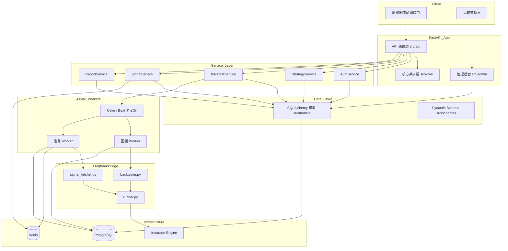
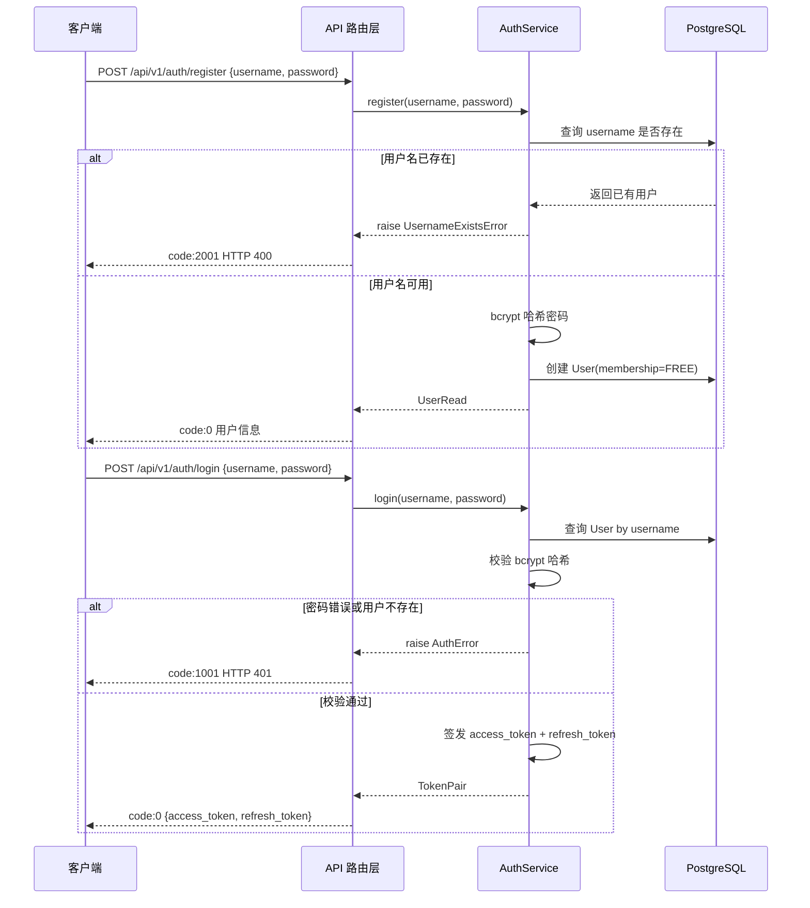
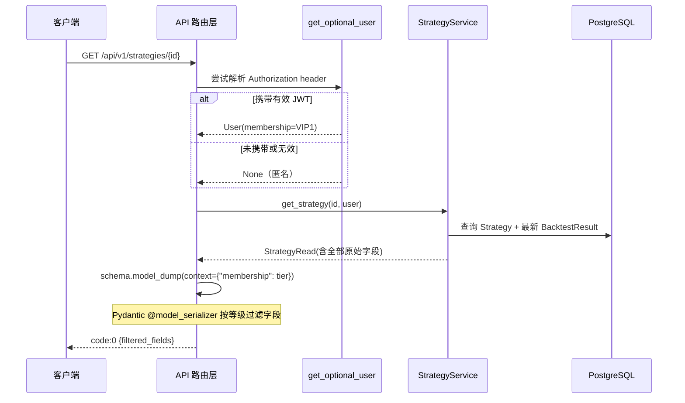
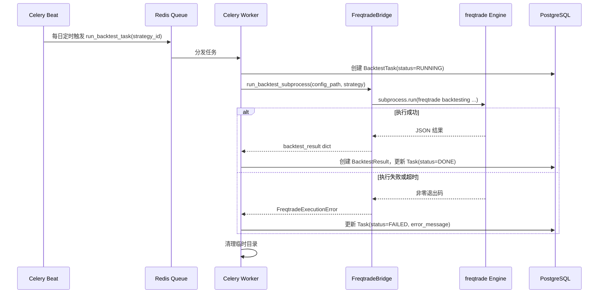
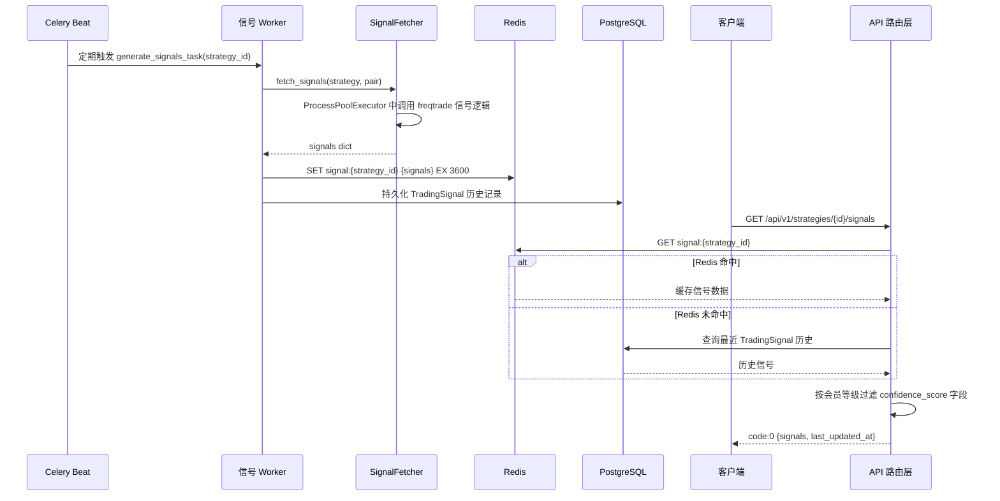
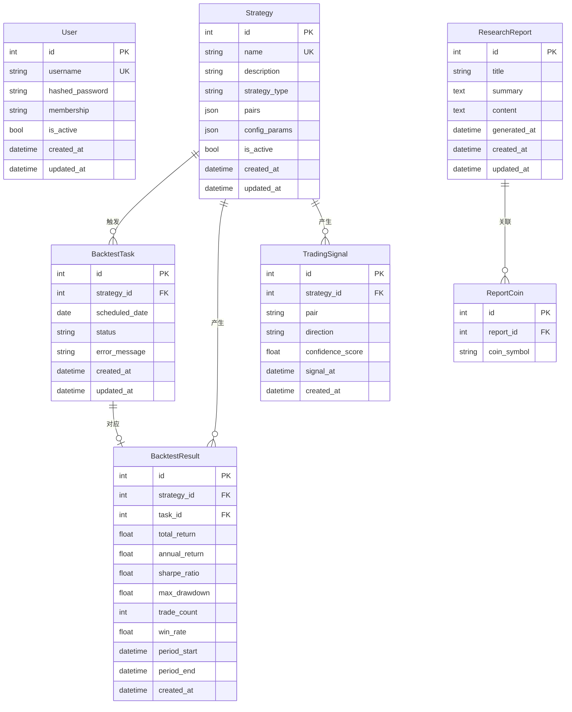

# 技术设计文档

## 概述

本功能为 `strategy_platform_service` 实现完整的量化平台后端服务。该服务基于 FastAPI 构建，面向数字货币量化交易入门用户，提供经典策略科普展示、系统自动回测、实时交易信号、AI 市场研报和分级会员权限等核心能力。

**目标用户**: 数字货币量化交易入门用户（浏览学习）、VIP 付费会员（解锁高级指标）、运营人员（通过 sqladmin 后台管理数据）。

**影响**: 将现有空白 FastAPI 脚手架扩展为包含完整 API 路由层、业务服务层、数据模型层、freqtrade 集成层、Celery 异步任务层和 sqladmin 管理后台的全功能后端服务。

---

### Goals

- 提供统一 JWT 无状态鉴权体系，支持注册、登录和 token 刷新（需求 1）
- 通过会员等级（匿名 / Free / VIP1 / VIP2）在序列化层实现字段级权限控制（需求 2）
- 以只读方式展示后台预设策略列表和详情（需求 3）
- 通过 Celery 异步任务系统集成 freqtrade 引擎，实现定时回测并持久化结果（需求 4）
- 展示 freqtrade 生成的交易信号，优先从 Redis 缓存读取（需求 5）
- 提供 AI 市场研报的数据模型和只读 API（需求 6、7）
- 通过 sqladmin 提供运营管理后台（需求 8）
- 所有接口使用统一 JSON 信封响应格式和错误码约定（需求 9）

### Non-Goals

- 不提供用户自定义策略开发或用户手动触发回测的功能
- 不实现会员付费购买流程（会员等级由运营后台手动维护）
- 不实现 WebSocket 实时推送（信号和回测结果通过客户端轮询获取）
- 不实现多交易所真实下单功能
- 不实现前端 UI 页面（纯 RESTful API 后端）

---

## 架构

### 现有架构分析

当前项目为基础脚手架：`src/main.py` 仅包含 `ApplicationRunner` 占位实现，`src/api/`、`src/services/`、`src/models/` 等目录仅有空的 `__init__.py`。本设计在此基础上全量构建各层组件，不涉及重构或兼容性约束。

### 架构模式与边界划分

**选定模式**: 分层架构（Router → Service → Model），freqtrade 集成封装在独立 bridge 层，与业务逻辑单向解耦。



**架构集成说明**:
- 单向依赖：`api` → `services` → `models`，禁止反向
- `src/core/` 被所有层引用，自身不引用业务层
- `src/freqtrade_bridge/` 仅由 Celery Worker 中的任务函数调用，不暴露给 `src/api/`
- sqladmin 挂载在同一 FastAPI app 上，使用独立同步 engine 实例
- Redis 同时作为 Celery Broker 和信号热缓存

### 技术栈

| 层次 | 技术/版本 | 在本功能中的角色 | 备注 |
|------|----------|----------------|------|
| Web 框架 | FastAPI（最新稳定版）| API 路由、依赖注入、OpenAPI 文档 | 原生异步 |
| ORM（异步） | SQLAlchemy 2.x + asyncpg | Web 请求路径的数据读写 | `create_async_engine` |
| ORM（同步） | SQLAlchemy 2.x + psycopg2-binary | sqladmin 和 Alembic 迁移 | `create_engine` |
| 管理后台 | sqladmin | 策略/用户/研报 CRUD 管理界面 | 挂载至 FastAPI |
| 量化引擎 | freqtrade（系统已安装）| 回测执行和信号生成 | 通过子进程调用 |
| 任务队列 | Celery 5.x + Redis Broker | 回测和信号的异步调度 | `celery[redis]` |
| 缓存 | Redis + redis[hiredis] | 信号热缓存，Celery broker 和 result backend | |
| 数据库 | PostgreSQL | 主持久化存储 | UTC 时区 |
| JWT | python-jose[cryptography] | access_token / refresh_token 签发与校验 | HS256 |
| 密码哈希 | passlib[bcrypt] | 用户密码存储 | |
| Schema 校验 | Pydantic v2 + pydantic-settings | 请求/响应校验、字段级权限序列化、配置 | |
| 迁移 | Alembic | 数据库 Schema 版本管理 | |
| 日志 | structlog ≥ 24.0 | 结构化日志（开发彩色/生产 JSON）| |

---

## 系统流程

### 流程 1：用户注册与登录



### 流程 2：策略展示（含字段级权限过滤）



### 流程 3：freqtrade 回测异步任务生命周期



### 流程 4：信号生成与缓存读取



---

## 需求追溯

| 需求 | 摘要 | 组件 | 接口 | 流程 |
|------|------|------|------|------|
| 1.1 | POST /auth/register 创建用户 | AuthService, User 模型 | API: POST /api/v1/auth/register | 流程 1 |
| 1.2 | 用户名重复返回 code:2001 | AuthService | Service: register() | 流程 1 |
| 1.3 | POST /auth/login 返回 token 对 | AuthService | API: POST /api/v1/auth/login | 流程 1 |
| 1.4 | 密码错误返回 code:1001 | AuthService | Service: login() | 流程 1 |
| 1.5 | POST /auth/refresh 刷新 token | AuthService | API: POST /api/v1/auth/refresh | — |
| 1.6 | refresh_token 过期返回 code:1001 | SecurityUtils | Service: refresh_token() | — |
| 1.7 | JWT claims 结构 | SecurityUtils | — | — |
| 1.8 | 过期 token 拦截 | SecurityUtils, get_current_user | Depends: get_current_user | — |
| 2.1 | 三种会员等级枚举 | MembershipTier, User 模型 | — | — |
| 2.2 | 三种访问身份 | get_optional_user, get_current_user | Depends 注入 | — |
| 2.3 | 匿名用户字段可见性 | StrategyRead, BacktestResultRead | @model_serializer | 流程 2 |
| 2.4 | Free 用户字段可见性 | StrategyRead, BacktestResultRead | @model_serializer | 流程 2 |
| 2.5 | VIP 用户全量字段 | StrategyRead, BacktestResultRead | @model_serializer | 流程 2 |
| 2.6 | get_optional_user 依赖注入 | AuthService, Core Deps | Depends: get_optional_user | 流程 2 |
| 2.7 | require_membership 工厂函数 | Core Deps | Depends: require_membership() | — |
| 2.8 | 禁用用户拦截 | get_current_user | Depends 校验 is_active | — |
| 2.9 | 序列化层字段过滤 | Pydantic Schema | @model_serializer | 流程 2 |
| 3.1 | GET /strategies 分页列表 | StrategyService | API: GET /api/v1/strategies | — |
| 3.2 | GET /strategies/{id} 详情 + 字段过滤 | StrategyService | API: GET /api/v1/strategies/{id} | 流程 2 |
| 3.3 | 无公开写入 API | StrategyService | — | — |
| 3.4 | 策略不存在返回 code:3001 | StrategyService | Service: get_strategy() | — |
| 3.5 | 详情含最近回测摘要 | StrategyService, BacktestService | Service: get_latest_backtest() | — |
| 4.1 | Celery Beat 定时回测调度 | BacktestScheduler | Batch: run_backtest_task | 流程 3 |
| 4.2 | 回测在独立 Worker 执行 | BacktestWorker, FreqtradeBridge | Batch 任务 | 流程 3 |
| 4.3 | 回测结果持久化 | BacktestResult 模型 | Service: save_backtest_result() | 流程 3 |
| 4.4 | 回测失败标记 FAILED | BacktestTask 模型 | Service: mark_task_failed() | 流程 3 |
| 4.5 | GET /strategies/{id}/backtests 分页 | BacktestService | API: GET /api/v1/strategies/{id}/backtests | — |
| 4.6 | GET /backtests/{id} 详情 | BacktestService | API: GET /api/v1/backtests/{id} | — |
| 4.7 | 隔离目录生成配置并清理 | FreqtradeBridge | Bridge: run_backtest_subprocess() | 流程 3 |
| 4.8 | 无公开触发回测接口 | BacktestService | — | — |
| 5.1 | GET /strategies/{id}/signals 信号列表 | SignalService | API: GET /api/v1/strategies/{id}/signals | 流程 4 |
| 5.2 | VIP 用户返回 confidence_score | SignalRead | @model_serializer | 流程 4 |
| 5.3 | 信号缓存至 Redis，持久化至 DB | SignalService, SignalWorker | Batch/Event | 流程 4 |
| 5.4 | 信号生成失败回退至缓存 | SignalService | Service: get_signals() | 流程 4 |
| 5.5 | 禁止同步调用 freqtrade | FreqtradeBridge | — | 流程 4 |
| 5.6 | 策略不存在返回 code:3001 | SignalService | Service: get_signals() | — |
| 6.1 | ResearchReport SQLAlchemy 模型 | ResearchReport 模型 | — | — |
| 6.2 | TimestampMixin 自动维护时间戳 | TimestampMixin | — | — |
| 6.3 | 关联币种多值存储 | ReportCoin 关联表 | — | — |
| 6.4 | Alembic 迁移管理研报表 | Alembic 迁移 | — | — |
| 7.1 | GET /reports 分页列表 | ReportService | API: GET /api/v1/reports | — |
| 7.2 | GET /reports/{id} 详情 | ReportService | API: GET /api/v1/reports/{id} | — |
| 7.3 | 研报不存在返回 code:3001 | ReportService | Service: get_report() | — |
| 7.4 | 无公开写入接口 | ReportService | — | — |
| 7.5 | 允许匿名访问研报 | API 路由 | Depends: get_optional_user (可选) | — |
| 8.1 | sqladmin 挂载至 FastAPI | AdminSetup | Admin: setup_admin() | — |
| 8.2 | User ModelView | UserAdmin | ModelView | — |
| 8.3 | Strategy ModelView（创建/编辑）| StrategyAdmin | ModelView | — |
| 8.4 | ResearchReport ModelView | ReportAdmin | ModelView | — |
| 8.5 | 后台修改 membership 和 is_active | UserAdmin | ModelView | — |
| 8.6 | 独立管理员认证 | AdminAuth | AuthenticationBackend | — |
| 8.7 | 未认证重定向登录页 | AdminAuth | AuthenticationBackend | — |
| 8.8 | sqladmin 使用同步 engine | AdminSetup | — | — |
| 8.9 | 禁止后台删除 User | UserAdmin | can_delete = False | — |
| 9.1 | 统一信封响应格式 | ApiResponse, ResponseUtils | Core: ok() / fail() | — |
| 9.2 | Pydantic 422 转信封格式 | ExceptionHandlers | 全局异常处理器 | — |
| 9.3 | 错误码范围约定 | AppError 体系 | Core: exceptions.py | — |
| 9.4 | 列表分页信封 | PaginatedResponse | Schema: PaginatedResponse | — |
| 9.5 | URL 路径版本 /api/v1/ | FastAPI 路由 | Router prefix | — |
| 9.6 | freqtrade 失败返回 code:5001 | ExceptionHandlers | 全局异常处理器 | — |

---

## 组件与接口

### 组件总览

| 组件 | 域/层 | 职责摘要 | 需求覆盖 | 关键依赖（P0/P1） | 合约类型 |
|------|-------|---------|---------|------------------|---------|
| AuthService | 服务层 | 注册、登录、token 刷新 | 1.1–1.8 | SecurityUtils(P0), User 模型(P0) | Service, API |
| SecurityUtils | 核心共享层 | JWT 签发/校验，密码哈希 | 1.6–1.8, 2.7–2.8 | python-jose(P0), passlib(P0) | Service |
| CoreDeps | 核心共享层 | FastAPI Depends 注入函数集合 | 2.6–2.8 | SecurityUtils(P0), AsyncSession(P0) | Service |
| StrategyService | 服务层 | 策略只读查询，回测摘要聚合 | 3.1–3.5 | Strategy 模型(P0), BacktestResult 模型(P1) | Service, API |
| BacktestService | 服务层 | 回测结果查询，任务状态读取 | 4.3–4.6 | BacktestTask 模型(P0), BacktestResult 模型(P0) | Service, API |
| BacktestScheduler | Celery Worker 层 | 定时调度和执行回测任务 | 4.1–4.4, 4.7 | FreqtradeBridge(P0), BacktestTask 模型(P0) | Batch |
| SignalService | 服务层 | 信号查询（Redis 优先，DB 兜底） | 5.1–5.6 | Redis(P0), TradingSignal 模型(P1) | Service, API |
| SignalScheduler | Celery Worker 层 | 定时调度信号生成，写入缓存和 DB | 5.3–5.5 | FreqtradeBridge(P0), Redis(P0) | Batch |
| FreqtradeBridge | bridge 层 | 封装 freqtrade 子进程调用和信号获取 | 4.2, 4.7, 5.5 | freqtrade(P0) | Service |
| ReportService | 服务层 | 研报只读查询 | 6.1–7.5 | ResearchReport 模型(P0) | Service, API |
| AdminSetup | admin 层 | sqladmin 注册和独立管理员认证 | 8.1–8.9 | sqladmin(P0), 同步 engine(P0) | Service |
| ResponseUtils | 核心共享层 | 统一信封构造和分页结构 | 9.1, 9.4 | Pydantic(P0) | Service |
| ExceptionHandlers | 核心共享层 | 全局异常拦截转信封格式 | 9.2, 9.3, 9.6 | FastAPI(P0) | Service |
| PermissionSchemas | schema 层 | Pydantic Schema 字段级权限序列化 | 2.3–2.5, 2.9 | Pydantic v2(P0) | State |

---

### 核心共享层（src/core/）

#### SecurityUtils

| 字段 | 详情 |
|------|------|
| Intent | JWT token 签发与校验、bcrypt 密码哈希 |
| 需求 | 1.3, 1.5, 1.6, 1.7, 1.8 |

**职责与约束**
- 签发 access_token（有效期 30 分钟）和 refresh_token（有效期 7 天）
- JWT claims 必须包含 `sub`、`membership`、`exp`、`iat`、`type` 字段
- 密钥从环境变量 `SECRET_KEY` 注入，禁止硬编码
- 密码校验仅比较哈希，禁止记录明文密码日志

**依赖**
- 外部：`python-jose[cryptography]` — JWT 签发（P0）
- 外部：`passlib[bcrypt]` — 密码哈希（P0）

**合约**: Service [x]

##### 服务接口

```python
class SecurityUtils:
    def create_access_token(self, sub: str, membership: MembershipTier) -> str: ...
    def create_refresh_token(self, sub: str) -> str: ...
    def decode_token(self, token: str) -> dict[str, Any]: ...
    # 校验失败抛出 AuthenticationError(code=1001)
    def verify_password(self, plain: str, hashed: str) -> bool: ...
    def hash_password(self, plain: str) -> str: ...
```

- 前置条件：`decode_token` 接收非空字符串 token
- 后置条件：`decode_token` 返回包含 `sub`、`membership`、`type` 的 dict；签名无效或过期时抛出 `AuthenticationError`
- 不变量：`type == "access"` 时方可用于接口调用，`type == "refresh"` 时仅用于刷新

**实现注意事项**
- 集成：`SECRET_KEY` 通过 `pydantic-settings` 注入
- 验证：`decode_token` 检查 `type` 字段，防止 refresh token 被用于接口调用
- 风险：HS256 为对称签名，密钥泄露影响所有 token；如需多节点扩展可升级为 RS256

---

#### CoreDeps

| 字段 | 详情 |
|------|------|
| Intent | FastAPI Depends 注入函数：数据库 session、当前用户、可选用户、会员等级校验 |
| 需求 | 2.6, 2.7, 2.8 |

**职责与约束**
- `get_db`：异步 session 生命周期管理，请求结束后自动关闭
- `get_current_user`：强制鉴权，token 无效或用户禁用时抛出 `AuthenticationError`。**关键约束**：从 DB 实时读取用户 `membership` 和 `is_active` 字段，不信任 JWT claims 中的 `membership` 值，确保运营后台修改会员等级或禁用账户后即时生效
- `get_optional_user`：宽松鉴权，无 token 或无效 token 时返回 `None`，不拦截请求。携带有效 token 时同样从 DB 实时读取用户状态
- `require_membership(min_tier)`：工厂函数，返回检查等级的 Depends 函数，等级以 DB 用户对象的 `membership` 字段为准

**依赖**
- 内部：SecurityUtils — token 解析（P0）
- 内部：AsyncSessionLocal — 数据库 session（P0）

**合约**: Service [x]

##### 服务接口

```python
async def get_db() -> AsyncGenerator[AsyncSession, None]: ...

async def get_current_user(
    credentials: HTTPAuthorizationCredentials = Depends(bearer_scheme),
    db: AsyncSession = Depends(get_db),
) -> User: ...
# 1. 从 token 解析 sub（用户 ID）
# 2. 从 DB 实时查询 User 对象（获取最新 membership 和 is_active）
# 3. is_active=False 时抛出 AuthenticationError(code=1001)
# 注意：不使用 JWT claims 中的 membership，以 DB 为准

async def get_optional_user(
    request: Request,
    db: AsyncSession = Depends(get_db),
) -> User | None: ...
# 始终返回，不抛出异常

def require_membership(min_tier: MembershipTier) -> Callable[..., User]: ...
# 返回的 checker 函数：等级不足时抛出 PermissionError(code=1003)
```

---

#### ResponseUtils 与 ExceptionHandlers

| 字段 | 详情 |
|------|------|
| Intent | 统一信封响应构造，全局异常处理器注册 |
| 需求 | 9.1–9.4, 9.6 |

**合约**: Service [x]

##### 服务接口

```python
# src/core/response.py
class ApiResponse(BaseModel, Generic[T]):
    code: int = 0
    message: str = "success"
    data: T | None = None

class PaginatedData(BaseModel, Generic[T]):
    items: list[T]
    total: int
    page: int
    page_size: int

def ok(data: T, message: str = "success") -> ApiResponse[T]: ...
def fail(code: int, message: str, data: Any = None) -> ApiResponse[Any]: ...
def paginated(items: list[T], total: int, page: int, page_size: int) -> ApiResponse[PaginatedData[T]]: ...
```

**错误码约定**（`src/core/exceptions.py`）:

| 错误码 | 类 | 场景 |
|--------|-----|------|
| 1001 | `AuthenticationError` | 未登录、token 过期、用户禁用 |
| 1002 | `PermissionError` | 权限不足 |
| 1003 | `MembershipError` | 会员等级不足 |
| 2001 | `ValidationError` | 请求参数校验失败（含用户名重复） |
| 3001 | `NotFoundError` | 资源不存在 |
| 3002 | `ConflictError` | 回测任务冲突 |
| 5001 | `FreqtradeError` | freqtrade 调用失败 |

---

### 认证服务层（src/services/auth_service.py）

#### AuthService

| 字段 | 详情 |
|------|------|
| Intent | 用户注册、登录、token 刷新的业务逻辑 |
| 需求 | 1.1–1.8 |

**职责与约束**
- 注册时检查用户名唯一性，密码以 bcrypt 哈希存储
- 登录时调用 `SecurityUtils.verify_password`，返回 token 对
- 刷新时校验 refresh_token 类型和有效性，签发新 access_token

**依赖**
- 内部：SecurityUtils（P0）
- 内部：AsyncSession via get_db（P0）
- 内部：User 模型（P0）

**合约**: Service [x], API [x]

##### 服务接口

```python
class AuthService:
    async def register(
        self, db: AsyncSession, username: str, password: str
    ) -> User: ...
    # 用户名重复时抛出 ValidationError(code=2001)

    async def login(
        self, db: AsyncSession, username: str, password: str
    ) -> tuple[str, str]: ...
    # 返回 (access_token, refresh_token)
    # 凭证错误时抛出 AuthenticationError(code=1001)

    async def refresh_access_token(
        self, db: AsyncSession, refresh_token: str
    ) -> str: ...
    # 返回新 access_token
    # token 无效时抛出 AuthenticationError(code=1001)
```

##### API 合约

| 方法 | 端点 | 请求体 | 响应 data | 错误码 |
|------|------|--------|-----------|--------|
| POST | /api/v1/auth/register | `{username: str, password: str}` | `{id, username, membership, created_at}` | 2001(400), 5001(500) |
| POST | /api/v1/auth/login | `{username: str, password: str}` | `{access_token, refresh_token, token_type}` | 1001(401) |
| POST | /api/v1/auth/refresh | `{refresh_token: str}` | `{access_token, token_type}` | 1001(401) |

---

### 策略服务层（src/services/strategy_service.py）

#### StrategyService

| 字段 | 详情 |
|------|------|
| Intent | 策略只读查询，聚合最近回测摘要 |
| 需求 | 3.1–3.5 |

**职责与约束**
- 仅提供读取操作，不暴露任何写入接口
- 查询策略详情时同时加载最近一次成功回测结果（`selectinload`，避免 N+1）
- 策略不存在时抛出 `NotFoundError(code=3001)`

**依赖**
- 内部：Strategy 模型（P0）
- 内部：BacktestResult 模型（P1）
- 内部：AsyncSession（P0）

**合约**: Service [x], API [x]

##### 服务接口

```python
class StrategyService:
    async def list_strategies(
        self, db: AsyncSession, page: int, page_size: int
    ) -> tuple[list[Strategy], int]: ...

    async def get_strategy(
        self, db: AsyncSession, strategy_id: int
    ) -> Strategy: ...
    # 不存在时抛出 NotFoundError(code=3001)
```

##### API 合约

| 方法 | 端点 | 查询参数 | 响应 data | 错误码 |
|------|------|----------|-----------|--------|
| GET | /api/v1/strategies | `?page=1&page_size=20` | PaginatedData[StrategyRead] | 无 |
| GET | /api/v1/strategies/{id} | — | StrategyRead（字段按权限过滤） | 3001(404) |

---

### 回测服务层（src/services/backtest_service.py）

#### BacktestService

| 字段 | 详情 |
|------|------|
| Intent | 回测结果只读查询，任务状态读取 |
| 需求 | 4.3–4.6 |

**职责与约束**
- 不提供触发回测的公开接口
- 查询结果时根据 `strategy_id` 关联过滤，分页返回
- 单条结果不存在时抛出 `NotFoundError(code=3001)`

**合约**: Service [x], API [x]

##### 服务接口

```python
class BacktestService:
    async def list_backtests(
        self, db: AsyncSession, strategy_id: int, page: int, page_size: int
    ) -> tuple[list[BacktestResult], int]: ...

    async def get_backtest(
        self, db: AsyncSession, backtest_id: int
    ) -> BacktestResult: ...
    # 不存在时抛出 NotFoundError(code=3001)
```

##### API 合约

| 方法 | 端点 | 查询参数 | 响应 data | 错误码 |
|------|------|----------|-----------|--------|
| GET | /api/v1/strategies/{id}/backtests | `?page=1&page_size=20` | PaginatedData[BacktestResultRead] | 3001(404) |
| GET | /api/v1/backtests/{id} | — | BacktestResultRead（字段按权限过滤） | 3001(404) |

---

#### BacktestScheduler（Celery Worker）

| 字段 | 详情 |
|------|------|
| Intent | Celery 回测任务定义：定时触发、执行 freqtrade、持久化结果 |
| 需求 | 4.1, 4.2, 4.4, 4.7, 4.8 |

**职责与约束**
- 以 Celery Beat `crontab` 配置定时触发（默认每日凌晨执行）
- 任务状态流转：PENDING → RUNNING → DONE | FAILED
- 每个任务在 `/tmp/freqtrade_jobs/{task_id}/` 下生成隔离配置，结束后清理
- `acks_late=True` 保证 Worker 崩溃时任务重新入队
- 任务幂等性：以 `(strategy_id, scheduled_date)` 为键，通过 DB 唯一约束 `uq_btask_strategy_date` 防止同日重复回测；`BacktestScheduler` 任务启动时先查询当日是否已有 RUNNING/DONE 状态的任务记录，存在则跳过

**依赖**
- 内部：FreqtradeBridge.run_backtest_subprocess（P0）
- 内部：BacktestTask 模型（P0）
- 外部：Celery + Redis（P0）

**合约**: Batch [x]

##### Batch/Job 合约

- **触发**: Celery Beat crontab（`0 2 * * *` 每日 02:00 UTC）
- **输入**: `strategy_id: int`；从 DB 读取策略配置
- **输出**: 新建 `BacktestResult` 记录，更新 `BacktestTask.status`
- **幂等性与恢复**: `acks_late=True`，`max_retries=3`，超时 600 秒后标记 FAILED

---

### 信号服务层（src/services/signal_service.py）

#### SignalService

| 字段 | 详情 |
|------|------|
| Intent | 信号查询（Redis 优先，DB 兜底），按会员等级过滤 confidence_score |
| 需求 | 5.1–5.6 |

**职责与约束**
- 优先读取 Redis key `signal:{strategy_id}`，缓存未命中时回退至 PostgreSQL
- Redis 不可用时静默回退至 DB，不向客户端暴露缓存错误
- 响应中必须携带 `last_updated_at` 字段标注数据时效
- 策略不存在时抛出 `NotFoundError(code=3001)`

**依赖**
- 外部：Redis 客户端（P0）
- 内部：TradingSignal 模型（P1）
- 内部：AsyncSession（P0）

**合约**: Service [x], API [x]

##### 服务接口

```python
class SignalService:
    async def get_signals(
        self, db: AsyncSession, strategy_id: int
    ) -> tuple[list[TradingSignal], datetime]: ...
    # 返回 (signals, last_updated_at)
    # 策略不存在时抛出 NotFoundError(code=3001)
```

##### API 合约

| 方法 | 端点 | 查询参数 | 响应 data | 错误码 |
|------|------|----------|-----------|--------|
| GET | /api/v1/strategies/{id}/signals | `?limit=20` | `{signals: SignalRead[], last_updated_at}` | 3001(404) |

---

#### SignalScheduler（Celery Worker）

| 字段 | 详情 |
|------|------|
| Intent | 定期生成信号，写入 Redis 缓存和 PostgreSQL 历史表 |
| 需求 | 5.3, 5.5 |

**合约**: Batch [x]

##### Batch/Job 合约

- **触发**: Celery Beat（`*/15 * * * *` 每 15 分钟）
- **输入**: `strategy_id: int, pair: str`
- **输出**: Redis SET `signal:{strategy_id}`（TTL 3600s）；PostgreSQL `TradingSignal` 新记录
- **幂等性**: 每次执行覆盖 Redis 缓存，DB 写入新历史记录（时间戳不同）

---

### freqtrade 集成层（src/freqtrade_bridge/）

#### FreqtradeBridge

| 字段 | 详情 |
|------|------|
| Intent | 封装所有 freqtrade 交互，对上层服务暴露简单接口，内部处理子进程/进程池 |
| 需求 | 4.2, 4.7, 5.5 |

**职责与约束**
- `run_backtest_subprocess`：通过 `subprocess.run` 执行 freqtrade CLI，超时 600s
- `fetch_signals`：通过 `ProcessPoolExecutor` 在独立进程中调用 freqtrade 信号逻辑
- 配置文件在隔离目录生成，禁止共享，任务完成后清理
- 失败时抛出 `FreqtradeExecutionError` 或 `FreqtradeTimeoutError`，不暴露原始 traceback

**依赖**
- 外部：freqtrade CLI / Python 模块（P0）
- 标准库：`subprocess`, `concurrent.futures`, `pathlib`, `shutil`

**合约**: Service [x]

##### 服务接口

```python
# src/freqtrade_bridge/backtester.py
def run_backtest_subprocess(
    config_path: Path,
    strategy: str,
    timeout: int = 600,
) -> dict[str, Any]: ...
# 失败时抛出 FreqtradeExecutionError
# 超时时抛出 FreqtradeTimeoutError

# src/freqtrade_bridge/signal_fetcher.py
async def fetch_signals(strategy: str, pair: str) -> dict[str, Any]: ...
# 通过 ProcessPoolExecutor 在独立进程执行
# 失败时抛出 FreqtradeExecutionError

# src/freqtrade_bridge/runner.py
def generate_config(task_dir: Path, strategy_config: dict[str, Any]) -> Path: ...
def cleanup_task_dir(task_dir: Path) -> None: ...
```

**实现注意事项**
- 集成：`task_dir = Path("/tmp/freqtrade_jobs") / str(task_id)`，任务开始时创建，结束时通过 `finally` 清理
- 风险：freqtrade 进程可能修改或创建全局文件，通过隔离目录和 `--userdir` 参数约束其工作路径
- 风险：`ProcessPoolExecutor` 进程数过多会耗尽系统资源，建议 `max_workers=2`

---

### 研报服务层（src/services/report_service.py）

#### ReportService

| 字段 | 详情 |
|------|------|
| Intent | AI 市场研报只读查询 |
| 需求 | 6.1–7.5 |

**职责与约束**
- 仅提供读取操作，无写入 API
- 允许匿名访问（路由不使用 `get_current_user`）
- 研报不存在时抛出 `NotFoundError(code=3001)`

**合约**: Service [x], API [x]

##### 服务接口

```python
class ReportService:
    async def list_reports(
        self, db: AsyncSession, page: int, page_size: int
    ) -> tuple[list[ResearchReport], int]: ...

    async def get_report(
        self, db: AsyncSession, report_id: int
    ) -> ResearchReport: ...
    # 不存在时抛出 NotFoundError(code=3001)
```

##### API 合约

| 方法 | 端点 | 查询参数 | 响应 data | 错误码 |
|------|------|----------|-----------|--------|
| GET | /api/v1/reports | `?page=1&page_size=20` | PaginatedData[ReportRead] | 无 |
| GET | /api/v1/reports/{id} | — | ReportDetailRead | 3001(404) |

---

### 管理后台层（src/admin/）

#### AdminSetup

| 字段 | 详情 |
|------|------|
| Intent | sqladmin Admin 实例创建、ModelView 注册、独立管理员认证 |
| 需求 | 8.1–8.9 |

**职责与约束**
- 使用独立同步 engine（`psycopg2`），不复用 Web 层异步 engine
- `AdminAuth` 实现 `AuthenticationBackend`，管理员账户不共用 User 表
- 未认证请求重定向至 `/admin/login`
- `UserAdmin.can_delete = False`

**依赖**
- 外部：sqladmin（P0）
- 内部：所有 SQLAlchemy 模型（P0）
- 外部：psycopg2-binary（同步 engine）（P0）

**合约**: Service [x]

##### 服务接口

```python
# src/admin/__init__.py
def setup_admin(app: FastAPI, sync_engine: Engine) -> None:
    """注册 sqladmin Admin 实例和所有 ModelView，挂载至 FastAPI app。"""

# src/admin/auth.py
class AdminAuth(AuthenticationBackend):
    async def login(self, request: Request) -> bool: ...
    async def logout(self, request: Request) -> bool: ...
    async def authenticate(self, request: Request) -> bool: ...
```

**ModelView 配置摘要**:

| ModelView | 模型 | 支持操作 | 搜索字段 | 排序字段 | 特殊约束 |
|-----------|------|---------|---------|---------|---------|
| UserAdmin | User | 列表、编辑 | username | created_at | can_delete=False |
| StrategyAdmin | Strategy | 列表、创建、编辑 | name | created_at | — |
| ReportAdmin | ResearchReport | 列表、创建、编辑 | title | generated_at | — |

---

### Schema 层（src/schemas/）

#### PermissionSchemas（字段级权限序列化）

| 字段 | 详情 |
|------|------|
| Intent | Pydantic v2 响应 Schema，通过 @model_serializer 实现按会员等级的字段级权限控制 |
| 需求 | 2.3–2.5, 2.9 |

**职责与约束**
- `StrategyRead`、`BacktestResultRead`、`SignalRead` 继承此模式
- 字段的最低可见等级通过 `Field` 的 `json_schema_extra={"min_tier": "vip1"}` 声明
- `@model_serializer(mode='wrap')` 读取 `SerializationInfo.context["membership"]` 动态过滤
- 未提供 context 时（匿名用户）以 `None` 或空字符串作为默认等级，仅返回匿名可见字段

**合约**: State [x]

##### 序列化接口

```python
from typing import Any
from pydantic import BaseModel, model_serializer, SerializationInfo
from src.core.enums import MembershipTier

# 字段等级层次（低 → 高）
TIER_ORDER: list[MembershipTier | None] = [
    None,                    # 匿名
    MembershipTier.FREE,     # Free
    MembershipTier.VIP1,     # VIP1
    MembershipTier.VIP2,     # VIP2
]

class StrategyRead(BaseModel):
    # 匿名可见字段（无 min_tier 约束）
    id: int
    name: str
    description: str
    pairs: list[str]
    strategy_type: str
    # Free 可见字段
    trade_count: int | None = None  # Field(json_schema_extra={"min_tier": "free"})
    max_drawdown: float | None = None  # Field(json_schema_extra={"min_tier": "free"})
    # VIP 专属字段
    sharpe_ratio: float | None = None  # Field(json_schema_extra={"min_tier": "vip1"})
    win_rate: float | None = None  # Field(json_schema_extra={"min_tier": "vip1"})
    confidence_score: float | None = None  # Field(json_schema_extra={"min_tier": "vip1"})

    @model_serializer(mode='wrap')
    def filter_by_tier(
        self, handler: Any, info: SerializationInfo
    ) -> dict[str, Any]: ...
    # 从 info.context 获取 membership，过滤低于该等级的字段
```

路由层调用示例：
```python
# 在路由函数中
membership = user.membership if user else None
return ok(data=strategy_schema.model_dump(context={"membership": membership}))
```

---

## 数据模型

### 领域模型

平台核心聚合根：

- **User**（用户聚合根）：拥有会员等级，通过 JWT 携带至 API 层
- **Strategy**（策略聚合根）：包含 1..N 个 BacktestResult，包含 0..N 个 TradingSignal
- **BacktestTask**（任务实体）：记录回测任务生命周期状态
- **BacktestResult**（回测结果值对象）：归属于 Strategy 和 BacktestTask
- **TradingSignal**（信号实体）：归属于 Strategy，含时间戳和方向枚举
- **ResearchReport**（研报聚合根）：通过关联表与多个币种关联

**业务不变量**:
- Strategy 的 `is_active=True` 才纳入定时回测调度
- BacktestTask 状态只能单向流转（不可从 DONE 回退 RUNNING）
- TradingSignal 的 `direction` 必须为 `BUY | SELL | HOLD` 枚举值

### 逻辑数据模型



### 物理数据模型

**表定义与索引策略**:

| 表名 | 主键 | 唯一约束 | 外键 | 索引 |
|------|------|---------|------|------|
| `users` | `id` | `username` | — | `idx_users_username` |
| `strategies` | `id` | `name` | — | `idx_strategies_is_active` |
| `backtest_tasks` | `id` | `(strategy_id, scheduled_date)` | `strategy_id → strategies.id` | `idx_btask_strategy_status`, `uq_btask_strategy_date` |
| `backtest_results` | `id` | — | `strategy_id`, `task_id` | `idx_bresult_strategy_id`, `idx_bresult_created_at` |
| `trading_signals` | `id` | — | `strategy_id → strategies.id` | `idx_signal_strategy_at DESC` |
| `research_reports` | `id` | — | — | `idx_report_generated_at DESC` |
| `report_coins` | `id` | — | `report_id → research_reports.id` | `idx_reportcoin_report_id` |

**时间列约定**: 所有时间列使用 `DateTime(timezone=True)`，UTC 存储。

**SQLAlchemy 模型枚举**:

```python
# src/core/enums.py
from enum import Enum

class MembershipTier(str, Enum):
    FREE = "free"
    VIP1 = "vip1"
    VIP2 = "vip2"

class TaskStatus(str, Enum):
    PENDING = "pending"
    RUNNING = "running"
    DONE = "done"
    FAILED = "failed"

class SignalDirection(str, Enum):
    BUY = "buy"
    SELL = "sell"
    HOLD = "hold"
```

### 数据合约与集成

**Redis 键设计**:

| Key 模式 | 数据格式 | TTL | 用途 |
|----------|---------|-----|------|
| `signal:{strategy_id}` | JSON（信号列表 + last_updated_at）| 3600s | 信号热缓存 |
| `celery-*` | Celery 内部格式 | 由 Celery 管理 | 任务 broker / result backend |

**Alembic 迁移命名约定**:
- `001_create_users.py`
- `002_create_strategies.py`
- `003_create_backtest_tables.py`
- `004_create_trading_signals.py`
- `005_create_research_reports.py`

---

## 错误处理

### 错误策略

所有业务异常继承 `AppError` 基类，携带 `code` 和 `message`；全局异常处理器统一转换为信封格式。freqtrade 相关错误对外仅暴露 `code:5001`，禁止泄露内部路径或 traceback。

### 错误分类与响应

**4xx 客户端错误**:
- `AuthenticationError(1001)` → HTTP 401，`{"code": 1001, "message": "..."}`
- `PermissionError(1002/1003)` → HTTP 403
- `ValidationError(2001)` → HTTP 400 或 422
- `NotFoundError(3001)` → HTTP 404
- `ConflictError(3002)` → HTTP 409

**5xx 服务端错误**:
- `FreqtradeError(5001)` → HTTP 500，对用户友好描述，无 traceback
- 未捕获异常 → HTTP 500，`{"code": 5000, "message": "服务内部错误"}`

**全局异常处理器注册**（`src/main.py` 中 lifespan 启动时）:

```python
app.add_exception_handler(RequestValidationError, validation_exception_handler)
app.add_exception_handler(AppError, app_error_handler)
app.add_exception_handler(Exception, generic_exception_handler)
```

### 监控

- 使用 structlog 记录所有异常（level=ERROR）含 `exc_info`
- Celery 任务失败写入 `backtest_tasks.error_message` 字段
- Redis 缓存未命中记录 WARNING 日志，便于监控缓存命中率

---

## 测试策略

### 单元测试（`tests/unit/`）

- `test_security.py`：`SecurityUtils` JWT 签发/校验/过期/类型校验
- `test_auth_service.py`：注册（用户名重复）、登录（密码错误）、token 刷新
- `test_permission_schemas.py`：`StrategyRead`、`SignalRead` 各等级字段过滤
- `test_freqtrade_bridge.py`：mock `subprocess.run` 测试 `run_backtest_subprocess` 超时和失败处理

### 集成测试（`tests/integration/`）

- `test_auth_api.py`：注册、登录、刷新完整 HTTP 流程（httpx.AsyncClient）
- `test_strategy_api.py`：匿名/Free/VIP 用户字段可见性差异验证
- `test_backtest_api.py`：回测列表和详情接口（使用 DB fixture）
- `test_signal_api.py`：Redis 命中和回退至 DB 两种路径
- `test_report_api.py`：研报列表和详情匿名访问

### 性能/负载

- 信号接口 Redis 缓存命中延迟目标：P99 < 50ms
- 策略列表接口（含分页）延迟目标：P99 < 200ms
- Celery 回测任务并发：建议 `concurrency=2`（CPU 密集，避免内存竞争）

---

## 安全考量

- **密码安全**：bcrypt 哈希，禁止明文存储和日志输出
- **JWT 密钥**：`SECRET_KEY` 通过环境变量注入，建议 256-bit 随机字符串；生产环境通过 secret manager 管理
- **freqtrade 配置隔离**：临时目录不包含交易所 API Key，配置仅含回测参数
- **sqladmin 访问控制**：生产环境建议通过反向代理（Nginx）对 `/admin` 路径启用 IP 白名单
- **SQL 注入防护**：所有查询通过 SQLAlchemy ORM 或 `text().bindparams()`，禁止字符串拼接 SQL
- **错误信息脱敏**：5001 错误仅返回友好描述，freqtrade 原始 stderr 记录日志但不透传给客户端
- **refresh_token 类型校验**：`decode_token` 检查 `type == "refresh"`，防止 access_token 被用于刷新接口

---

## 性能与可扩展性

- **数据库查询**：列表接口必须分页（`limit + offset`），禁止全表扫描；关联数据使用 `selectinload` 避免 N+1
- **Redis 缓存**：信号数据 TTL 3600s，减少 DB 查询压力；缓存 Key 按 `strategy_id` 分片
- **Celery 队列隔离**：回测任务（`backtest` 队列）与信号任务（`signal` 队列）使用独立 Worker，避免长耗时回测阻塞信号更新
- **连接池**：异步 engine 配置 `pool_size=10, max_overflow=20`；同步 engine（sqladmin）配置 `pool_size=5`
- **水平扩展**：FastAPI 实例无状态，可多节点部署；Celery Worker 可独立扩容

---

## 迁移策略

本功能为 greenfield 建设，无历史数据迁移。Alembic 迁移按以下顺序执行：

1. `001_create_users` → 建立基础用户表
2. `002_create_strategies` → 建立策略表
3. `003_create_backtest_tables` → 建立 `backtest_tasks` 和 `backtest_results`
4. `004_create_trading_signals` → 建立信号表
5. `005_create_research_reports` → 建立研报和关联表

每次迁移必须实现 `upgrade()` 和 `downgrade()`，在 CI 中通过 `alembic upgrade head` 验证。

---

## 支持参考

详细研究发现、架构方案对比和设计权衡记录见 `.kiro/specs/quant-platform-backend/research.md`。
