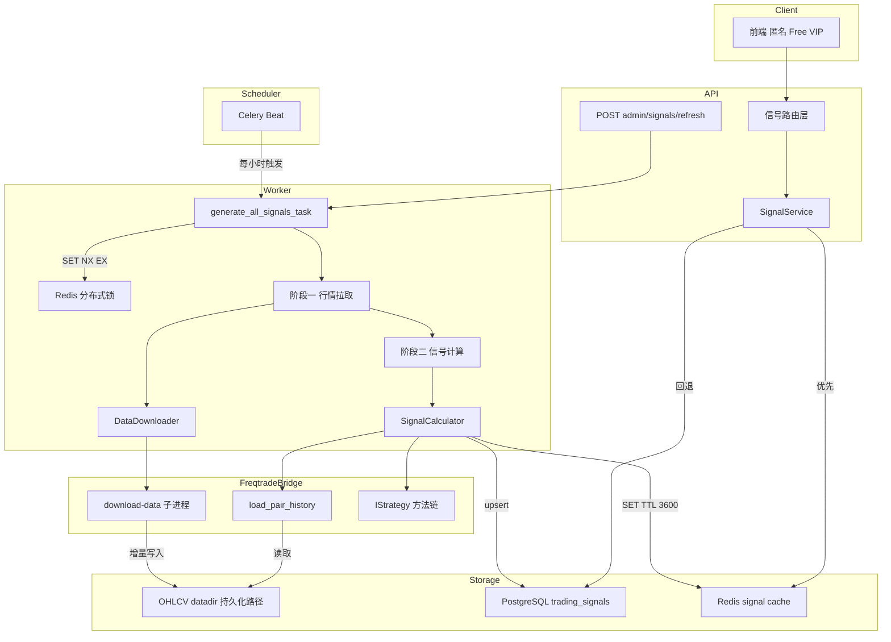
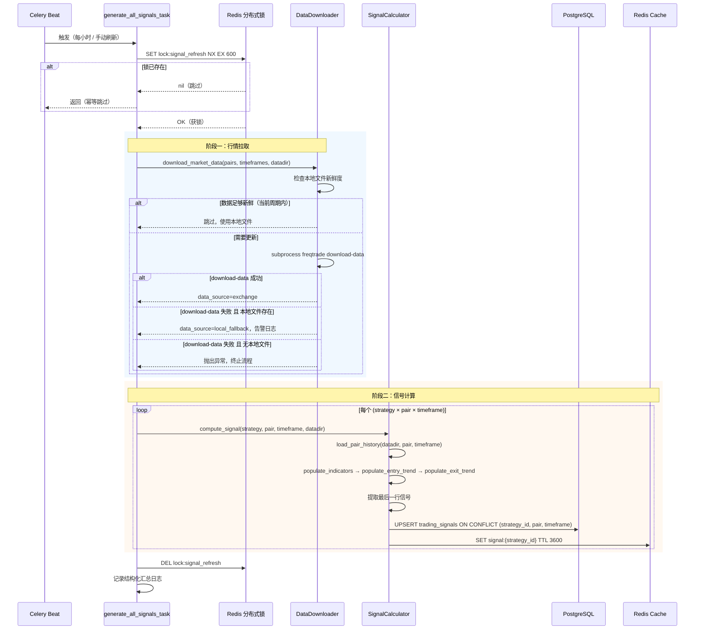
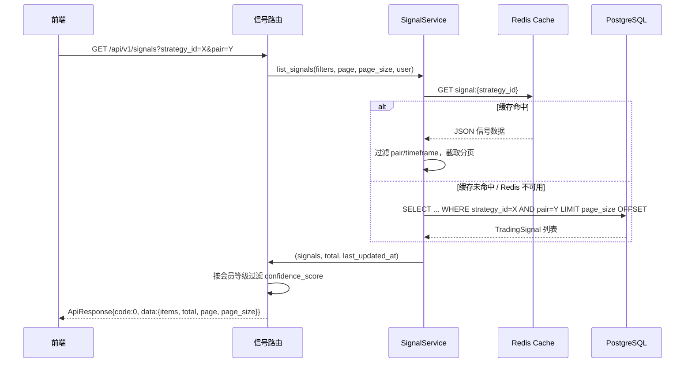
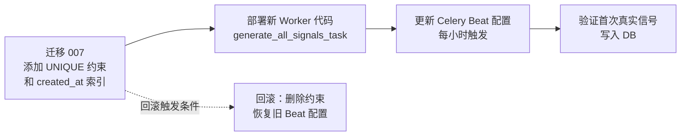

# 技术设计文档：实时交易信号（real-time-signals）

---

## 概述

本功能将量化策略科普展示平台的信号生成从合成模拟数据切换为基于 Binance 真实行情的实时信号。核心机制为**两阶段流水线**：第一阶段通过 `freqtrade download-data` CLI 增量更新本地 OHLCV 数据文件，第二阶段遍历所有 (策略 × 交易对) 组合（当前统一使用 1h 时间周期）调用 freqtrade `IStrategy` 方法链生成信号并持久化。平台仅做展示，不执行任何真实交易指令。

**目标用户**：平台运营方（配置调度、监控告警）；前端用户（匿名/Free/VIP，通过 REST API 查看信号）。

**变更范围**：替换现有 `signal_fetcher.py` 的合成数据层；重构 `signal_tasks.py` 为全局协调任务；扩展 `trading_signals` 表约束；新增两个信号查询 API 端点；新增 `datadir` 持久化配置。

### 目标

- 将合成数据替换为 Binance 真实 OHLCV 行情，使信号具有真实市场参考价值
- 实现增量行情更新（不重复下载历史数据）和 Redis 分布式锁任务幂等性
- 扩展信号查询 API，支持顶级过滤、分页和字段级会员权限控制
- 提供后台管理视图和手动刷新接口，支持运营监控

### 非目标

- 不执行任何真实订单或链接账户 API Key
- 不提供 WebSocket 推送（信号通过轮询 REST API 获取）
- 不支持用户自定义策略或自定义交易对（仅运营后台维护）
- 不实现 AI 研报、回测等其他模块的变更

---

## 架构

### 现有架构分析

现有信号流程为：`Celery Beat (每 15 分钟)` → `generate_signals_task(strategy_id, pair)` → `fetch_signals_sync` → `_build_ohlcv_dataframe`（合成数据） → `IStrategy.populate_*` → Redis 写入 + PostgreSQL INSERT。

存在的问题：
- 合成数据无真实行情参考价值（不满足需求 2）
- 每个 (strategy_id, pair) 独立触发任务，无全局行情拉取协调（不满足需求 1 两阶段架构）
- 无分布式锁，并发触发时存在重复执行风险（不满足需求 2.7）
- 无全局连续失败告警（不满足需求 5.4）
- `trading_signals` 表缺少 `(strategy_id, pair, timeframe)` 唯一约束（不满足需求 3.2）

### 架构模式与边界图



**关键决策**：
- 选定"单协调任务 + 两阶段流水线"模式（方案 A），详见 `research.md`；两阶段严格串行（需求 2.1）
- `DataDownloader` 封装在 `FreqtradeBridge` 层，对上层暴露简单接口（符合现有 `freqtrade_bridge` 模式）
- `signal_fetcher.py` 中的合成数据函数 `_build_ohlcv_dataframe` 替换为 `_load_ohlcv_from_datadir`（从本地 datadir 加载）

### 技术栈

| 层 | 选择 / 版本 | 本功能中的角色 | 备注 |
|----|------------|--------------|------|
| 后端框架 | FastAPI（现有） | 信号查询 API 新增端点 | 扩展现有路由 |
| 任务队列 | Celery + Redis Broker（现有） | 全局信号协调任务调度 | 重构 Beat 调度项 |
| freqtrade CLI | freqtrade（现有） | `download-data` 子进程行情拉取 | 无需新依赖 |
| freqtrade Python API | `freqtrade.data.history`（现有） | `load_pair_history` 本地数据加载 | 替换合成数据层 |
| 数据库 | PostgreSQL + SQLAlchemy 2.x（现有） | `trading_signals` 表 upsert 持久化 | 新增唯一约束迁移 |
| 缓存 | Redis（现有） | 信号缓存（TTL 3600s）+ 分布式锁 | 新增锁 key 命名空间 |
| 配置 | pydantic-settings（现有） | `FREQTRADE_DATADIR` 环境变量 | 新增配置项 |
| 日志 | structlog（现有） | 结构化任务日志 | 新增字段（耗时、命中率等）|

---

## 系统流程

### 流程一：全量信号生成主流程（两阶段流水线）



### 流程二：API 信号查询（读缓存优先）



---

## 需求可追溯性

| 需求 | 摘要 | 组件 | 接口 | 流程 |
|------|------|------|------|------|
| 1.1 | 两阶段流水线架构 | DataDownloader, SignalCalculator | `download_market_data`, `compute_signal` | 流程一阶段一 |
| 1.2 | 增量更新，新鲜度检查 | DataDownloader | `_is_data_fresh` | 流程一阶段一 |
| 1.3 | freqtrade download-data 子进程 | DataDownloader | `_run_download_subprocess` | 流程一阶段一 |
| 1.4 | 仅公开接口，无 API Key | DataDownloader 配置 | freqtrade config `dry_run: true` | 流程一阶段一 |
| 1.5 | 请求限速 200ms 间隔 | DataDownloader | freqtrade 内置 ccxt 速率控制 | 流程一阶段一 |
| 1.6 | 429/418 退避重试 | DataDownloader | freqtrade 内置 + 降级日志 | 流程一阶段一 |
| 1.7 | datadir 持久化，环境变量配置 | AppSettings, DataDownloader | `FREQTRADE_DATADIR` 配置项 | — |
| 1.8 | 禁止删除/清空 datadir | DataDownloader | 仅调用 download-data，禁止 rmtree | — |
| 1.9 | 本地文件降级（local_fallback） | DataDownloader | `data_source=local_fallback` 日志标记 | 流程一阶段一 |
| 1.10 | 子进程不阻塞事件循环 | CoordTask（Celery Worker） | `subprocess.run` 在 Worker 中 | — |
| 2.1 | 串行两阶段，定时触发 | CoordTask | `generate_all_signals_task` | 流程一 |
| 2.2 | DataFrame 内存复用，populate 方法链 | SignalCalculator | `_load_ohlcv_from_datadir`, `_run_strategy_on_df` | 流程一阶段二 |
| 2.3 | IStrategy 子类实例化，不启动 bot | SignalCalculator | `strategy_class(config={})` | 流程一阶段二 |
| 2.4 | 信号结果写入数据库 | SignalCalculator | `upsert_signal` | 流程一阶段二 |
| 2.5 | 单策略失败不中断整体 | SignalCalculator | try/except per combination | 流程一阶段二 |
| 2.6 | upsert 语义，每组合仅保留最新 | SignalCalculator, TradingSignal 唯一约束 | `ON CONFLICT (strategy_id, pair, timeframe) DO UPDATE` | 流程一阶段二 |
| 2.7 | Redis 分布式锁，幂等性 | CoordTask | `acquire_signal_refresh_lock` | 流程一 |
| 3.1 | trading_signals 表字段定义 | TradingSignal 模型 | 现有字段 + `signal_source` 确认 | — |
| 3.2 | upsert 基于唯一约束 | TradingSignal 唯一约束迁移 | `UNIQUE(strategy_id, pair, timeframe)` | — |
| 3.3 | 唯一索引和 generated_at 索引 | Alembic 迁移 | 新增迁移文件 | — |
| 3.4 | 数据库写入失败记录错误日志 | SignalCalculator | structlog ERROR | — |
| 4.1 | GET /api/v1/signals 顶级端点 | SignalRouter（新） | `list_signals` API | 流程二 |
| 4.2 | 匿名用户隐藏 confidence_score | SignalRead Schema | `filter_by_tier` | 流程二 |
| 4.3 | VIP1+ 显示 confidence_score | SignalRead Schema | `filter_by_tier` | 流程二 |
| 4.4 | GET /api/v1/signals/{strategy_id} | SignalRouter（新） | `get_signals_by_strategy` API | 流程二 |
| 4.5 | strategy_id 不存在返回 3001/404 | SignalService | `NotFoundError` | — |
| 4.6 | 分页查询（page/page_size） | SignalService, SignalRouter | `PaginatedResponse[SignalRead]` | — |
| 4.7 | 100ms 内返回查询响应 | SignalService（Redis 优先） | 缓存命中路径 < 10ms | 流程二 |
| 5.1 | Celery Beat 定时调度 | CoordTask Beat 配置 | `crontab(minute=0)` 每小时 | — |
| 5.2 | 结构化汇总日志 | CoordTask | structlog info（耗时、命中率、成功/失败数） | — |
| 5.3 | sqladmin 只读视图 | TradingSignalAdmin（现有扩展） | can_create=False, can_edit=False | — |
| 5.4 | 连续 3 次失败告警 | CoordTask | Redis 计数器 + structlog ERROR | — |
| 5.5 | POST /admin/signals/refresh 手动刷新 | AdminSignalRouter | `trigger_signal_refresh` | — |
| 6.1 | dry_run=true，无 API Key | DataDownloader freqtrade 配置 | freqtrade config 生成 | — |
| 6.2 | 禁用 Telegram/RPC | DataDownloader freqtrade 配置 | freqtrade config 生成 | — |
| 6.3 | 子进程超时强制终止（300s） | DataDownloader / SignalCalculator | `subprocess.run(timeout=300)` | — |
| 6.4 | 不暴露 API Key 或内部路径 | 所有组件 | 日志过滤 + config 不传账户信息 | — |
| 6.5 | 独立临时目录，任务完成后清理 | CoordTask | `/tmp/freqtrade_signals/{task_id}/` | — |

---

## 组件与接口

### 组件概览

| 组件 | 领域/层 | 意图 | 需求覆盖 | 关键依赖（P0/P1） | 契约类型 |
|------|---------|------|---------|-----------------|---------|
| DataDownloader | freqtrade_bridge | 封装 download-data 子进程，管理本地行情文件 | 1.1–1.10 | freqtrade CLI (P0), AppSettings (P0) | Service, Batch |
| SignalCalculator | freqtrade_bridge | 从本地数据计算信号并写入 DB/Redis | 2.1–2.6, 3.1–3.4 | DataDownloader (P0), TradingSignal 模型 (P0), Redis (P1) | Service, Batch |
| CoordTask | workers/tasks | 全局协调两阶段流水线，分布式锁，日志汇总 | 2.1, 2.7, 5.1–5.5 | DataDownloader (P0), SignalCalculator (P0), Redis (P0) | Batch |
| SignalRouter（新增顶级路由） | api | 新增 `/api/v1/signals` 顶级端点 | 4.1–4.7 | SignalService (P0) | API |
| SignalService（扩展） | services | 扩展过滤、分页查询能力 | 4.1–4.7 | TradingSignal 模型 (P0), Redis (P1) | Service |
| TradingSignal 模型（扩展） | models | 新增唯一约束和索引 | 3.2–3.3 | PostgreSQL (P0) | State |
| AdminSignalRouter | api | 管理员手动触发刷新接口 | 5.5 | CoordTask (P0), JWT 管理员鉴权 (P0) | API |
| AppSettings（扩展） | config | 新增 `FREQTRADE_DATADIR` 配置项 | 1.7 | pydantic-settings (P0) | — |
| TradingSignalAdmin（扩展） | admin | 新增只读约束，按策略/类型/时间筛选 | 5.3 | TradingSignal 模型 (P0) | — |

---

### FreqtradeBridge 层

#### DataDownloader

| 字段 | 详情 |
|------|------|
| 意图 | 封装 freqtrade download-data 子进程，管理 OHLCV datadir 持久化文件；提供新鲜度检查和降级逻辑 |
| 需求 | 1.1, 1.2, 1.3, 1.4, 1.5, 1.6, 1.7, 1.8, 1.9, 1.10, 6.1, 6.2, 6.3 |

**职责与约束**
- 管理持久化 `datadir`（`FREQTRADE_DATADIR` 路径），禁止删除其中任何 OHLCV 文件
- 新鲜度检查：读取 (pair + timeframe) 对应的本地数据文件，检查最后一根 K 线时间戳是否在当前时间周期内
- 调用 `freqtrade download-data` 子进程时生成隔离 freqtrade 配置文件（无账户信息，`dry_run: true`，禁用 Telegram/RPC）
- 子进程超时 300 秒强制终止；download-data 失败时降级使用本地已有数据并标记 `data_source=local_fallback`
- 整个 download-data 流程在 Celery Worker 进程中同步执行，不阻塞 FastAPI 事件循环

**依赖**
- 入站：`CoordTask` — 调用 `download_market_data`（P0）
- 出站：`freqtrade CLI` — `subprocess.run(["freqtrade", "download-data", ...])` （P0）
- 出站：`AppSettings` — 读取 `freqtrade_datadir` 路径（P0）
- 出站：`structlog` — 写入告警日志（P1）

**契约**：Service [x] / Batch [x]

##### Service 接口

```python
class DataDownloader:
    def download_market_data(
        self,
        pairs: list[str],
        timeframes: list[str],
        datadir: Path,
        days: int = 30,
    ) -> DownloadResult:
        """执行两阶段行情拉取：新鲜度检查 + 增量 download-data。

        Returns:
            DownloadResult，含 data_source 标记和跳过/成功/失败统计
        Raises:
            FreqtradeExecutionError: download-data 失败且无本地文件可降级
        """
        ...

    def _is_data_fresh(
        self,
        datadir: Path,
        pair: str,
        timeframe: str,
    ) -> bool:
        """检查本地数据文件最后一根 K 线是否在当前时间周期内。

        Returns:
            True 表示数据足够新鲜，可跳过拉取
        """
        ...

    def _run_download_subprocess(
        self,
        pairs: list[str],
        timeframes: list[str],
        datadir: Path,
        days: int,
        timeout: int = 300,
    ) -> None:
        """以子进程方式调用 freqtrade download-data CLI。

        Raises:
            FreqtradeTimeoutError: 超过 timeout 秒
            FreqtradeExecutionError: 非零退出码
        """
        ...
```

**前置条件**：`datadir` 路径可写；`pairs` 和 `timeframes` 非空
**后置条件**：`datadir` 中对应 (pair, timeframe) 文件已更新或保持原状（降级）
**不变式**：不删除 `datadir` 下任何已有 OHLCV 文件

```python
class DownloadResult:
    data_source: Literal["exchange", "local_fallback", "cached"]
    pairs_downloaded: int
    pairs_skipped: int  # 新鲜度检查通过，跳过的数量
    pairs_failed: int
    elapsed_seconds: float
```

**实现说明**
- freqtrade download-data 子进程的配置文件生成在 `/tmp/freqtrade_signals/{task_id}/config.json`，任务结束后清理（符合需求 6.5）；`datadir` 本身不在临时目录中
- ccxt 内置的速率控制（默认 200ms 请求间隔）满足需求 1.5；无需业务层额外限速
- 风险：若 Binance 公开 API 封锁，则持续降级至本地数据；运维需关注连续失败告警

---

#### SignalCalculator

| 字段 | 详情 |
|------|------|
| 意图 | 从本地 datadir 加载 OHLCV 数据，运行策略方法链，提取信号，upsert 至 DB 和 Redis |
| 需求 | 2.1, 2.2, 2.3, 2.4, 2.5, 2.6, 3.1, 3.2, 3.4, 6.1, 6.2, 6.3 |

**职责与约束**
- 替换 `signal_fetcher.py` 中的 `_build_ohlcv_dataframe` 为 `_load_ohlcv_from_datadir`（调用 `freqtrade.data.history.load_pair_history`）
- 同一 (pair, timeframe) 的 DataFrame 在内存中仅加载一次，供所有策略复用（需求 2.2）
- 策略实例化通过 `strategy_class(config={})` 执行，不启动真实 bot（需求 2.3）
- 信号结果通过 `upsert_signal` 写入数据库（`ON CONFLICT (strategy_id, pair, timeframe) DO UPDATE`，需求 2.6）
- 单个 (strategy, pair, timeframe) 组合失败时记录 ERROR 日志，继续处理其余（需求 2.5）

**依赖**
- 入站：`CoordTask` — 调用 `compute_all_signals`（P0）
- 出站：`freqtrade.data.history.load_pair_history` — 本地 OHLCV 加载（P0）
- 出站：`STRATEGY_REGISTRY` — 策略类名和文件路径（P0）
- 出站：`TradingSignal` ORM 模型 + 同步 Session — upsert 写入（P0）
- 出站：`Redis` — 信号缓存更新（P1）

**契约**：Service [x] / Batch [x]

##### Service 接口

```python
class SignalCalculator:
    def compute_all_signals(
        self,
        strategies: list[str],
        pairs: list[str],
        timeframes: list[str],
        datadir: Path,
    ) -> SignalComputeResult:
        """遍历所有 (strategy × pair × timeframe) 组合，计算并持久化信号。

        DataFrame 按 (pair, timeframe) 缓存在内存，避免重复加载文件。

        Returns:
            SignalComputeResult，含成功/失败计数和各组合结果摘要
        """
        ...

    def _load_ohlcv_from_datadir(
        self,
        datadir: Path,
        pair: str,
        timeframe: str,
    ) -> "pd.DataFrame":
        """从本地 datadir 加载 OHLCV DataFrame。

        调用 freqtrade.data.history.load_pair_history。
        Raises:
            FreqtradeExecutionError: 文件不存在或加载失败
        """
        ...

    def _extract_signal_from_df(
        self,
        df: "pd.DataFrame",
        pair: str,
        timeframe: str,
    ) -> SignalData:
        """从策略输出 DataFrame 最后一行提取信号数据（现有逻辑）。"""
        ...

    def upsert_signal(
        self,
        session: Session,
        strategy_id: int,
        pair: str,
        timeframe: str,
        signal_data: SignalData,
    ) -> None:
        """以 upsert 语义写入 trading_signals 表。

        基于 (strategy_id, pair, timeframe) 唯一约束：
        冲突时 UPDATE 现有记录，否则 INSERT。
        """
        ...
```

**前置条件**：`datadir` 中对应 (pair, timeframe) 文件已由 DataDownloader 更新或降级可用
**后置条件**：`trading_signals` 表中每个 (strategy_id, pair, timeframe) 仅保留一条最新记录

```python
class SignalComputeResult:
    total_combinations: int
    success_count: int
    failure_count: int
    elapsed_seconds: float
    cache_hit_rate: float  # 内存 DataFrame 复用率（pair+timeframe 维度）
```

**实现说明**
- `_load_ohlcv_from_datadir` 使用 `candle_type=CandleType.FUTURES`（与 download-data 的 `--trading-mode futures` 对应）
- upsert 使用 PostgreSQL `INSERT ... ON CONFLICT DO UPDATE`（通过 SQLAlchemy `insert().on_conflict_do_update`）
- 风险：若策略计算超时（>300s），需强制终止子进程（需求 6.3）；SignalCalculator 在 Worker 进程中同步执行，需在方法级别设置超时守卫

---

### Workers 层

#### CoordTask（generate_all_signals_task）

| 字段 | 详情 |
|------|------|
| 意图 | 全局协调两阶段流水线的 Celery 任务；管理分布式锁、日志汇总和连续失败告警 |
| 需求 | 2.1, 2.7, 5.1, 5.2, 5.4, 5.5, 6.5 |

**职责与约束**
- Beat 调度：每小时整点触发（`crontab(minute=0, hour="*")`）；可通过管理接口手动触发
- 任务开始时尝试获取 Redis 分布式锁（`SET lock:signal_refresh NX EX 600`），获取失败则跳过并记录日志
- 严格串行执行：阶段一（DataDownloader）完成后才进入阶段二（SignalCalculator）
- 任务完成（成功或失败）后记录结构化汇总日志（含总耗时、阶段一耗时、缓存命中率、成功/失败数）
- 维护 Redis 计数器 `signal:consecutive_failures`：失败时 +1，成功时重置为 0；连续 3 次失败时记录 `ERROR` 级别告警日志
- 任务结束时通过 `finally` 块删除分布式锁和临时目录

**依赖**
- 入站：`Celery Beat` — 定时触发（P0）；`AdminSignalRouter` — 手动触发（P0）
- 出站：`DataDownloader.download_market_data`（P0）
- 出站：`SignalCalculator.compute_all_signals`（P0）
- 出站：`Redis` — 分布式锁 + 失败计数器（P0）

**契约**：Batch [x]

##### Batch / Job 契约

- **触发**：Celery Beat 定时（每小时，可配置 `SIGNAL_REFRESH_INTERVAL`）；`POST /api/v1/admin/signals/refresh` 手动触发
- **输入 / 校验**：无外部输入；策略列表从数据库 `Strategy.is_active=True` 读取；交易对从 `Strategy.pairs` 聚合
- **输出 / 目标**：更新 `trading_signals` 表（upsert）；更新 Redis 信号缓存（TTL 3600s）
- **幂等性与恢复**：Redis `SET NX EX 600` 锁防止并发；任务失败时释放锁，下次触发时重新执行；降级逻辑确保本地数据可用时不完全失败

**实现说明**
- `SIGNAL_REFRESH_INTERVAL` 环境变量支持 crontab 表达式，默认 `"0 * * * *"`（每小时）
- 分布式锁 key：`lock:signal_refresh`；TTL = 600 秒（与子进程超时对齐）
- 连续失败计数器 key：`signal:consecutive_failures`；类型为 Redis String（INCR/SET 操作）
- 风险：若 Celery Worker 崩溃未能释放锁，TTL 超时后锁自动释放

---

### API 层

#### SignalRouter（顶级信号路由，新增）

| 字段 | 详情 |
|------|------|
| 意图 | 提供 `/api/v1/signals` 顶级端点，支持过滤、分页和字段级权限控制 |
| 需求 | 4.1, 4.2, 4.3, 4.4, 4.5, 4.6, 4.7 |

**职责与约束**
- 新建 `src/api/signals_top.py`，注册路由前缀 `/signals`（区别于现有 `/strategies/{id}/signals`）
- 无状态，仅负责参数校验 → 调用 `SignalService` → 构造统一响应信封
- 字段级权限过滤复用现有 `SignalRead.filter_by_tier` 机制

**依赖**
- 入站：前端客户端（P0）
- 出站：`SignalService.list_signals`（P0）；`get_optional_user` 依赖注入（P1）

**契约**：API [x]

##### API 契约

| 方法 | 端点 | 查询参数 | 响应 | 错误 |
|------|------|---------|------|------|
| GET | `/api/v1/signals` | `strategy_id?: int`, `pair?: str`, `timeframe?: str`, `page: int=1`, `page_size: int=20` | `ApiResponse[PaginatedResponse[SignalRead]]` | 无（空列表） |
| GET | `/api/v1/signals/{strategy_id}` | `page: int=1`, `page_size: int=20` | `ApiResponse[PaginatedResponse[SignalRead]]` | 3001 / 404（策略不存在）|

响应示例（匿名用户）：
```json
{
  "code": 0,
  "message": "success",
  "data": {
    "items": [
      {
        "id": 1,
        "strategy_id": 2,
        "pair": "BTC/USDT",
        "timeframe": "1h",
        "signal_type": "BUY",
        "bar_timestamp": "2026-03-15T10:00:00Z",
        "confidence": null
      }
    ],
    "total": 30,
    "page": 1,
    "page_size": 20
  }
}
```

**实现说明**
- 路由注册在 `src/api/main_router.py` 中 include，前缀 `/api/v1`
- VIP1+ 用户的 `confidence_score` 通过 `SignalRead.model_dump(context={"membership": tier})` 控制（现有机制，无需修改 Schema 定义）

---

#### AdminSignalRouter（管理员手动刷新）

| 字段 | 详情 |
|------|------|
| 意图 | 提供管理员手动触发全量信号刷新的 API 端点 |
| 需求 | 5.5 |

**依赖**
- 入站：管理员客户端（P0）
- 出站：`CoordTask.generate_all_signals_task.delay()`（P0）；`require_admin` 依赖注入（P0）

**契约**：API [x]

##### API 契约

| 方法 | 端点 | 请求体 | 响应 | 错误 |
|------|------|-------|------|------|
| POST | `/api/v1/admin/signals/refresh` | 无 | `ApiResponse[{"task_id": str, "message": str}]` | 1002 / 403（非管理员）|

**实现说明**
- `require_admin` 依赖注入检查 `current_user.is_admin == True`（利用现有 `User.is_admin` 字段）
- 返回 Celery task_id 供运营人员确认任务已入队

---

### Services 层

#### SignalService（扩展）

| 字段 | 详情 |
|------|------|
| 意图 | 扩展现有信号查询逻辑，支持顶级过滤、分页 |
| 需求 | 4.1, 4.4, 4.5, 4.6, 4.7 |

**职责与约束**
- 新增 `list_signals(db, strategy_id, pair, timeframe, page, page_size)` 方法，支持可选过滤参数
- 保持现有 Redis 优先 + DB 回退策略（需求 4.7：Redis 命中路径 < 10ms）
- 策略不存在时抛出 `NotFoundError(code=3001)`

**契约**：Service [x]

##### Service 接口

```python
class SignalService:
    async def list_signals(
        self,
        db: AsyncSession,
        strategy_id: int | None = None,
        pair: str | None = None,
        timeframe: str | None = None,
        page: int = 1,
        page_size: int = 20,
    ) -> tuple[list[TradingSignal], int, datetime]:
        """查询信号列表，支持过滤和分页。

        Returns:
            (signals, total, last_updated_at) 三元组
        Raises:
            NotFoundError: strategy_id 指定但不存在
        """
        ...

    # 保留现有方法（兼容性）
    async def get_signals(
        self,
        db: AsyncSession,
        strategy_id: int,
        limit: int = 20,
    ) -> tuple[list[TradingSignal], datetime]:
        ...
```

---

### 数据层

#### TradingSignal 模型（扩展）

| 字段 | 详情 |
|------|------|
| 意图 | 扩展现有 `trading_signals` 表，添加唯一约束和补充索引 |
| 需求 | 3.1, 3.2, 3.3 |

**契约**：State [x]

##### State 管理

- **状态模型**：每个 (strategy_id, pair, timeframe) 组合在表中仅保留一条"最新信号"记录（upsert 语义）
- **持久化与一致性**：`ON CONFLICT (strategy_id, pair, timeframe) DO UPDATE` 在单个 SQL 语句中完成，无中间状态
- **并发策略**：唯一约束由数据库保证，Celery Worker 串行执行（分布式锁），无并发写入冲突

**实现说明**
- 新增 Alembic 迁移（`007_add_trading_signals_constraints.py`）：
  1. `CREATE UNIQUE INDEX uq_trading_signals_strategy_pair_tf ON trading_signals (strategy_id, pair, timeframe)`
  2. `CREATE INDEX idx_signal_generated_at ON trading_signals (created_at DESC)`（用于时间范围查询）
  3. 如现有 `signal_source` 列 NOT NULL 约束缺失，补充 `ALTER TABLE`

---

## 数据模型

### 领域模型

本功能的核心领域对象为 **TradingSignal 聚合根**，代表特定时刻 (策略 + 交易对 + 时间周期) 的市场信号。

- **聚合根**：`TradingSignal`（identity = `(strategy_id, pair, timeframe)` — 每组合仅保留最新一条）
- **值对象**：`SignalData`（方向、置信度、价格、指标快照），不独立持久化
- **域事件**（概念，不实现 Event Store）：`SignalRefreshed(strategy_id, pair, timeframe, signal_at)`

**不变式**：
- `confidence_score` ∈ [0.0, 1.0]（由 SignalCalculator 保证）
- `direction` ∈ {BUY, SELL, HOLD}
- `signal_at`（= K 线时间戳）不得晚于 `created_at`（生成时间）

### 逻辑数据模型

**扩展后的 `trading_signals` 表**（仅列出变更项）：

| 列名 | 类型 | 约束 / 索引 | 说明 |
|------|------|-----------|------|
| `strategy_id` | INTEGER | FK → strategies.id, NOT NULL | （现有）|
| `pair` | VARCHAR(32) | NOT NULL | （现有）|
| `timeframe` | VARCHAR(16) | NOT NULL | 由现有 NULLABLE 改为 NOT NULL |
| `signal_source` | VARCHAR(32) | NOT NULL, DEFAULT 'realtime' | （现有）|
| `signal_at` | TIMESTAMPTZ | NOT NULL | 承载 K 线时间戳（`bar_timestamp` 语义）|
| `created_at` | TIMESTAMPTZ | NOT NULL, server_default=now() | 承载信号生成时间（`generated_at` 语义）|
| — | 唯一索引 | `UNIQUE(strategy_id, pair, timeframe)` | **新增**，支持 upsert |
| — | 普通索引 | `INDEX(created_at DESC)` | **新增**，加速时间范围查询 |

**`app_settings` 新增配置项**：

| 变量名 | Python 类型 | 默认值 | 说明 |
|--------|-----------|-------|------|
| `FREQTRADE_DATADIR` | `Path` | `/opt/freqtrade_data` | OHLCV 持久化根目录 |
| `SIGNAL_REFRESH_INTERVAL` | `str` | `"0 * * * *"` | Celery Beat crontab，默认每小时 |
| `SIGNAL_PAIRS` | `list[str]` | `["BTC/USDT", "ETH/USDT", "BNB/USDT", "SOL/USDT", "XRP/USDT", "ADA/USDT", "DOGE/USDT", "AVAX/USDT", "DOT/USDT", "MATIC/USDT"]` | 信号生成覆盖的交易对（10 个） |
| `SIGNAL_TIMEFRAMES` | `list[str]` | `["1h"]` | 信号生成覆盖的时间周期（当前所有策略均为 1h；未来新增其他周期策略时通过此配置扩展） |

### 数据契约与集成

**Redis 键设计（新增/变更）**

| Key | 类型 | TTL | 描述 |
|-----|------|-----|------|
| `signal:{strategy_id}` | String (JSON) | 3600s | 单策略所有交易对最新信号（现有） |
| `lock:signal_refresh` | String | 600s | 全局信号刷新分布式锁（新增） |
| `signal:consecutive_failures` | String | 永久（业务逻辑删除） | 连续失败计数器（新增） |

**`SignalRead` Schema 字段（对前端的 API 契约）**

| 字段名 | 类型 | 可见性 | 说明 |
|--------|------|--------|------|
| `id` | int | 所有用户 | 信号记录 ID |
| `strategy_id` | int | 所有用户 | 策略 ID |
| `pair` | str | 所有用户 | 交易对 |
| `timeframe` | str \| None | 所有用户 | 时间周期 |
| `signal_type` | SignalDirection | 所有用户 | BUY/SELL/HOLD（对应 `direction` 字段别名）|
| `bar_timestamp` | datetime | 所有用户 | K 线时间（对应 `signal_at`）|
| `confidence` | float \| None | VIP1+ | 置信度（对应 `confidence_score`，匿名/Free 为 null）|
| `generated_at` | datetime | 所有用户 | 信号生成时间（对应 `created_at`）|

> **注意**：`SignalRead` schema 将在本功能中扩展字段别名（`signal_type` 对应 `direction`，`bar_timestamp` 对应 `signal_at`），以对齐需求规格中的字段命名，同时保持向后兼容。

---

## 错误处理

### 错误策略

遵循"局部失败不中断全局"原则（Graceful Degradation）：单个信号计算失败不影响其他组合；行情拉取失败降级至本地数据；只有在连续多次全局失败时才升级为 ERROR 告警。

### 错误分类与响应

**系统错误（行情拉取层）**

| 场景 | 处理方式 | 日志级别 |
|------|---------|---------|
| download-data 返回 429/418 | freqtrade ccxt 自动退避重试 | WARNING |
| download-data 子进程超时（>300s） | 强制终止，降级使用本地文件 | WARNING |
| download-data 失败且无本地文件 | 终止流程，释放锁 | ERROR |
| download-data 失败但本地文件存在 | 降级 `data_source=local_fallback` | WARNING |

**系统错误（信号计算层）**

| 场景 | 处理方式 | 日志级别 |
|------|---------|---------|
| 单个 (strategy, pair, tf) 计算异常 | 跳过，继续下一个组合 | ERROR |
| 数据库写入失败 | 记录错误，不重试（下次任务覆盖） | ERROR |
| Redis 写入失败 | 静默降级（DB 仍有数据），记录 WARNING | WARNING |
| 连续 3 次全局任务失败 | 记录 ERROR 告警（含任务 ID、时间戳）| ERROR |

**API 错误（4xx）**

| 场景 | 错误码 | HTTP 状态 |
|------|--------|---------|
| `strategy_id` 不存在 | 3001 | 404 |
| 非管理员访问 `/admin/signals/refresh` | 1002 | 403 |

### 监控

结构化汇总日志（每次任务完成时，`level=INFO`）：
```json
{
  "event": "signal_refresh_completed",
  "total_elapsed_seconds": 45.2,
  "phase1_elapsed_seconds": 6.1,
  "phase2_elapsed_seconds": 39.1,
  "pairs_downloaded": 8,
  "pairs_skipped_fresh": 2,
  "cache_hit_rate": 0.73,
  "total_combinations": 100,
  "success_count": 118,
  "failure_count": 2,
  "data_source": "exchange"
}
```

---

## 测试策略

### 单元测试

- `DataDownloader._is_data_fresh`：测试时间周期内 / 超期 / 文件不存在三种情况
- `DataDownloader._run_download_subprocess`：mock `subprocess.run`，测试超时抛出 `FreqtradeTimeoutError`、非零退出码抛出 `FreqtradeExecutionError`、成功路径
- `SignalCalculator._load_ohlcv_from_datadir`：mock `load_pair_history`，测试文件不存在时的错误处理
- `SignalCalculator.upsert_signal`：测试 INSERT 和 UPDATE 两条路径（唯一冲突）
- `CoordTask` 分布式锁逻辑：mock Redis，测试锁获取失败时跳过任务、连续失败计数器逻辑
- `SignalService.list_signals`：测试过滤参数组合、分页偏移计算、Redis 降级路径

### 集成测试

- `DataDownloader` + 本地 datadir：使用测试 fixtures 的本地 OHLCV 文件（非真实 Binance），验证新鲜度检查和降级逻辑
- `SignalCalculator.compute_all_signals` 端到端：给定本地数据文件，验证 DB upsert 后表中每组合仅一条记录
- `GET /api/v1/signals`：测试过滤和分页参数；测试匿名 / VIP1 用户的 `confidence` 字段可见性
- `POST /api/v1/admin/signals/refresh`：测试管理员权限验证；测试任务入队返回 task_id

### 性能验证

- 信号查询 API（Redis 命中路径）：目标 < 100ms，基准测试 10 并发请求
- `generate_all_signals_task` 端到端：10 策略 × 10 交易对 × 1 时间周期 = 100 组合，目标 < 120 秒

---

## 可选章节

### 安全考量

- freqtrade 配置文件生成时明确 `"dry_run": true`，不传入 `exchange.key` / `exchange.secret`（满足需求 6.1）
- freqtrade 配置中禁用 `telegram`、`api_server` 节（满足需求 6.2）
- `POST /admin/signals/refresh` 使用 `require_admin` 依赖（`is_admin=True` 字段鉴权），与普通 JWT 鉴权体系兼容
- 日志中不输出 `datadir` 的完整绝对路径（使用相对路径或截断）；API 响应中不含内部路径（满足需求 6.4）

### 性能与可扩展性

- Redis 缓存命中路径（信号查询）延迟 < 10ms，满足需求 4.7 的 100ms 目标
- `trading_signals` 表通过 `UNIQUE(strategy_id, pair, timeframe)` 约束保持每组合一行，防止无限增长（满足需求 2.6）
- 若未来交易对或策略数量大幅增加，可将 `generate_all_signals_task` 中的阶段二改为 Celery `group()` 并行；当前阶段串行已满足需求
- `FREQTRADE_DATADIR` 应挂载 SSD 或高 IOPS 存储，避免 OHLCV 文件读取成为瓶颈

### 迁移策略



**迁移注意事项**：
- 迁移 007 在添加 UNIQUE 约束前需先清理 `trading_signals` 表中同一 (strategy_id, pair, timeframe) 的重复记录（保留最新一条）
- 第一次启动新版本 Worker 前确保 `FREQTRADE_DATADIR` 路径存在且可写；Docker 部署需提前创建 named volume
- 现有 `generate_signals_task` 从 Beat 调度中移除，但保留函数定义用于单策略调试

---

## 附录参考（可选）

### `DownloadResult` 完整类型定义

```python
from typing import Literal
from dataclasses import dataclass

@dataclass
class DownloadResult:
    data_source: Literal["exchange", "local_fallback", "cached"]
    pairs_downloaded: int
    pairs_skipped: int
    pairs_failed: int
    elapsed_seconds: float
    failed_pairs: list[str]  # 失败的交易对列表，用于日志
```

### `SignalComputeResult` 完整类型定义

```python
from dataclasses import dataclass, field

@dataclass
class SignalComputeResult:
    total_combinations: int
    success_count: int
    failure_count: int
    elapsed_seconds: float
    cache_hit_rate: float
    failed_combinations: list[tuple[str, str, str]]  # (strategy, pair, timeframe)
```

> 详细的研究日志、架构方案比较和设计决策权衡见 `.kiro/specs/real-time-signals/research.md`。
