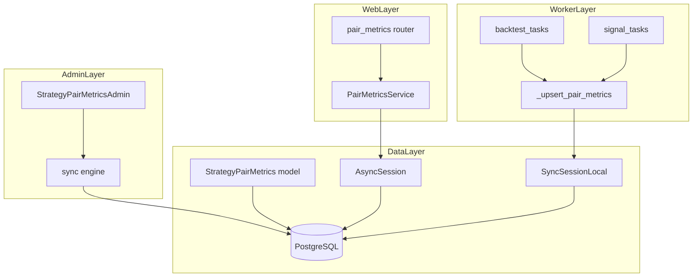
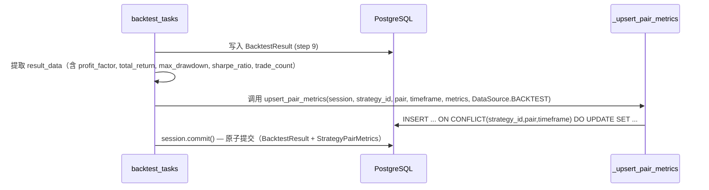
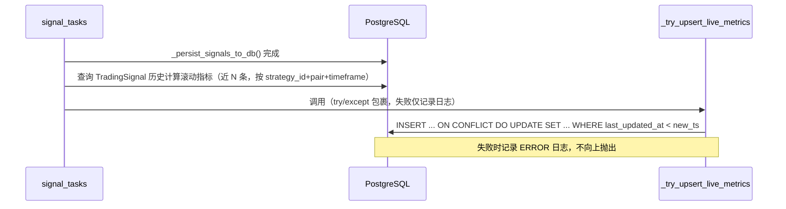
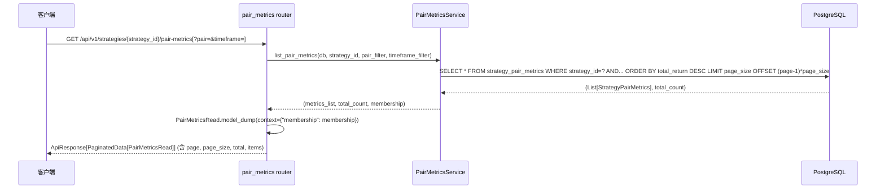
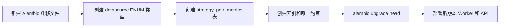

# 设计文档：策略对绩效指标（strategy-pair-metrics）

## 概览

本功能为量化策略科普展示平台的每一个"策略 × 币种 × 周期"组合（简称"策略对"）引入独立的绩效指标持久化体系。指标字段包括累计收益率（`total_return`，映射自 freqtrade 的 `profit_total`）、盈利因子（`profit_factor`，来自 freqtrade 回测输出的独立字段）、最大回撤（`max_drawdown`）、夏普比率（`sharpe_ratio`）和交易次数（`trade_count`）。指标在回测任务完成时原子写入，在实盘信号生成周期内增量更新，前端 API 按会员等级过滤返回。

**目标用户**：前端消费方（匿名/Free/VIP）通过 API 查看策略对排行；运营管理员通过 sqladmin 后台监控和修正指标数据。
**影响**：新增 `strategy_pair_metrics` 表，在现有回测 Worker 任务和信号 Worker 任务末尾注入指标写入逻辑，新增 `GET /api/v1/strategies/{strategy_id}/pair-metrics` 系列接口，新增 `StrategyPairMetricsAdmin` sqladmin 视图。

### 目标

- 为每个策略对建立唯一绩效指标记录，支持 upsert 语义保证幂等
- 回测完成后原子写入指标，不破坏现有事务边界
- 实盘信号生成后非阻塞更新指标，写入失败不中断主流程
- API 按会员等级（匿名/Free/VIP1+）分级返回字段
- sqladmin 提供只读监控视图，禁止删除，允许手动修正

### 非目标

- 不提供实盘绩效的逐笔计算引擎（实盘指标从积累的 `trading_signals` 历史表统计派生）
- 不提供写入接口（指标仅由 Worker 任务和 sqladmin 写入）
- 不引入额外消息队列或事件总线
- 不对历史回测结果进行回填（仅从本功能上线后的回测任务开始写入）

---

## 架构

### 现有架构分析

系统采用严格的分层架构：路由层（`src/api/`）→ 服务层（`src/services/`）→ 数据层（`src/models/`），Celery Worker 层（`src/workers/tasks/`）通过同步 SQLAlchemy session 直接访问数据层，不经过服务层。sqladmin 绑定同步 engine，独立于 Web 异步路径。

现有与本功能最相关的集成点：

- `backtest_tasks.run_backtest_task`：回测完成后在同一 `session.commit()` 前完成所有写入（步骤 12）。注入点明确，在第 12 步 `session.commit()` 前插入指标 upsert 调用。
- `signal_tasks.generate_signals_task`：信号生成后调用 `_persist_signals_to_db`，本功能在 `_persist_signals_to_db` 之后追加非阻塞的指标更新调用。
- `src/schemas/strategy.py`：`@model_serializer` + `json_schema_extra={"min_tier": ...}` 实现字段级权限，直接复用此模式。
- `src/admin/views.py` + `src/admin/__init__.py`：ModelView 注册模式固定，新增 `StrategyPairMetricsAdmin` 后在 `setup_admin()` 中追加一行 `admin.add_view(...)` 即可。

### 架构模式与边界图



**架构集成说明**：
- 选型模式：新增独立组件（model / service / schema / router / admin view），通过最小注入点接入现有 Worker 任务
- 域边界：`StrategyPairMetrics` 作为独立聚合根，不依赖 `BacktestResult`、`TradingSignal` 表（通过 `strategy_id + pair + timeframe` 关联）
- 保留现有模式：`@model_serializer` 字段过滤、同步 session（Worker）/ 异步 session（Web）双轨、sqladmin 统一注册
- 新增组件理由：独立服务层保持单一职责，独立 schema 保持类型安全

### 技术栈

| 层次 | 选型 / 版本 | 在本功能中的角色 | 备注 |
|------|-------------|-----------------|------|
| 后端服务 | FastAPI（现有） | 提供新增 pair-metrics 路由 | 复用现有 router 模式 |
| ORM | SQLAlchemy 2.x（现有） | `StrategyPairMetrics` 模型声明；upsert 使用 `insert().on_conflict_do_update()` | asyncpg（Web）/ psycopg2（Worker + sqladmin） |
| 数据库 | PostgreSQL（现有） | `strategy_pair_metrics` 表，`UNIQUE(strategy_id, pair, timeframe)` | 利用 PostgreSQL 原生 upsert |
| Schema 校验 | Pydantic v2（现有） | `PairMetricsRead` 及 `@model_serializer` 字段过滤 | 复用 `TIER_ORDER` / `_tier_index` |
| 任务调度 | Celery（现有） | 注入回测任务和信号任务的指标写入 | 无新队列 |
| 管理界面 | sqladmin（现有） | `StrategyPairMetricsAdmin` ModelView | 同步 engine，禁止删除 |
| 日志 | structlog（现有） | 每次指标更新记录结构化 INFO 日志 | 含 strategy_id / pair / timeframe / data_source / trade_count |
| 迁移 | Alembic（现有） | 新建 `strategy_pair_metrics` 表迁移文件 | 同时新增 `DataSource` 枚举类型 |

---

## 系统流程

### 流程 1：回测完成后指标原子写入



关键决策：指标 upsert 与 `BacktestResult` 写入在同一事务内，确保 2.5 要求的原子性。回测结果字段中 `profit_factor` 直接来自 freqtrade 输出（`profit_factor` 字段），`total_return` 映射自 `profit_total`，两者并存，不互相替代（用户澄清 1）。

### 流程 2：实盘信号生成后非阻塞指标更新



关键决策：实盘指标从 `trading_signals` 历史表的滚动窗口统计派生（近 200 条记录），不依赖 freqtrade 实时 RPC（因为 freqtrade 在 signal_tasks 中为模块导入模式而非常驻进程）。计算逻辑封装在 `_compute_live_metrics()` 辅助函数中，包含：`trade_count`（信号条数）、近似 `sharpe_ratio`（收益率序列标准差估算）、近似 `max_drawdown`（累计价格序列最大回撤）、`total_return`（最近 N 条信号的累计方向乘以固定收益率的简化估算）、`profit_factor`（置信度加权）。写入失败不中断信号任务主流程（3.4）。

**⚠️ 实盘指标精度说明**：`data_source=live` 的指标为基于信号历史的**估算值**（estimation），而非精确的交易绩效数据。具体而言：`profit_factor` 通过信号方向的 buy/sell 比率近似，而非实际盈亏金额比；`sharpe_ratio` 基于 `confidence_score` 序列的均值/标准差估算，而非真实收益率序列。回测数据（`data_source=backtest`）来自 freqtrade 的精确回测引擎，精度远高于实盘估算值。前端在展示实盘指标时应标注"估算"字样，以避免用户误解。

### 流程 3：API 查询（含权限过滤）



---

## 需求可追溯性

| 需求 | 摘要 | 组件 | 接口 | 流程 |
|------|------|------|------|------|
| 1.1 | 策略对唯一指标记录，含全部指标字段 | `StrategyPairMetrics` 模型 | 数据库 UNIQUE 约束 | — |
| 1.2 | `(strategy_id, pair, timeframe)` 唯一约束 | `StrategyPairMetrics` 模型 | `UniqueConstraint` | — |
| 1.3 | `data_source` 枚举字段 | `StrategyPairMetrics` 模型 + `DataSource` 枚举 | 模型字段 | — |
| 1.4 | `last_updated_at` UTC 时间戳 | `StrategyPairMetrics` 模型 | `DateTime(timezone=True)` | — |
| 1.5 | 首次写入自动创建（upsert 语义） | `_upsert_pair_metrics()` | PostgreSQL ON CONFLICT | 流程 1、2 |
| 2.1 | 回测 DONE 后提取并写入指标 | `backtest_tasks` 注入点 + `_upsert_pair_metrics()` | Worker 任务 | 流程 1 |
| 2.2 | 回测写入时 `data_source=backtest`，更新 `last_updated_at` | `_upsert_pair_metrics()` | Service 调用参数 | 流程 1 |
| 2.3 | 缺失字段不覆盖现有值 | `_upsert_pair_metrics()` | `ON CONFLICT DO UPDATE SET` 使用 `COALESCE` | 流程 1 |
| 2.4 | live 来源记录被回测数据全量覆盖 | `_upsert_pair_metrics()` | upsert 逻辑（无条件覆盖） | 流程 1 |
| 2.5 | BacktestResult 写入与指标写入原子一致 | `backtest_tasks` | 同一 session.commit() | 流程 1 |
| 3.1 | 实盘信号产生后更新指标 | `signal_tasks` 注入点 + `_try_upsert_live_metrics()` | Worker 任务 | 流程 2 |
| 3.2 | 实盘写入 `data_source=live`，更新 `last_updated_at` | `_try_upsert_live_metrics()` | upsert 参数 | 流程 2 |
| 3.3 | 记录不存在时自动创建 | `_upsert_pair_metrics()` | ON CONFLICT DO UPDATE | 流程 1、2 |
| 3.4 | 写入失败不阻塞信号任务 | `_try_upsert_live_metrics()` | try/except + structlog ERROR | 流程 2 |
| 3.5 | 幂等更新 | `_upsert_pair_metrics()` | ON CONFLICT DO UPDATE（WHERE last_updated_at 防旧数据覆盖新数据） | 流程 2 |
| 4.1 | GET pair-metrics 列表接口 | `PairMetricsRouter` + `PairMetricsService` | REST API | 流程 3 |
| 4.2 | 匿名用户仅返回基础字段 | `PairMetricsRead` + `@model_serializer` | Schema 字段过滤 | 流程 3 |
| 4.3 | VIP1+ 返回 `max_drawdown` / `sharpe_ratio` | `PairMetricsRead` + `@model_serializer` | Schema 字段过滤 | 流程 3 |
| 4.4 | strategy_id 不存在返回 HTTP 404 code=3001 | `PairMetricsService` | `NotFoundError` | 流程 3 |
| 4.5 | 按 `total_return` 降序，支持 `?pair` / `?timeframe` 过滤 | `PairMetricsService` | SQLAlchemy 查询 | 流程 3 |
| 4.6 | GET 单个策略对详情接口 | `PairMetricsRouter` + `PairMetricsService` | REST API | 流程 3 |
| 5.1 | sqladmin StrategyPairMetricsAdmin 视图 | `StrategyPairMetricsAdmin` | sqladmin ModelView | — |
| 5.2 | sqladmin 按多字段筛选 | `StrategyPairMetricsAdmin` | `column_searchable_list` / `column_filters` | — |
| 5.3 | sqladmin 按 `last_updated_at` / `total_return` 排序 | `StrategyPairMetricsAdmin` | `column_sortable_list` | — |
| 5.4 | 禁止 sqladmin 删除 | `StrategyPairMetricsAdmin` | `can_delete = False` | — |
| 5.5 | 允许管理员手动编辑指标字段 | `StrategyPairMetricsAdmin` | `can_edit = True` + `form_columns` | — |
| 6.1 | DB 错误重试（指数退避，最多 3 次） | `_upsert_pair_metrics()` | 重试辅助函数 | — |
| 6.2 | 异常值拒绝写入，记录 WARNING 日志 | `MetricsValidator` | 校验函数 | — |
| 6.3 | `trade_count` 负数拒绝写入 | `MetricsValidator` | 校验函数 | — |
| 6.4 | 并发 upsert 不产生重复记录 | `_upsert_pair_metrics()` | PostgreSQL ON CONFLICT | — |
| 6.5 | 结构化日志记录每次更新 | `_upsert_pair_metrics()` | structlog INFO | — |

---

## 组件与接口

### 组件总览

| 组件 | 层次 | 职责摘要 | 需求覆盖 | 关键依赖 | 契约类型 |
|------|------|---------|---------|---------|---------|
| `StrategyPairMetrics` | 数据层 | ORM 模型，定义表结构和约束 | 1.1–1.5 | `Base`, `DataSource` 枚举 | State |
| `DataSource` 枚举 | 核心层 | `backtest` / `live` 枚举，扩展 `src/core/enums.py` | 1.3 | — | — |
| `_upsert_pair_metrics()` | Worker 工具层 | PostgreSQL upsert + 重试 + 日志 | 1.5, 2.1–2.5, 3.1–3.5, 6.1, 6.4–6.5 | `StrategyPairMetrics`, `Session` | Batch |
| `MetricsValidator` | 工具层 | 指标值域校验，拒绝异常值 | 6.2–6.3 | — | Service |
| `_compute_live_metrics()` | Worker 工具层 | 从 `trading_signals` 历史计算实盘滚动指标 | 3.1 | `TradingSignal` | Batch |
| `_try_upsert_live_metrics()` | Worker 工具层 | 非阻塞封装 `_upsert_pair_metrics`，失败只记录日志 | 3.4 | `_upsert_pair_metrics`, `_compute_live_metrics` | Batch |
| `PairMetricsService` | 服务层 | API 查询逻辑，策略存在性检查 | 4.1–4.6 | `StrategyPairMetrics`, `Strategy`, `AsyncSession` | Service |
| `PairMetricsRead` Schema | Schema 层 | Pydantic 响应 Schema，含 `@model_serializer` 字段过滤 | 4.1–4.3 | `TIER_ORDER`, `_tier_index` | — |
| `PairMetricsRouter` | 路由层 | FastAPI 路由，挂载 pair-metrics 端点 | 4.1, 4.4–4.6 | `PairMetricsService`, `get_optional_user`, `get_db` | API |
| `StrategyPairMetricsAdmin` | Admin 层 | sqladmin ModelView | 5.1–5.5 | `StrategyPairMetrics` | State |

---

### 数据层

#### StrategyPairMetrics

| 字段 | 详情 |
|------|------|
| Intent | 持久化每个"策略 × 币种 × 周期"组合的绩效指标，确保全局唯一 |
| Requirements | 1.1, 1.2, 1.3, 1.4, 1.5 |

**职责与约束**
- 表 `strategy_pair_metrics` 以 `(strategy_id, pair, timeframe)` 三元组作为业务唯一键
- 同时持有 `total_return`（累计收益率，映射自 `profit_total`）和 `profit_factor`（盈利因子，freqtrade 回测独立字段）两个独立字段，不合并
- `last_updated_at` 由写入方显式传入，不使用 `server_default`，以支持幂等判断（3.5）
- 外键 `strategy_id` 关联 `strategies.id`，`ON DELETE CASCADE`

**依赖**
- 入站：`_upsert_pair_metrics()` — 写入（P0）；`PairMetricsService` — 读取（P0）；`StrategyPairMetricsAdmin` — sqladmin 读写（P1）
- 外部：`DataSource` 枚举（`src/core/enums.py`）— P0

**契约**：State

##### State 定义

```
表名: strategy_pair_metrics
主键: id (INTEGER, autoincrement)
唯一约束: (strategy_id, pair, timeframe)
外键: strategy_id → strategies.id (ON DELETE CASCADE)
索引:
  - idx_spm_strategy_id (strategy_id)
  - idx_spm_strategy_pair_tf (strategy_id, pair, timeframe)  -- 覆盖唯一约束的查询
  - idx_spm_last_updated_at (last_updated_at)
字段:
  strategy_id: INTEGER NOT NULL
  pair: VARCHAR(32) NOT NULL
  timeframe: VARCHAR(16) NOT NULL
  total_return: FLOAT NULLABLE       -- 累计收益率，freqtrade profit_total
  profit_factor: FLOAT NULLABLE      -- 盈利因子，freqtrade profit_factor
  max_drawdown: FLOAT NULLABLE       -- 最大回撤（绝对值，正数）
  sharpe_ratio: FLOAT NULLABLE       -- 夏普比率
  trade_count: INTEGER NULLABLE      -- 总交易次数（非负）
  data_source: ENUM(backtest,live) NOT NULL
  last_updated_at: TIMESTAMPTZ NOT NULL  -- 显式传入，UTC
  created_at: TIMESTAMPTZ NOT NULL DEFAULT now()
```

**实现说明**
- 所有指标字段声明为 `NULLABLE`，以支持"缺失字段不覆盖"（2.3）语义
- `data_source` 使用 SQLAlchemy `Enum` 类型，枚举名 `"datasource"`，与现有 `taskstatus` / `signaldirection` 命名风格一致

---

### 核心层

#### DataSource 枚举

新增至 `src/core/enums.py`：

```
class DataSource(str, Enum):
    BACKTEST = "backtest"
    LIVE = "live"
```

---

### Worker 工具层

#### MetricsValidator

| 字段 | 详情 |
|------|------|
| Intent | 在写入数据库前校验指标值域，拒绝异常值 |
| Requirements | 6.2, 6.3 |

**职责与约束**
- 纯函数，无副作用，不依赖数据库
- 校验范围：`total_return` / `profit_factor` / `max_drawdown` / `sharpe_ratio` 须在 `[-10000, 10000]` 区间；`trade_count` 须为非负整数
- 校验失败时抛出 `ValueError`，由调用方记录 WARNING 日志后保留原有值

**契约**：Service

##### 服务接口

```python
def validate_metrics(
    total_return: float | None,
    profit_factor: float | None,
    max_drawdown: float | None,
    sharpe_ratio: float | None,
    trade_count: int | None,
) -> None:
    """校验指标值域。校验失败时抛出 ValueError（含描述消息）。"""
```

- 前置条件：各参数为 Python 原生数值类型或 None
- 后置条件：返回 None 表示全部通过；任一失败立即抛出
- 不变量：不修改任何外部状态

---

#### _upsert_pair_metrics()

| 字段 | 详情 |
|------|------|
| Intent | 执行 PostgreSQL `INSERT ... ON CONFLICT DO UPDATE`，附带重试和结构化日志 |
| Requirements | 1.5, 2.1–2.5, 3.1–3.5, 6.1, 6.4, 6.5 |

**职责与约束**
- 在调用方提供的同步 `Session` 中执行 upsert，不自行 commit（由 Worker 任务统一 commit）
- 对于回测来源：无条件覆盖所有非 None 指标字段（2.4）；对于来源为缺失的字段使用 `COALESCE(excluded.field, current.field)` 保留现有值（2.3）
- `last_updated_at` 由调用方传入，upsert 时使用 `WHERE strategy_pair_metrics.last_updated_at < excluded.last_updated_at` 防止旧数据覆盖新数据（3.5）
- DB 连接错误时指数退避重试，最多 3 次（初始等待 1s，2s，4s）；重试耗尽后记录结构化 ERROR 日志并向上抛出（6.1）
- 每次成功 upsert 后记录 structlog INFO（含 `strategy_id`, `pair`, `timeframe`, `data_source`, `trade_count`）（6.5）

**依赖**
- 入站：`backtest_tasks.run_backtest_task` — 回测注入（P0）；`_try_upsert_live_metrics` — 实盘注入（P0）
- 出站：`StrategyPairMetrics` 模型 — P0；`MetricsValidator` — P0
- 外部：`sqlalchemy.dialects.postgresql.insert` — P0

**契约**：Batch

##### Batch 契约

```python
def upsert_pair_metrics(
    session: Session,
    strategy_id: int,
    pair: str,
    timeframe: str,
    total_return: float | None,
    profit_factor: float | None,
    max_drawdown: float | None,
    sharpe_ratio: float | None,
    trade_count: int | None,
    data_source: DataSource,
    last_updated_at: datetime,
) -> None:
    """执行 strategy_pair_metrics upsert。

    调用前须通过 MetricsValidator.validate_metrics() 校验，
    校验失败时此函数不应被调用。
    不执行 session.commit()，由调用方控制事务边界。
    """
```

- 触发：回测任务 DONE 后（`run_backtest_task` step 12 之前）；实盘信号写入后（`_try_upsert_live_metrics`）
- 输入校验：由 `MetricsValidator` 在调用前完成；None 字段通过 `COALESCE` 保留现有值
- 幂等性：相同 `(strategy_id, pair, timeframe, last_updated_at)` 重复写入结果相同
- 恢复：DB 错误指数退避重试 3 次，仍失败则向上传播

**实现说明**
- 使用 `sqlalchemy.dialects.postgresql.insert(StrategyPairMetrics)` 构建 upsert 语句，调用 `.on_conflict_do_update()`
- 回测来源：`set_` 参数中直接使用 `excluded.field`（无条件覆盖）；对于来源为 None 的字段：`COALESCE(excluded.field, StrategyPairMetrics.field)`
- 实盘来源：统一使用 `COALESCE(excluded.field, StrategyPairMetrics.field)`，避免覆盖已有较高质量的回测数据中的 None 字段

---

#### _compute_live_metrics()

| 字段 | 详情 |
|------|------|
| Intent | 从 `trading_signals` 历史表统计计算实盘滚动绩效指标 |
| Requirements | 3.1 |

**职责与约束**
- 查询 `trading_signals` 中 `strategy_id + pair + timeframe` 匹配的最近 200 条记录（按 `signal_at` 降序）
- 计算规则（全部为**估算值**，非精确交易绩效，仅供科普展示参考）：
  - `trade_count`：非 `hold` 方向的信号条数（精确值）
  - `total_return`：以 `buy` 方向信号置信度加权的简化累计收益估算（科普展示级精度，非真实持仓盈亏）
  - `profit_factor`：`buy` 信号置信度总和 / `sell` 信号置信度总和（近似盈亏比，非实际盈利金额/亏损金额）
  - `sharpe_ratio`：最近 200 条 `confidence_score` 序列的均值 / 标准差（近似夏普，非真实收益率序列的夏普比率）
  - `max_drawdown`：最近 200 条信号累计方向序列的最大连续负序长度归一化（简化估算，非实际净值曲线回撤）
- 全部指标为 `NULLABLE`，若历史数据不足（< 5 条）则返回 `None`

**契约**：Batch

```python
def compute_live_metrics(
    session: Session,
    strategy_id: int,
    pair: str,
    timeframe: str,
) -> dict[str, float | int | None]:
    """从 trading_signals 历史计算实盘滚动指标。返回含 5 个指标键的字典。"""
```

---

#### _try_upsert_live_metrics()

| 字段 | 详情 |
|------|------|
| Intent | 非阻塞封装 `_compute_live_metrics` + `_upsert_pair_metrics`，写入失败仅记录日志 |
| Requirements | 3.1–3.5 |

**职责与约束**
- 在 `signal_tasks._persist_signals_to_db()` 之后调用，使用独立的 `SyncSessionLocal()` session（避免污染信号写入事务）
- 全部逻辑包裹在 `try/except Exception`，失败时记录 structlog ERROR（含 `strategy_id`, `pair`, `timeframe`, `error_message`），不向上抛出（3.4）
- 成功时自行 `session.commit()`

```python
def try_upsert_live_metrics(
    strategy_id: int,
    pair: str,
    timeframe: str,
) -> None:
    """非阻塞实盘指标更新，失败仅记录日志。"""
```

---

### 服务层

#### PairMetricsService

| 字段 | 详情 |
|------|------|
| Intent | 提供策略对绩效指标的异步查询，包含策略存在性验证和多条件过滤 |
| Requirements | 4.1, 4.4–4.6 |

**职责与约束**
- 不含写入逻辑；写入仅由 Worker 任务负责
- 查询前先验证 `strategy_id` 对应策略存在，不存在时抛出 `NotFoundError(code=3001)`（4.4）
- 按 `total_return DESC` 排序（4.5）；支持 `pair` / `timeframe` 过滤参数（4.5）
- 使用异步 `AsyncSession`（Web 层），由路由层通过 `Depends(get_db)` 注入

**依赖**
- 入站：`PairMetricsRouter` — HTTP 请求（P0）
- 出站：`StrategyPairMetrics` 模型 — 查询（P0）；`Strategy` 模型 — 策略存在性检查（P0）
- 外部：`AsyncSession` / `select` — P0

**契约**：Service

##### 服务接口

```python
class PairMetricsService:
    async def list_pair_metrics(
        self,
        db: AsyncSession,
        strategy_id: int,
        pair_filter: str | None = None,
        timeframe_filter: str | None = None,
        page: int = 1,
        page_size: int = 20,
    ) -> tuple[list[StrategyPairMetrics], int]:
        """按 total_return 降序返回策略对绩效分页列表和总记录数。策略不存在时抛出 NotFoundError。"""

    async def get_pair_metric(
        self,
        db: AsyncSession,
        strategy_id: int,
        pair: str,
        timeframe: str,
    ) -> StrategyPairMetrics:
        """返回单个策略对详情。策略不存在或记录不存在时抛出 NotFoundError。"""
```

- 前置条件：`strategy_id` 为正整数；`pair` / `timeframe` 若传入须为非空字符串
- 后置条件：返回 ORM 对象列表或单个对象
- 不变量：不写入任何数据库记录

**实现说明**
- 查询均使用 `select(StrategyPairMetrics).where(...)` + `order_by(StrategyPairMetrics.total_return.desc().nullslast())`（`total_return` 为 NULLABLE，使用 `nullslast()` 避免 null 排在前面）
- 列表查询实现分页：接收 `page`（默认 1）和 `page_size`（默认 20，最大 100）参数，使用 `LIMIT page_size OFFSET (page-1)*page_size`，同时执行 `SELECT COUNT(*)` 返回总记录数
- 返回 `PaginatedData` 包装对象，包含 `items`、`total`、`page`、`page_size` 字段

---

### Schema 层

#### PairMetricsRead

| 字段 | 详情 |
|------|------|
| Intent | 策略对绩效响应 Schema，含 `@model_serializer` 字段级权限过滤 |
| Requirements | 4.1–4.3 |

**字段等级设计**（复用现有 `TIER_ORDER` / `_tier_index` / `filter_by_tier` 模式）：

```
匿名可见字段（无 min_tier）:
  pair: str
  timeframe: str
  total_return: float | None
  trade_count: int | None

Free 可见字段（min_tier="free"）:
  profit_factor: float | None
  data_source: DataSource

VIP1 可见字段（min_tier="vip1"）:
  max_drawdown: float | None
  sharpe_ratio: float | None
  last_updated_at: datetime | None
```

**实现说明**
- 完整复用 `src/schemas/strategy.py` 中的 `filter_by_tier` `@model_serializer(mode="wrap")` 实现，无需重新设计
- `model_config = {"from_attributes": True}` 以支持 ORM 对象直接转换
- `data_source` 字段序列化为字符串枚举值（Pydantic v2 默认行为）

---

### 路由层

#### PairMetricsRouter

| 字段 | 详情 |
|------|------|
| Intent | 提供 pair-metrics REST 端点，集成 `get_optional_user` 和 `PairMetricsService` |
| Requirements | 4.1, 4.4–4.6 |

**契约**：API

##### API 契约

| 方法 | 端点 | 请求参数 | 响应体 | 错误 |
|------|------|---------|-------|------|
| GET | `/api/v1/strategies/{strategy_id}/pair-metrics` | `?pair=BTC/USDT&timeframe=1h&page=1&page_size=20`（可选） | `ApiResponse[PaginatedData[PairMetricsRead]]` | 404 (code=3001) |
| GET | `/api/v1/strategies/{strategy_id}/pair-metrics/{pair}/{timeframe}` | path params | `ApiResponse[PairMetricsRead]` | 404 (code=3001) |

说明：
- `{pair}` 路径参数中 `/` 须 URL 编码为 `%2F`（如 `BTC%2FUSDT`）
- 认证可选：`Depends(get_optional_user)`，匿名时 `membership=None`
- 响应体通过 `PairMetricsRead.model_dump(context={"membership": membership})` 序列化

**实现说明**
- 路由文件位于 `src/api/pair_metrics.py`，在 `src/api/main_router.py` 的 `_register_routers()` 中追加注册
- 路由前缀通过嵌套在 `strategies` 路由器下实现（`prefix="/strategies"`，端点路径含 `/{strategy_id}/pair-metrics`），或作为独立路由器均可；推荐作为独立路由器 `prefix="/strategies"` 以避免与现有 strategies 路由器合并冲突

---

### Admin 层

#### StrategyPairMetricsAdmin

| 字段 | 详情 |
|------|------|
| Intent | sqladmin 管理视图，提供绩效指标的监控和手动修正能力 |
| Requirements | 5.1–5.5 |

**契约**：State

```python
class StrategyPairMetricsAdmin(ModelView, model=StrategyPairMetrics):
    name = "策略对绩效"
    name_plural = "策略对绩效列表"

    column_list = [
        # strategy_id, pair, timeframe, total_return, profit_factor,
        # max_drawdown, sharpe_ratio, trade_count, data_source, last_updated_at
    ]

    column_searchable_list = [pair, timeframe, data_source]  # 按字段对象引用
    column_filters = [strategy_id, pair, timeframe, data_source]
    column_sortable_list = [last_updated_at, total_return]

    can_delete = False  # 5.4：禁止删除，保护历史数据完整性
    can_create = False  # 由 Worker 任务创建，不在后台创建
    can_edit = True     # 5.5：允许管理员手动修正
    can_view_details = True

    form_columns = [
        # total_return, profit_factor, max_drawdown, sharpe_ratio,
        # trade_count, data_source, last_updated_at
    ]
```

**实现说明**
- 在 `src/admin/views.py` 末尾新增类定义
- 在 `src/admin/__init__.py` 的 `setup_admin()` 中追加 `admin.add_view(StrategyPairMetricsAdmin)`

---

## 数据模型

### 域模型

`StrategyPairMetrics` 作为独立聚合根，聚合边界为单个策略对的指标快照：

- **聚合根**：`StrategyPairMetrics`，通过业务键 `(strategy_id, pair, timeframe)` 标识
- **值对象**：指标字段集（`total_return`, `profit_factor`, `max_drawdown`, `sharpe_ratio`, `trade_count`）+ 元数据（`data_source`, `last_updated_at`）
- **业务规则**：
  - 同一策略对全局唯一，upsert 保证不产生重复
  - 回测来源数据优先级高于实盘（覆盖语义，需求 2.4）
  - 指标字段均可为 NULL（初始或缺失状态）
  - `last_updated_at` 由写入方显式控制，不使用 `onupdate`


### 逻辑数据模型

**实体关系**：
- `strategies.id` 1:N `strategy_pair_metrics.strategy_id`（一个策略有多个策略对绩效记录）
- `data_source` 枚举约束值域为 `{backtest, live}`

**索引设计**：
- `(strategy_id, pair, timeframe)` — UNIQUE，支持 upsert 冲突判断
- `(strategy_id)` — 覆盖列表 API 按策略查询
- `(last_updated_at)` — 覆盖 sqladmin 按时间排序

**一致性**：
- upsert 事务边界由调用方控制（回测任务：与 `BacktestResult` 同一事务；实盘任务：独立事务）
- `last_updated_at` 时区始终为 UTC（`DateTime(timezone=True)`）

### 物理数据模型

```sql
-- Alembic 迁移文件命名示例：{seq}_add_strategy_pair_metrics.py

CREATE TYPE datasource AS ENUM ('backtest', 'live');

CREATE TABLE strategy_pair_metrics (
    id              SERIAL PRIMARY KEY,
    strategy_id     INTEGER NOT NULL REFERENCES strategies(id) ON DELETE CASCADE,
    pair            VARCHAR(32) NOT NULL,
    timeframe       VARCHAR(16) NOT NULL,
    total_return    FLOAT,
    profit_factor   FLOAT,
    max_drawdown    FLOAT,
    sharpe_ratio    FLOAT,
    trade_count     INTEGER,
    data_source     datasource NOT NULL,
    last_updated_at TIMESTAMPTZ NOT NULL,
    created_at      TIMESTAMPTZ NOT NULL DEFAULT now(),
    CONSTRAINT uq_spm_strategy_pair_tf UNIQUE (strategy_id, pair, timeframe)
);

CREATE INDEX idx_spm_strategy_id ON strategy_pair_metrics (strategy_id);
CREATE INDEX idx_spm_last_updated_at ON strategy_pair_metrics (last_updated_at);
```

### 数据契约与集成

**API 数据传输**

请求（列表端点）：
```
GET /api/v1/strategies/{strategy_id}/pair-metrics
Query: pair?: string, timeframe?: string
Headers: Authorization: Bearer {token}（可选）
```

响应（匿名）：
```json
{
  "code": 0,
  "message": "success",
  "data": {
    "items": [
      {
        "pair": "BTC/USDT",
        "timeframe": "1h",
        "total_return": 0.1523,
        "trade_count": 45,
        "profit_factor": null,
        "max_drawdown": null,
        "sharpe_ratio": null,
        "data_source": null,
        "last_updated_at": null
      }
    ],
    "total": 1,
    "page": 1,
    "page_size": 20
  }
}
```

响应（VIP1）：含全部字段，`profit_factor` / `data_source` 在 Free 层可见，`max_drawdown` / `sharpe_ratio` / `last_updated_at` 在 VIP1 层可见。

---

## 错误处理

### 错误策略

- **写入路径**（Worker 任务）：校验异常不阻断 Worker，记录 WARNING 并跳过该策略对的指标更新；DB 错误重试，耗尽后对实盘写入记录 ERROR 不抛出，对回测写入向上传播（保持任务状态为 FAILED）
- **读取路径**（API）：策略不存在返回 HTTP 404 + `code=3001`，其他内部错误由全局异常处理器转为 HTTP 500 + `code=5000`

### 错误分类与响应

**用户错误（4xx）**
- `strategy_id` 不存在 → `NotFoundError` → HTTP 404, `code=3001`, `message="策略不存在"`（4.4）
- `pair` / `timeframe` 路径参数格式错误 → FastAPI 参数校验 → HTTP 422, `code=2001`

**系统错误（5xx）**
- DB 连接错误（写入路径）→ 指数退避重试 3 次（1s/2s/4s）→ 耗尽后 structlog ERROR，实盘写入不抛出，回测写入向上传播
- DB 连接错误（读取路径）→ 全局异常处理器 → HTTP 500, `code=5000`

**业务逻辑错误**
- 指标值域异常（`±10000` 范围外）→ `MetricsValidator` 抛出 `ValueError` → 调用方捕获，structlog WARNING，保留原有值（6.2）
- `trade_count` 为负数 → `MetricsValidator` → 同上（6.3）

### 监控

structlog 结构化日志字段：

| 事件 | 级别 | 关键字段 |
|------|------|---------|
| 指标 upsert 成功 | INFO | `strategy_id`, `pair`, `timeframe`, `data_source`, `trade_count` |
| 指标值域校验失败 | WARNING | `strategy_id`, `pair`, `timeframe`, `field`, `value`, `reason` |
| DB 写入重试 | WARNING | `strategy_id`, `pair`, `timeframe`, `attempt`, `error_message` |
| DB 写入全部重试耗尽 | ERROR | `strategy_id`, `pair`, `timeframe`, `error_message` |
| 实盘指标更新失败（非阻塞） | ERROR | `strategy_id`, `pair`, `timeframe`, `error_message` |

---

## 测试策略

### 单元测试

- `MetricsValidator`：边界值测试（`±10000` 临界值、负 `trade_count`、None 字段通过）
- `_compute_live_metrics()`：空历史、不足 5 条返回 None、正常计算结果验证
- `PairMetricsRead.filter_by_tier`：三种等级（匿名/Free/VIP1）各自字段可见性断言
- `upsert_pair_metrics()`：验证 COALESCE 语义（缺失字段不覆盖现有值）、`last_updated_at` 时序防护

### 集成测试

- 回测任务 DONE → `strategy_pair_metrics` 记录创建（含 `data_source=backtest`）
- 同一策略对重复回测 → upsert 幂等，记录数不增加
- 实盘信号任务完成 → `strategy_pair_metrics` 记录创建/更新（含 `data_source=live`）
- `GET /api/v1/strategies/{strategy_id}/pair-metrics`：匿名隐藏高级字段，VIP1 全量返回
- 并发 upsert 测试：多线程写入同一策略对不产生重复记录（利用 ON CONFLICT 保证）

### 性能/负载

- 单策略查询（含 10 个策略对）响应时间 < 50ms（P95）
- 并发 20 个回测任务同时写入不同策略对，不产生死锁（`ON CONFLICT` 行级锁天然避免）

---

## 安全考量

- 指标写入接口无公开 HTTP 入口（仅 Worker 任务和 sqladmin 操作），无额外 auth 风险
- sqladmin 使用独立认证后端（`AdminAuth`），与用户 JWT 隔离，且 `can_delete=False` 保护历史数据
- API 读取路径通过 `get_optional_user`，字段过滤在序列化层完成，不存在字段泄漏风险
- `pair` / `timeframe` 路径参数通过 FastAPI 自动校验类型；无 SQL 注入风险（ORM 绑定参数）

---

## 迁移策略



- **回滚触发条件**：迁移失败（`downgrade()` 删除表和 ENUM）；部署后 Worker 异常率 > 5%（回滚代码，表可保留）
- **历史数据**：不回填；上线前的历史回测结果不写入 `strategy_pair_metrics`，从第一次 DONE 回测任务开始积累
- **零停机**：新表独立，不修改现有表结构；API 路由追加不影响现有端点
